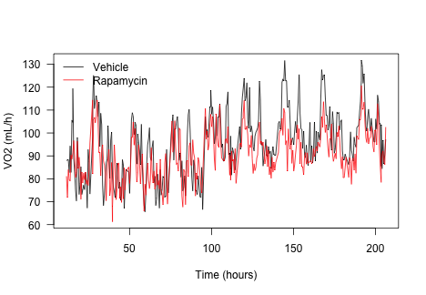
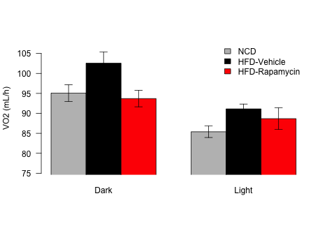
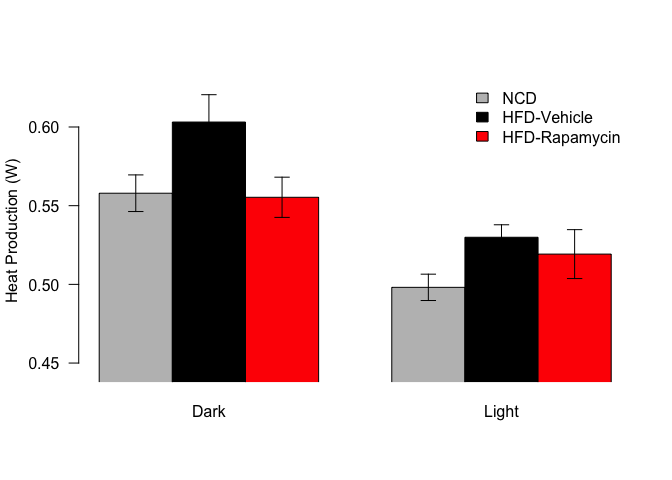
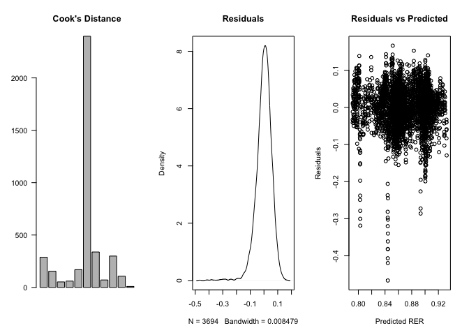
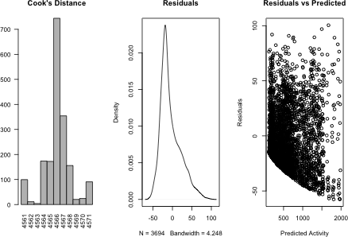
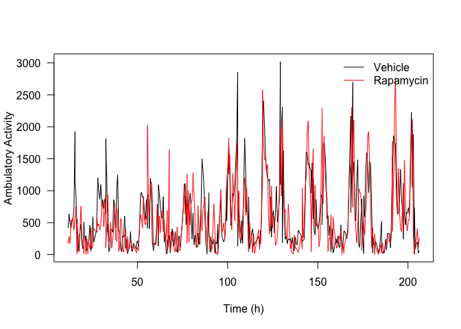
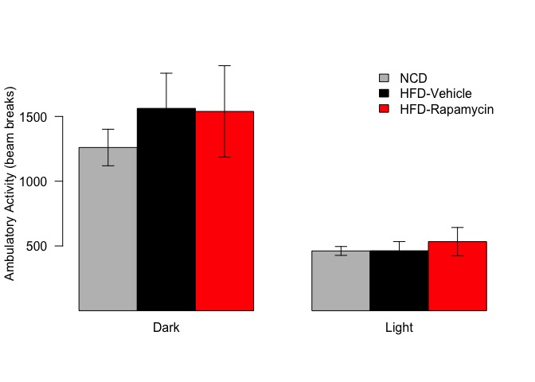

After having been acclimitized in the CLAMS at the normal temperature (25C) for 2 days then treatment and diet started simulataneously. 


The input files were 2015-10-07-C57BL6J-Rapa-HFD-PreCLAMSEchoMRI.XLSX for the echoMRI data and 2015-10-07-C57BL6J-Rapa-HFD-OxymaxDataFile1.csv  and 2015-10-07-C57BL6J-Rapa-HFD-OxymaxDataFile2.csv for the CLAMS data.  These data can be found in /Users/davebrid/Documents/GitHub/TissueSpecificTscKnockouts/Mouse Data/CLAMS B6-HFD-Rapamycin.  This script was most recently updated on Mon May 20 08:07:18 2019 and includes the following number of animals:


Treatment    Males
----------  ------
Vehicle          5
Rapamycin        6

This study was done coincident with diet/drug treatment, using male mice only.  The first day was on NCD then animals were switched to HFD and randomized into drug/vehicle.

# Effects of the Drug at 25C


## Resting Metabolic Rate

The proxy for energy consumption is the volume of oxygen consumed.  This is best presented in proportion to the amount of lean body mass, since fat mass does not appreciably consume oxygen.  Resting metabolic rate should be high in the evening (when mice are active) and low during the day.  The interpretation of changes in VO2 also requires looking at the levels of physical activity, since more physically active animals will consume more oxygen.

The VO2 levels were first merged to average over light and dark cycles, removing the first 20 measurements.  


We first checked whether normality was maintained in the residuals from the ANCOVA.  These results are summarized below:




This data was averaged for the VO2 before the HFD switch and after the HFD switch




## VO2 Statistics

For the vehicle treated animals we noted a 7.887% increase in the volume of oxygen consumed during the dark phase, and a 6.702% increase in the light phase.

Alternatively we used a mixed linear model, with non-interacting covariates for the Light cycle, the lean mass and the treatment  A Chi-squared test comparing a model with or without the Treatment term yielded a p-value of 1.24e-05 for the mice.  This analysis excluded the chow fed animals, and only compares HFD vehicle to HFD drug.

The model coefficients are:


Table: Model Coefficients for VO2 Mixed Linear Model

                              Coefficent      SE
---------------------------  -----------  ------
(Intercept)                      135.408   8.672
Light.DarkLight                   -8.756   0.571
Lean                              -1.839   0.342
Exp.Time                           0.095   0.007
TreatmentRapamycin                -4.506   1.786
HFDTRUE                           -0.092   1.259
TreatmentRapamycin:HFDTRUE        -3.959   1.440


Table: Estimates and p-values from mixed linear models.

                              Estimate   Std..Error   t.value     p.z
---------------------------  ---------  -----------  --------  ------
(Intercept)                    135.408        8.672    15.615   0.000
Light.DarkLight                 -8.756        0.571   -15.335   0.000
Lean                            -1.839        0.342    -5.380   0.000
Exp.Time                         0.095        0.007    13.934   0.000
TreatmentRapamycin              -4.506        1.786    -2.522   0.012
HFDTRUE                         -0.092        1.259    -0.073   0.942
TreatmentRapamycin:HFDTRUE      -3.959        1.440    -2.750   0.006

## Heat




## Heat Statistics

For the vehicle treated animals we noted a 8.106% increase in the heat produced during the dark phase, and a 6.389% increase in the light phase.

Alternatively we used a mixed linear model, with non-interacting covariates for the Light cycle, the lean mass and the treatment  A Chi-squared test comparing a model with or without the Treatment term yielded a p-value of 2.05e-04 for the mice.  This analysis excluded the chow fed animals, and only compares HFD vehicle to HFD drug.

The model coefficients are:


Table: Model Coefficients for VO2 Mixed Linear Model

                              Coefficent      SE
---------------------------  -----------  ------
(Intercept)                        0.781   0.059
Light.DarkLight                   -0.056   0.003
Lean                              -0.010   0.002
Exp.Time                           0.001   0.000
TreatmentRapamycin                -0.025   0.012
HFDTRUE                            0.007   0.007
TreatmentRapamycin:HFDTRUE        -0.020   0.008


Table: Estimates and p-values from mixed linear models for heat production.

                              Estimate   Std..Error   t.value     p.z
---------------------------  ---------  -----------  --------  ------
(Intercept)                      0.781        0.059    13.167   0.000
Light.DarkLight                 -0.056        0.003   -16.849   0.000
Lean                            -0.010        0.002    -4.373   0.000
Exp.Time                         0.001        0.000    12.649   0.000
TreatmentRapamycin              -0.025        0.012    -2.145   0.032
HFDTRUE                          0.007        0.007     0.895   0.371
TreatmentRapamycin:HFDTRUE      -0.020        0.008    -2.404   0.016

## Respiratory Exchange Rate

The respiratory exchange ratio is an indicator of substrate preference.  A high RER indicates preferential utilization of carbohydrates for energy, while a low RER indicates preferential use of lipids.  The normal range of these values are 0.7 (nearly exclusivley lipid) to 1.0 (nearly exclusively carbohydrate).  Lipid utilization (low RER) is increased during sleep (day cycle for mice).




We used a mixed linear model, with non-interacting covariates for the Light cycle and the treatment.  A Chi-squared test comparing a model with or without the treatment term yielded a p-value of 1.41e-02 for the mice.  This only is comparing the differnce between HFD and HFD + Drug mice.


Table: Model Coefficients for RER Mixed Linear Model

                               Coefficent         SE
----------------------------  -----------  ---------
(Intercept)                      0.907155   0.010300
Light.DarkLight                 -0.042227   0.001862
Exp.Time                        -0.000140   0.000024
TreatmentRapamycin              -0.010411   0.013888
Exp.Time:TreatmentRapamycin      0.000081   0.000033


## Activity Data

Physical activity is determined via the number of beam brakes in the X or Y direction (not vertically).  These numbers are high when the mice are awake (dark cycle) and low during the light cycle.  The beam breaks are converted into ambulatory counts based on consecutive breaks of beams, indicating movement.  These counts data are not normally distributed and as such are typically analysed with generalized linear models.




We used a generalized mixed linear model, with non-interacting covariates for the Light cycle and the treatment  A Chi-squared test comparing a model with or without the Genotype term yielded a p-value of 1e+00 for the mice.  This analysis used a generalized mixed linear model (Poission) and only compares HFD to HFD + Drug.







# Substrate Use

Equations from Frayn (1983) J Appl Physiol Respir Environ Exerc Physiol. and assume negligible protein oxidation

Fat oxidation: (1.695 g/L * VO2 L/min) - (1.701 g/L * VCO2 L/min) = FA ox in g/min

CHO oxidation is (4.585 * VCO2) - (3.226 * VO2)


# Session Information


```
## R version 3.5.0 (2018-04-23)
## Platform: x86_64-apple-darwin15.6.0 (64-bit)
## Running under: macOS  10.14.4
## 
## Matrix products: default
## BLAS: /Library/Frameworks/R.framework/Versions/3.5/Resources/lib/libRblas.0.dylib
## LAPACK: /Library/Frameworks/R.framework/Versions/3.5/Resources/lib/libRlapack.dylib
## 
## locale:
## [1] en_US.UTF-8/en_US.UTF-8/en_US.UTF-8/C/en_US.UTF-8/en_US.UTF-8
## 
## attached base packages:
## [1] stats     graphics  grDevices utils     datasets  methods   base     
## 
## other attached packages:
##  [1] car_3.0-2       carData_3.0-2   arm_1.10-1      MASS_7.3-51.1  
##  [5] lme4_1.1-19     Matrix_1.2-15   lubridate_1.7.4 bindrcpp_0.2.2 
##  [9] dplyr_0.7.8     readxl_1.2.0    tidyr_0.8.2     knitr_1.21     
## 
## loaded via a namespace (and not attached):
##  [1] zip_1.0.0         Rcpp_1.0.0        cellranger_1.1.0 
##  [4] pillar_1.3.1      compiler_3.5.0    nloptr_1.2.1     
##  [7] highr_0.7         bindr_0.1.1       forcats_0.3.0    
## [10] tools_3.5.0       digest_0.6.18     evaluate_0.12    
## [13] tibble_2.0.0      nlme_3.1-137      lattice_0.20-38  
## [16] pkgconfig_2.0.2   rlang_0.3.1       openxlsx_4.1.0   
## [19] curl_3.2          yaml_2.2.0        haven_2.0.0      
## [22] xfun_0.4          rio_0.5.16        coda_0.19-2      
## [25] stringr_1.3.1     hms_0.4.2         grid_3.5.0       
## [28] tidyselect_0.2.5  data.table_1.11.8 glue_1.3.0       
## [31] R6_2.3.0          foreign_0.8-71    rmarkdown_1.11   
## [34] minqa_1.2.4       purrr_0.2.5       magrittr_1.5     
## [37] htmltools_0.3.6   splines_3.5.0     abind_1.4-5      
## [40] assertthat_0.2.0  stringi_1.2.4     crayon_1.3.4
```
