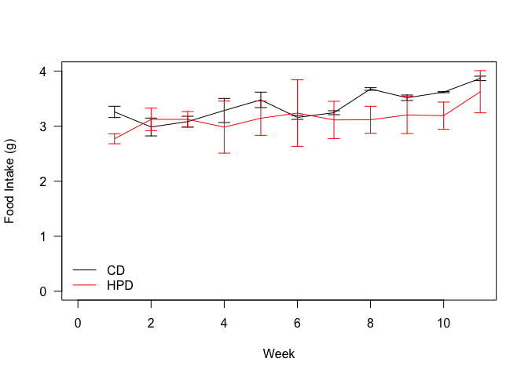
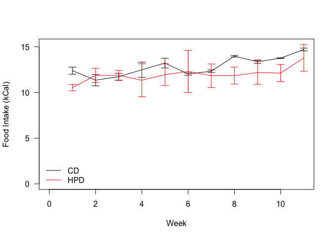
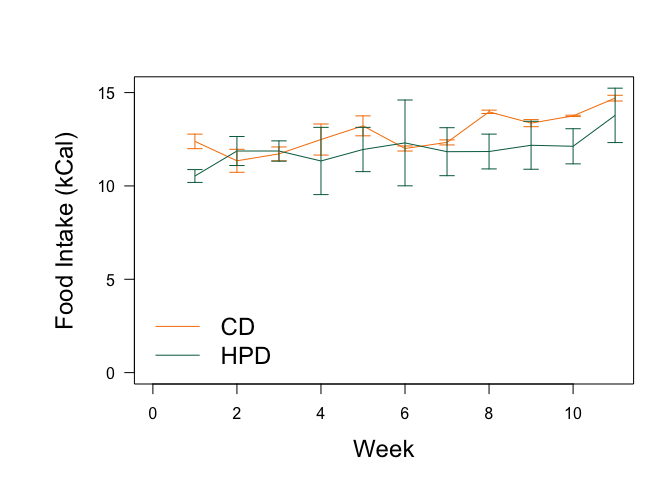

# Food Intake Analysis of HPD Fed Animals
Innocence Harvey and Dave Bridges  
August 10, 2015  


This data uses the input file HPD Food Intake Data.csv.  This script was most recently run on Mon Sep  7 10:37:29 2015.


 

 

 

## Statistics


To test the effects of food intake we used a mixed linear model in which the week did not matter and either the Treatment covariate was included or not.  The cage was the random effect.   From this model the Chi-squared value was 0.964 for a p-value of 0.326.  The residuals of this model were normally distributed (Shapiro-Wilk test p-value = 0.829).

# Cumulative Food Intake

 

# Session Information


```
## R version 3.2.2 (2015-08-14)
## Platform: x86_64-apple-darwin13.4.0 (64-bit)
## Running under: OS X 10.10.4 (Yosemite)
## 
## locale:
## [1] en_US.UTF-8/en_US.UTF-8/en_US.UTF-8/C/en_US.UTF-8/en_US.UTF-8
## 
## attached base packages:
## [1] stats     graphics  grDevices utils     datasets  methods   base     
## 
## other attached packages:
## [1] lme4_1.1-8   Matrix_1.2-2 dplyr_0.4.2  knitr_1.11  
## 
## loaded via a namespace (and not attached):
##  [1] Rcpp_0.12.0     lattice_0.20-33 digest_0.6.8    assertthat_0.1 
##  [5] MASS_7.3-43     grid_3.2.2      R6_2.1.1        nlme_3.1-121   
##  [9] DBI_0.3.1       formatR_1.2     magrittr_1.5    evaluate_0.7.2 
## [13] stringi_0.5-5   lazyeval_0.1.10 minqa_1.2.4     nloptr_1.0.4   
## [17] rmarkdown_0.7   splines_3.2.2   tools_3.2.2     stringr_1.0.0  
## [21] yaml_2.1.13     parallel_3.2.2  htmltools_0.2.6
```
