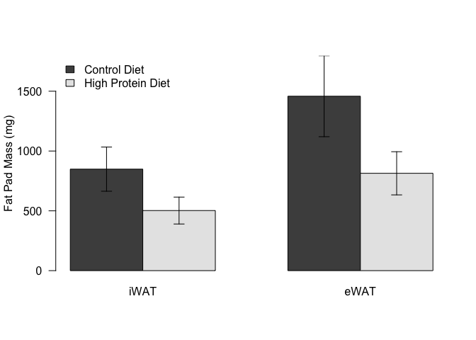
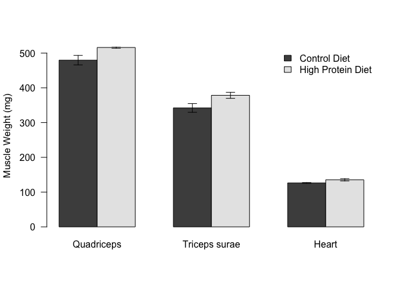
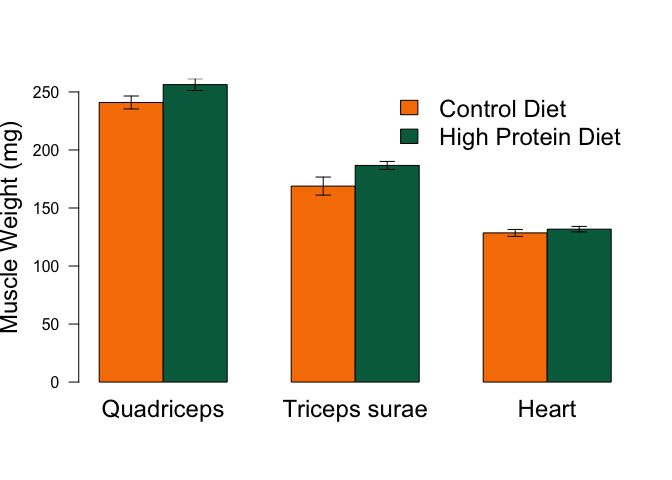

# Tissue Weight Analysis of HPD Fed Animals
Innocence Harvey and Dave Bridges  
August 10, 2015  


This data uses the input file HPD fat pad weights.csv.  This script was most recently run on Fri Dec 18 15:10:59 2015.

# Adipose Tissue

The iWAT and eWAT values are the right fat pads for each mouse.


We tested whether normality can be assumed for eWAT and iWAT by a Shapiro-Wilk test.  The p-values for this were all greater than 0.046.  There was a reduction of 38.873% for iWAT and 46.018% for eWAT.  For summary statistics see below.  


Table: Inguinal Fat Pads (mg)

Diet                  n   Average    SD     SE   Shapiro
------------------  ---  --------  ----  -----  --------
Control Diet         10       349   178   56.4     0.327
High Protein Diet    10       213   115   36.4     0.502


Table: Epididymal Fat Pads (mg)

Diet                  n   Average    SD      SE   Shapiro
------------------  ---  --------  ----  ------  --------
Control Diet         10       568   382   120.8     0.153
High Protein Diet    10       307   181    57.1     0.046

 

 

We next tested whether equal variance can be assumed via Levene's test.  For iWAT the p-value was 0.455 and for eWAT the p-value was 0.232.  Therefore in both cases, equal variance can be assumed and Student's *t* tests were performed.  These p-values were **0.093** for iWAT and **0.102** for eWAT.

# Muscle Tissues

The TS and Quadriceps values is the right fat pad for each mouse.


We tested whether normality can be assumed for TS, Quadriceps and Heart by Shapiro-Wilk tests.  The p-values for this were all greater than 0.038.  For summary statistics see below.


Table: Triceps Surae Weights (mg)

Diet                  n   Average     SD     SE   Shapiro
------------------  ---  --------  -----  -----  --------
Control Diet         10       169   24.6   7.77     0.159
High Protein Diet    10       187   10.9   3.45     0.334


Table: Quadriceps Weights (mg)

Diet                  n   Average     SD     SE   Shapiro
------------------  ---  --------  -----  -----  --------
Control Diet         10       241   17.6   5.56     0.065
High Protein Diet    10       256   16.1   5.08     0.038


Table: Heart Weights (mg)

Diet                  n   Average     SD     SE   Shapiro
------------------  ---  --------  -----  -----  --------
Control Diet         10       129   9.41   2.98     0.688
High Protein Diet    10       132   7.51   2.38     0.751

 

 


We next tested whether equal variance can be assumed via Levene's test.  For quadriceps the p-value was 0.849,  for TS the p-value was 0.534 and for heart the p-value was 0.811.  Therefore in all cases, equal variance can be assumed and Student's *t* tests were performed.  These p-values were **0.089** for quadriceps, **0.234** for TS, and **0.465** for heart.


# Session Information


```
## R version 3.2.2 (2015-08-14)
## Platform: x86_64-apple-darwin13.4.0 (64-bit)
## Running under: OS X 10.10.5 (Yosemite)
## 
## locale:
## [1] en_US.UTF-8/en_US.UTF-8/en_US.UTF-8/C/en_US.UTF-8/en_US.UTF-8
## 
## attached base packages:
## [1] stats     graphics  grDevices utils     datasets  methods   base     
## 
## other attached packages:
## [1] car_2.1-0   dplyr_0.4.3 knitr_1.11 
## 
## loaded via a namespace (and not attached):
##  [1] Rcpp_0.12.2        magrittr_1.5       splines_3.2.2     
##  [4] MASS_7.3-45        lattice_0.20-33    R6_2.1.1          
##  [7] minqa_1.2.4        highr_0.5.1        stringr_1.0.0     
## [10] tools_3.2.2        nnet_7.3-11        parallel_3.2.2    
## [13] pbkrtest_0.4-2     grid_3.2.2         nlme_3.1-122      
## [16] mgcv_1.8-9         quantreg_5.19      DBI_0.3.1         
## [19] MatrixModels_0.4-1 htmltools_0.2.6    yaml_2.1.13       
## [22] lme4_1.1-10        lazyeval_0.1.10    assertthat_0.1    
## [25] digest_0.6.8       Matrix_1.2-3       nloptr_1.0.4      
## [28] formatR_1.2.1      evaluate_0.8       rmarkdown_0.8.1   
## [31] stringi_1.0-1      SparseM_1.7
```
