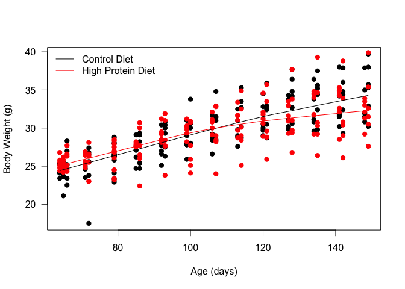
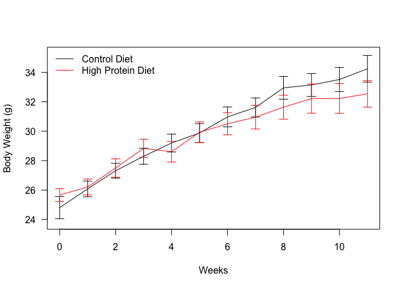
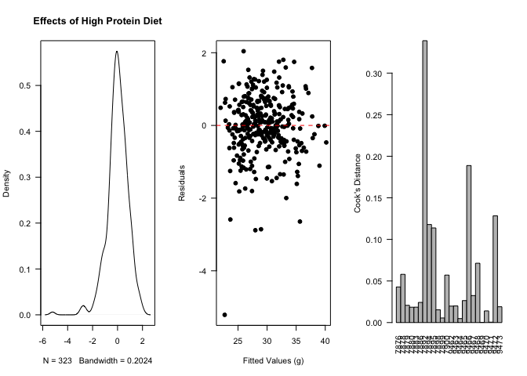
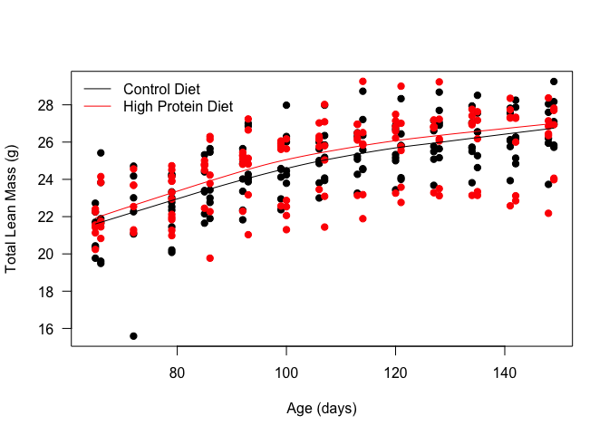
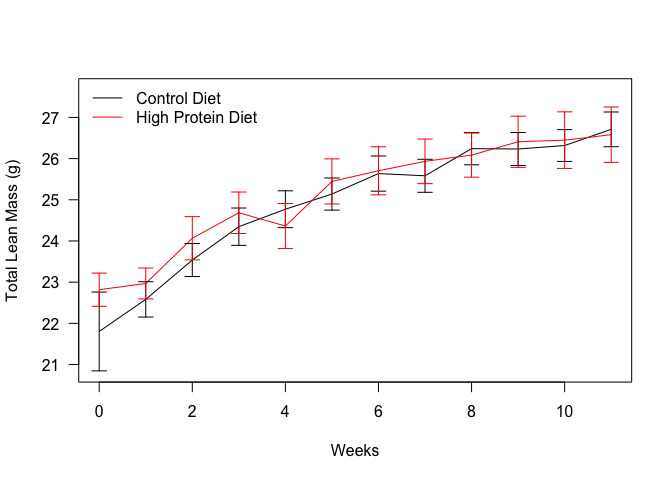
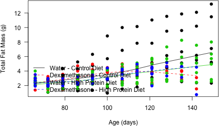
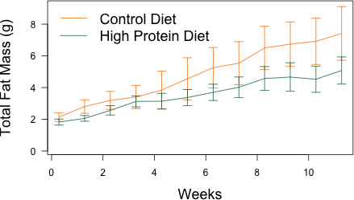
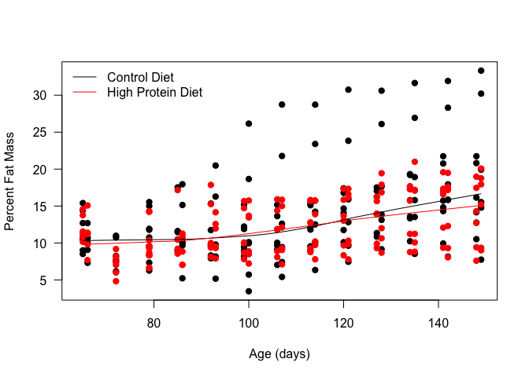
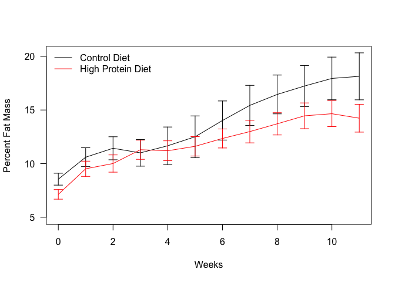

# Weight Analysis of Dexamethasone Treated C57BL/6J Mice on a High Protein Diet
Innocence Harvey, JeAnna Redd and Dave Bridges  
February 15, 2015  


# Data Entry
This was from combined weights over several measurements of C57BL/6J Mice on treated placed on a high protein or control diet.  Some animals may appear multiple times in this analysis.  This data includes fed weights from two cohorts


Data was downloaded from MouseDB then aand the data is saved as Body Weights and Composition.csv.  These data are located in /Users/davebridges/Documents/Source/TissueSpecificTscKnockouts/Mouse Data/HPD and was most recently updated on Fri Dec 18 14:33:39 2015.

## Body Weights

  

 

Based on linear fixed effects models, allowing for uncorrelated intercepts and slopes for the animals, within the water group, the High Protein Diet animals gained -0.194731g  weight per week, or -2.3367725g over the experiment.  This is a -22.8748733% change in body weight gain.  This effect was significant with a p-value of 0.0186615.  The residuals of this model **did not meet** the presumption of normality via a Shapiro-Wilk test (p=1.6442555\times 10^{-9}).

# Lean Mass

  

Based on a mixed linear model with a random slope and intercept for each animal, there was a significant decrease in the rate of lean mass gain with respect to time (Chisq = 2.1088553, p=0.7157457).  This as an average difference of -0.0659994 +/- 0.0789021 grams fat per week, or a total of -1.6971285 +/- 2.0289123 over the course of the study.  This is a 14.4618603% reduction.

# Fat Mass

  


 

Based on a mixed linear model with a random slope and intercept for each animal, there was a significant decrease in the rate of fat mass gain with respect to time (Chisq = 7.8459734, p=0.0197819).  This as an average difference of -0.1560042 +/- 0.0797226 grams fat per week, or a total of -4.0115372 +/- 2.0500094 over the course of the study.  This is a 42.5273954% reduction.


## Percent Fat Mass

  

Based on a mixed linear model with a random slope and intercept for each animal, there was a significant decrease in the rate of percent fat mass with respect to time (Chisq = 6.0895313, p=0.0476075).  This as an average difference of -0.3405411 +/- 0.1833884 percent fat per week, or a total of -8.7567716 +/- 4.7157006 over the course of the study.  This is a 43.6762951% reduction.


# Session Information

```
## R version 3.2.2 (2015-08-14)
## Platform: x86_64-apple-darwin13.4.0 (64-bit)
## Running under: OS X 10.10.5 (Yosemite)
## 
## locale:
## [1] en_US.UTF-8/en_US.UTF-8/en_US.UTF-8/C/en_US.UTF-8/en_US.UTF-8
## 
## attached base packages:
## [1] stats     graphics  grDevices utils     datasets  methods   base     
## 
## other attached packages:
## [1] influence.ME_0.9-6 lme4_1.1-10        Matrix_1.2-3      
## [4] tidyr_0.3.1        dplyr_0.4.3        knitr_1.11        
## 
## loaded via a namespace (and not attached):
##  [1] Rcpp_0.12.2     magrittr_1.5    splines_3.2.2   MASS_7.3-45    
##  [5] lattice_0.20-33 R6_2.1.1        minqa_1.2.4     stringr_1.0.0  
##  [9] tools_3.2.2     parallel_3.2.2  grid_3.2.2      nlme_3.1-122   
## [13] DBI_0.3.1       htmltools_0.2.6 yaml_2.1.13     lazyeval_0.1.10
## [17] assertthat_0.1  digest_0.6.8    nloptr_1.0.4    formatR_1.2.1  
## [21] evaluate_0.8    rmarkdown_0.8.1 stringi_1.0-1
```

