# HPD CLAMS, end of study
Dave Bridges, JeAnna Redd and Innocence Harvey  
August 18, 2015  


This experiment used the animals at the end of 12 weeks of CD/HPD.  


The input files were CLAMS Merged Data - Cohort 1.csv for cohort 1 data and CLAMS Merged Data - Cohort 2.csv for the cohort 2 data.  These data can be found in /Users/davebridges/Documents/Source/TissueSpecificTscKnockouts/Mouse Data/HPD.  This script was most recently updated on Mon Feb  8 16:33:36 2016 and includes the following number of animals:


Treatment            Males
------------------  ------
Control Diet            12
High Protein Diet       12


# Resting Metabolic Rate

The proxy for energy consumption is the volume of oxygen consumed.  This is best presented in proportion to the amount of lean body mass, since fat mass does not appreciably consume oxygen.  Resting metabolic rate should be high in the evening (when mice are active) and low during the day.  The interpretation of changes in VO2 also requires looking at the levels of physical activity, since more physically active animals will consume more oxygen.

The VO2 levels were first merged to average over light and dark cycles, To analyse these data we performed an ANCOVA analysis using lean body mass as the primary covariate, and removing the NCD animals.  This analysis presumes that the effect of lean body mass on VO2 is the same for each group.

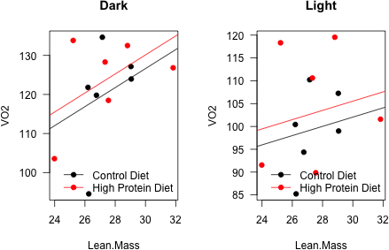 

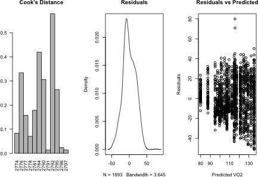 

We first checked whether normality was maintained in the residuals from the ANCOVA.  These results are summarized below:


Table: ANCOVA Analysis for Effect of Diet on VO2.

              Df   Sum Sq   Mean Sq   F value       Pr(>F)
-----------  ---  -------  --------  --------  -----------
Lean.Mass      1     1086      1086      9.02   0.00438577
Light.Dark     1     3414      3414     28.38   0.00000325
Treatment      1      318       318      2.64   0.11118972
Residuals     44     5293       120        NA           NA

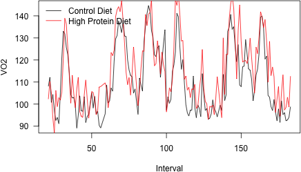 

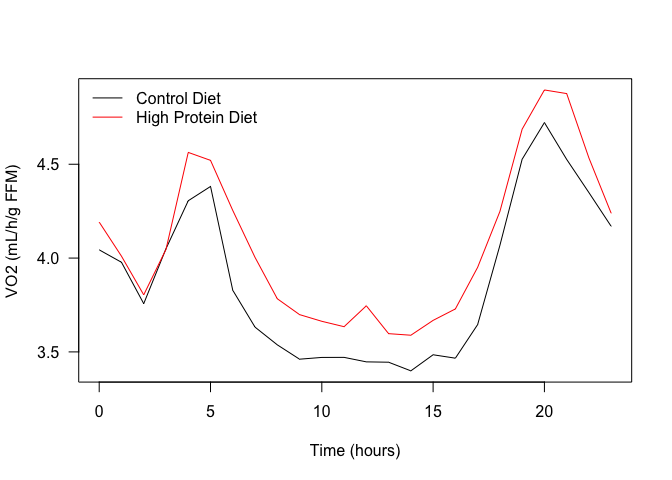 

The residuals of this model were normally distributed (p=0.298) via a Shapiro-Wilk Test. The oxygen consumption rate was increased by High Protein Diet in this model by 5.341% (p=0.111)

Alternatively we used a mixed linear model, with non-interacting covariates for the Light cycle, the lean mass and the treatment  A Chi-squared test comparing a model with or without the Treatment term yielded a p-value of 0.218 for the mice.  The residuals of this mixed linear model were **not normally distributed** (0 via Shapiro-Wilk Test).  

 

## Heat Production

Heat production is calculated from the formula $(3.815 + 1.232 * RER)*VO2$, also known as the Lusk equation.

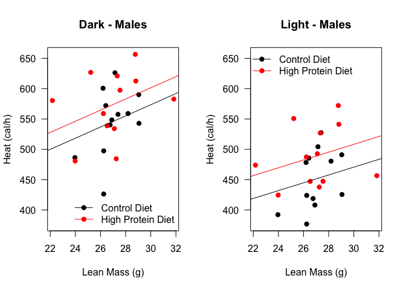 

 

We first checked whether normality was maintained in the residuals from the ANCOVA.  These results are summarized below:


Table: ANCOVA Analysis for Effect of Diet on Heat.

              Df   Sum Sq   Mean Sq   F value       Pr(>F)
-----------  ---  -------  --------  --------  -----------
Lean.Mass      1    10346     10346      4.19   0.04667824
Light.Dark     1    96374     96374     39.03   0.00000015
Treatment      1    12864     12864      5.21   0.02735634
Residuals     44   108659      2470        NA           NA

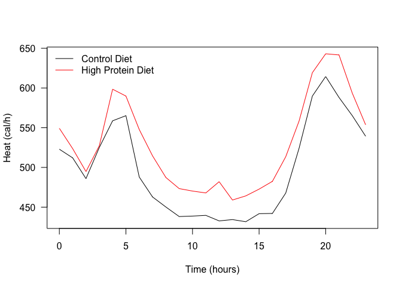 

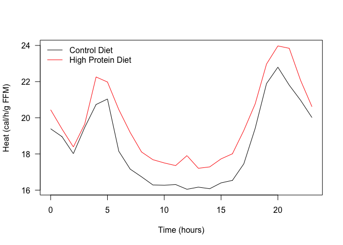 

The residuals of this model were normally distributed (p=0.227) via a Shapiro-Wilk Test. The heat production rate was increased by High Protein Diet in this model by 7.225% (p=0.027)

Alternatively we used a mixed linear model, with non-interacting covariates for the Light cycle, the lean mass and the treatment  A Chi-squared test comparing a model with or without the Treatment term yielded a p-value of 0.086 for the mice.  The residuals of this mixed linear model were **not normally distributed** (0 via Shapiro-Wilk Test).  

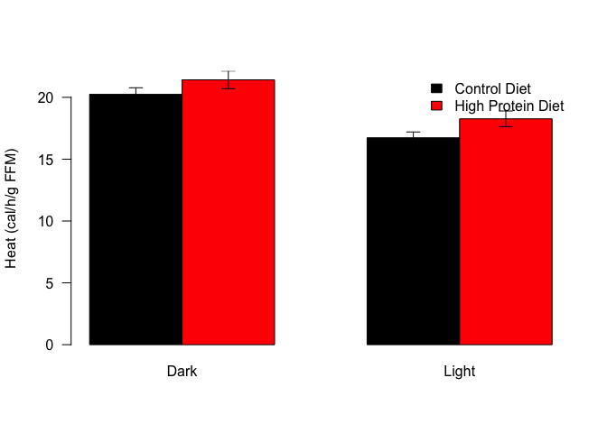 


\newpage

# Body Weights and Composition

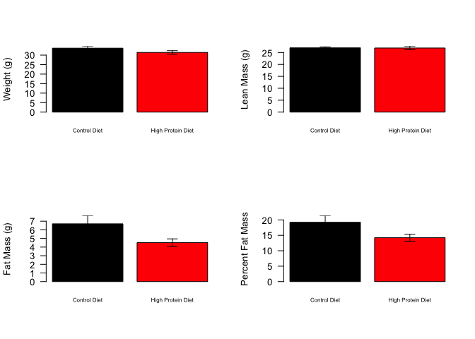 


Table: Statistical Tests for Body Composition

                    Shapiro   Levene   Wilcox   Welch   Student
-----------------  --------  -------  -------  ------  --------
Body Weight           0.152    0.360    0.160   0.125     0.125
Fat Mass              0.203    0.079    0.052   0.053     0.048
Percent Fat Mass      0.066    0.109    0.089   0.057     0.053
Lean Mass             0.315    0.231    0.977   0.936     0.936

\newpage

# Respiratory Exchange Rate

The respiratory exchange ratio is an indicator of substrate preference.  A high RER indicates preferential utilization of carbohydrates for energy, while a low RER indicates preferential use of lipids.  The normal range of these values are 0.7 (nearly exclusivley lipid) to 1.0 (nearly exclusively carbohydrate).  Lipid utilization (low RER) is increased during sleep (day cycle for mice).

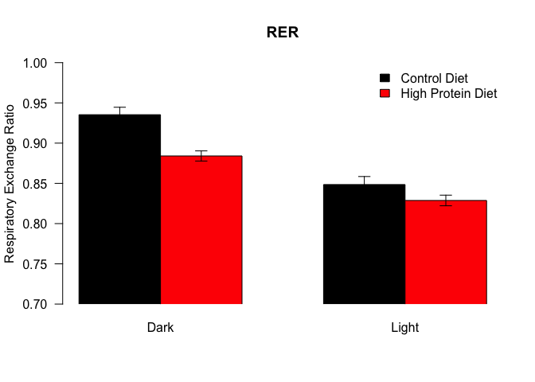 

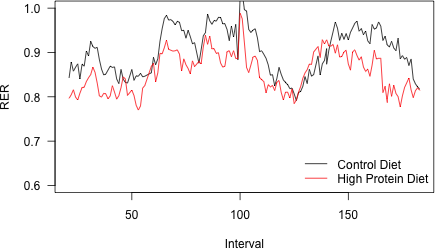 

 

We used a mixed linear model, with non-interacting covariates for the Light cycle and the treatment.  A Chi-squared test comparing a model with or without the treatment term yielded a p-value of 0.001 for the mice.  

\newpage

# Activity Data

Physical activity is determined via the number of beam brakes in the X or Y direction (not vertically).  These numbers are high when the mice are awake (dark cycle) and low during the light cycle.  The beam breaks are converted into ambulatory counts based on consecutive breaks of beams, indicating movement.  These counts data are not normally distributed and as such are typically analysed with generalized linear models.

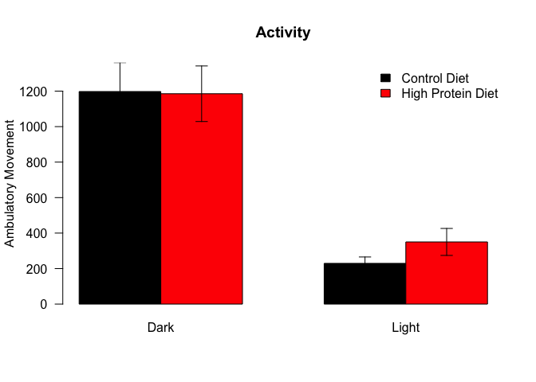 

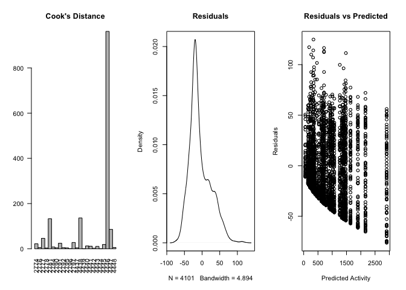 

We used a generalized mixed linear model, with non-interacting covariates for the Light cycle and the treatment  A Chi-squared test comparing a model with or without the Genotype term yielded a p-value of 0.611 for the mice.  This analysis used a generalized mixed linear model (Poission).

# Session Information


```
## R version 3.2.2 (2015-08-14)
## Platform: x86_64-apple-darwin13.4.0 (64-bit)
## Running under: OS X 10.11.3 (El Capitan)
## 
## locale:
## [1] en_US.UTF-8/en_US.UTF-8/en_US.UTF-8/C/en_US.UTF-8/en_US.UTF-8
## 
## attached base packages:
## [1] stats     graphics  grDevices utils     datasets  methods   base     
## 
## other attached packages:
## [1] tidyr_0.3.1        car_2.1-1          influence.ME_0.9-6
## [4] lme4_1.1-10        Matrix_1.2-3       dplyr_0.4.3       
## [7] lubridate_1.5.0    knitr_1.11        
## 
## loaded via a namespace (and not attached):
##  [1] Rcpp_0.12.2        magrittr_1.5       splines_3.2.2     
##  [4] MASS_7.3-45        lattice_0.20-33    R6_2.1.1          
##  [7] minqa_1.2.4        stringr_1.0.0      highr_0.5.1       
## [10] tools_3.2.2        pbkrtest_0.4-4     nnet_7.3-11       
## [13] parallel_3.2.2     grid_3.2.2         nlme_3.1-122      
## [16] mgcv_1.8-10        quantreg_5.19      DBI_0.3.1         
## [19] MatrixModels_0.4-1 htmltools_0.2.6    yaml_2.1.13       
## [22] lazyeval_0.1.10    assertthat_0.1     digest_0.6.8      
## [25] nloptr_1.0.4       formatR_1.2.1      evaluate_0.8      
## [28] rmarkdown_0.8.1    stringi_1.0-1      SparseM_1.7
```
