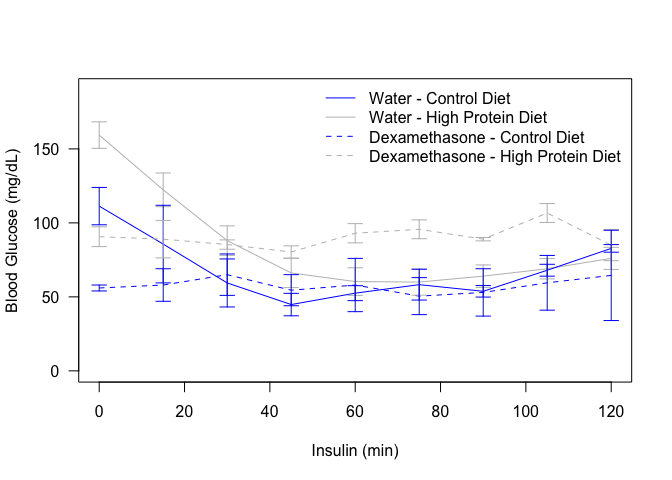
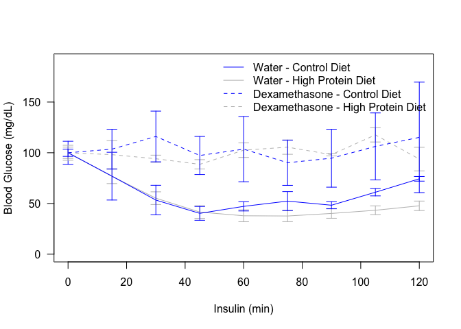
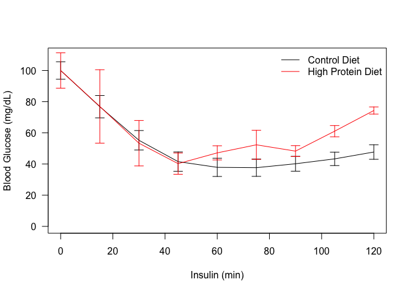
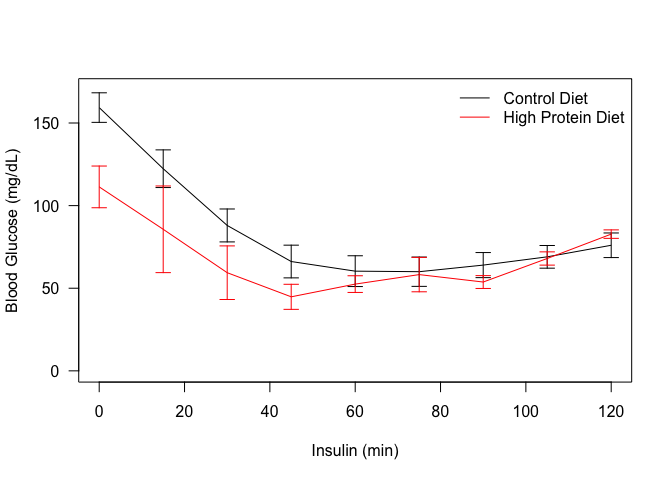

# ITT for Older Chow Dexamethasone Treated Mice
Innocence Harvey and Dave Bridges  
April 20, 2015  


  

# High Protein Diet Only

 

 


We generated mixed linear models with random slopes and intercepts using time (as a factor) and the diet as a covariate.  First this was done for absolute glucose values.  A chi-squared test comparing these models had a p-value of 0.0753.  For normalized glucose values, the p-value was 0.1176. Pairwise Student's *t* tests are shown in the table below:


Table: Pairwise t-tests for effects of diet at each point of the ITT, both for absolute and normalized values.

        pval.abs   pval.norm   padj.abs   padj.norm
-----  ---------  ----------  ---------  ----------
t0        0.0126          NA     0.1138          NA
t15       0.2415      0.2415     0.5166      0.5740
t30       0.2069      0.2069     0.5166      0.5740
t45       0.1328      0.1328     0.5166      0.5740
t60       0.5039      0.5039     0.6479      0.6719
t75       0.9141      0.9141     0.9141      0.9141
t90       0.2870      0.2870     0.5166      0.5740
t105      0.9087      0.9087     0.9141      0.9141
t120      0.4330      0.4330     0.6479      0.6719

## Session Information


```
## R version 3.2.2 (2015-08-14)
## Platform: x86_64-apple-darwin13.4.0 (64-bit)
## Running under: OS X 10.10.4 (Yosemite)
## 
## locale:
## [1] en_US.UTF-8/en_US.UTF-8/en_US.UTF-8/C/en_US.UTF-8/en_US.UTF-8
## 
## attached base packages:
## [1] stats     graphics  grDevices utils     datasets  methods   base     
## 
## other attached packages:
## [1] lme4_1.1-8     Matrix_1.2-2   tidyr_0.2.0    dplyr_0.4.2   
## [5] RCurl_1.95-4.7 bitops_1.0-6   rjson_0.2.15   knitr_1.11    
## 
## loaded via a namespace (and not attached):
##  [1] Rcpp_0.12.0     magrittr_1.5    MASS_7.3-43     splines_3.2.2  
##  [5] lattice_0.20-33 R6_2.1.1        minqa_1.2.4     highr_0.5      
##  [9] stringr_1.0.0   plyr_1.8.3      tools_3.2.2     parallel_3.2.2 
## [13] grid_3.2.2      nlme_3.1-121    DBI_0.3.1       htmltools_0.2.6
## [17] yaml_2.1.13     lazyeval_0.1.10 digest_0.6.8    assertthat_0.1 
## [21] nloptr_1.0.4    reshape2_1.4.1  formatR_1.2     evaluate_0.7.2 
## [25] rmarkdown_0.7   stringi_0.5-5
```
