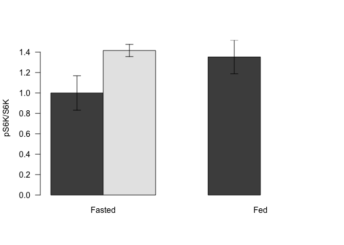
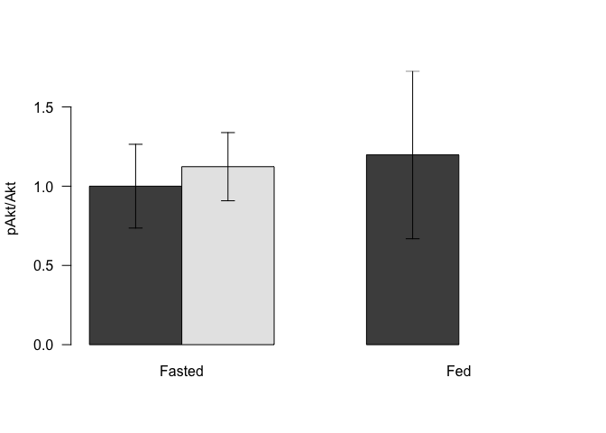
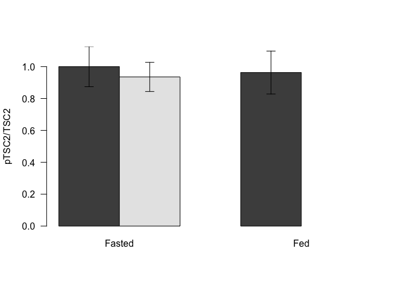
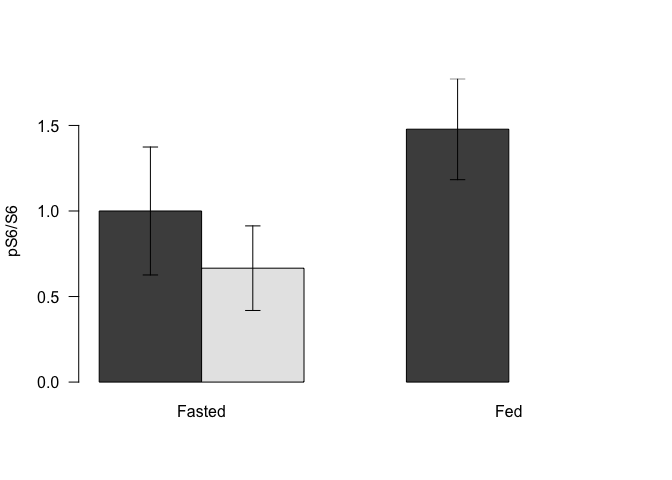

# mTORC1 Signaling in HPD Quadriceps
Dave Bridges  
June 26, 2015  

# S6K Phosphorylation

Table: Lane Summary for S6K

Treatment   Diet   Lane      pS6K     S6K   Ratio   Norm.Ratio
----------  -----  -----  -------  ------  ------  -----------
Fasted      CD     1       249000   67000    3.72         0.53
Fasted      CD     2       306000   34700    8.82         1.25
Fasted      CD     3       346000   49700    6.96         0.99
Fasted      CD     4       410000   47200    8.69         1.23
Fasted      HPD    5       386000   37500   10.29         1.46
Fasted      HPD    6       764000   69300   11.02         1.56
Fasted      HPD    7       660000   71300    9.26         1.31
Fasted      HPD    8       266000   28500    9.33         1.32
Fed         CD     9       745000   69700   10.69         1.52
Fed         CD     10      529000   63200    8.37         1.19

Table: Summarized Normalized Ratios for S6K

Treatment   Diet    Average     SE     SD    n
----------  -----  --------  -----  -----  ---
Fasted      CD         1.00   0.17   0.34    4
Fasted      HPD        1.42   0.06   0.12    4
Fed         CD         1.35   0.16   0.23    2

 

## S6K Statistics

Ignoring the fed mice, within the fasted mice, the data was normally distributed (Shapiro-Wilk test 0.227 for CD and 0.369 for HPD), and equal variance could be assumed (Levene's test 0.258).  Based on this a Student's *t* test had a p-value of 0.059.

# Akt Phosphorylation

Table: Lane Summary for Akt

Treatment   Diet   Lane      pAkt      Akt   Ratio   Norm.Ratio
----------  -----  -----  -------  -------  ------  -----------
Fasted      CD     1        87800   479000    0.18         0.55
Fasted      CD     2       122000   224000    0.54         1.63
Fasted      CD     3        46600   241000    0.19         0.58
Fasted      CD     4       132000   315000    0.42         1.25
Fasted      HPD    5        56300   267000    0.21         0.63
Fasted      HPD    6       131000   413000    0.32         0.95
Fasted      HPD    7       196000   360000    0.54         1.62
Fasted      HPD    8        77900   180000    0.43         1.29
Fed         CD     9        83300   372000    0.22         0.67
Fed         CD     10      162000   280000    0.58         1.73

Table: Summarized Normalized Ratios for Akt

Treatment   Diet    Average     SE     SD    n
----------  -----  --------  -----  -----  ---
Fasted      CD         1.00   0.26   0.53    4
Fasted      HPD        1.12   0.22   0.43    4
Fed         CD         1.20   0.53   0.75    2

 

## Akt Statistics

Ignoring the fed mice, within the fasted mice, the data was normally distributed (Shapiro-Wilk test 0.292 for CD and 0.961 for HPD), and equal variance could be assumed (Levene's test 0.463).  Based on this a Student's *t* test had a p-value of 0.73.

Table: Lane Summary for TSC

Treatment   Diet   Lane      ptsc      tsc   Ratio   Norm.Ratio
----------  -----  -----  -------  -------  ------  -----------
Fasted      CD     1        98800   897000    0.11         0.77
Fasted      CD     2        49800   365000    0.14         0.96
Fasted      CD     3        69100   357000    0.19         1.36
Fasted      CD     4        52800   407000    0.13         0.91
Fasted      HPD    5        44100   371000    0.12         0.83
Fasted      HPD    6        84300   798000    0.11         0.74
Fasted      HPD    7       117000   714000    0.16         1.15
Fasted      HPD    8        38800   268000    0.14         1.02
Fed         CD     9        91100   772000    0.12         0.83
Fed         CD     10       84600   541000    0.16         1.10

Table: Summarized Normalized Ratios for TSC2

Treatment   Diet    Average     SE     SD    n
----------  -----  --------  -----  -----  ---
Fasted      CD         1.00   0.13   0.25    4
Fasted      HPD        0.94   0.09   0.18    4
Fed         CD         0.96   0.13   0.19    2

 

## TSC Statistics

Ignoring the fed mice, within the fasted mice, the data was normally distributed (Shapiro-Wilk test 0.366 for CD and 0.801 for HPD), and equal variance could be assumed (Levene's test 0.92).  Based on this a Student's *t* test had a p-value of 0.693.

Table: Lane Summary for S6

Treatment   Diet   Lane       ps6      s6   Ratio   Norm.Ratio
----------  -----  -----  -------  ------  ------  -----------
Fasted      CD     1       116000    7040   16.48         0.95
Fasted      CD     2         9890     276   35.83         2.06
Fasted      CD     3         6210     559   11.11         0.64
Fasted      CD     4         8400    1370    6.13         0.35
Fasted      HPD    5         4620     413   11.19         0.64
Fasted      HPD    6         8740    1890    4.62         0.27
Fasted      HPD    7        75600   11300    6.69         0.38
Fasted      HPD    8        20300     853   23.80         1.37
Fed         CD     9       156000    5060   30.83         1.77
Fed         CD     10      101000    4910   20.57         1.18

Table: Summarized Normalized Ratios for S6

Treatment   Diet    Average     SE     SD    n
----------  -----  --------  -----  -----  ---
Fasted      CD         1.00   0.37   0.75    4
Fasted      HPD        0.67   0.25   0.49    4
Fed         CD         1.48   0.30   0.42    2

 

## S6 Statistics

Ignoring the fed mice, within the fasted mice, the data was normally distributed (Shapiro-Wilk test 0.407 for CD and 0.316 for HPD), and equal variance could be assumed (Levene's test 0.622).  Based on this a Student's *t* test had a p-value of 0.484.

# Session Information
R version 3.2.2 (2015-08-14)
Platform: x86_64-apple-darwin13.4.0 (64-bit)
Running under: OS X 10.10.4 (Yosemite)

locale:
[1] en_US.UTF-8/en_US.UTF-8/en_US.UTF-8/C/en_US.UTF-8/en_US.UTF-8

attached base packages:
[1] stats     graphics  grDevices utils     datasets  methods   base     

other attached packages:
[1] car_2.0-26  tidyr_0.2.0 dplyr_0.4.2 readr_0.1.1 knitr_1.11 

loaded via a namespace (and not attached):
 [1] Rcpp_0.12.0     magrittr_1.5    splines_3.2.2   MASS_7.3-43    
 [5] lattice_0.20-33 R6_2.1.1        minqa_1.2.4     stringr_1.0.0  
 [9] highr_0.5       tools_3.2.2     nnet_7.3-10     parallel_3.2.2 
[13] pbkrtest_0.4-2  grid_3.2.2      nlme_3.1-121    mgcv_1.8-7     
[17] quantreg_5.11   DBI_0.3.1       htmltools_0.2.6 yaml_2.1.13    
[21] lme4_1.1-8      lazyeval_0.1.10 assertthat_0.1  digest_0.6.8   
[25] Matrix_1.2-2    nloptr_1.0.4    formatR_1.2     evaluate_0.7.2 
[29] rmarkdown_0.7   stringi_0.5-5   SparseM_1.7    
