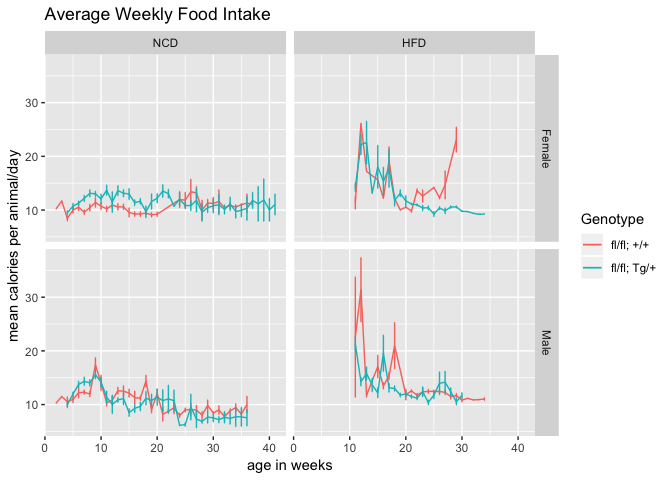
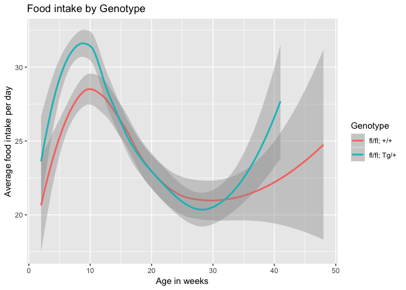
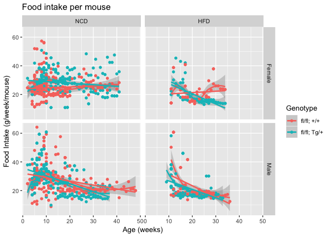
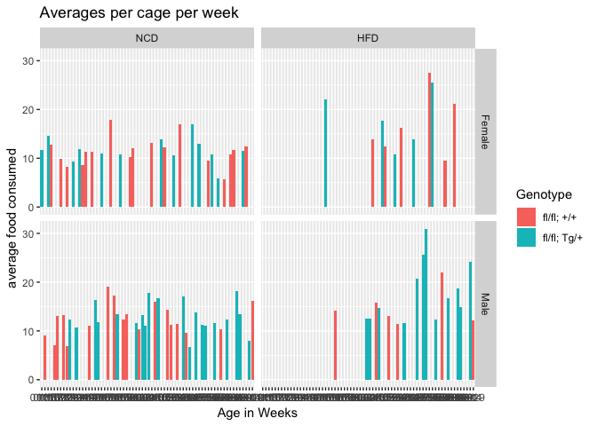
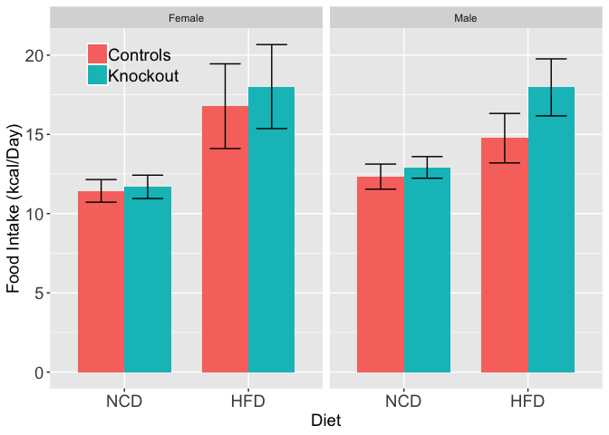
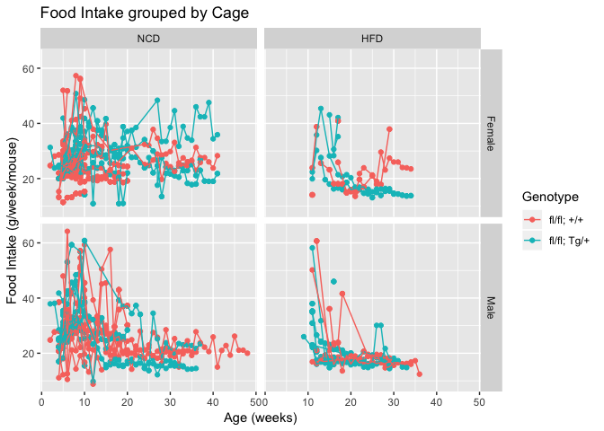

# Raw Data


<!-- -->
These data can be found in **/Users/davebrid/Documents/GitHub/TissueSpecificTscKnockouts/Mouse Data/Muscle Tsc1 Knockout** in a file named **Food Intake Log.csv**.  This script was most recently updated on **Wed Apr  3 15:42:42 2019**.
# Analysis

<!-- --><!-- --><!-- --><!-- -->

Table: ANOVA for diet and genotype Effects on averaged food intake

term         df   sumsq   meansq   statistic   p.value
----------  ---  ------  -------  ----------  --------
Sex           1    0.00     0.00        0.00     0.986
HFD           1   45.82    45.82       38.02     0.004
Genotype      1    3.48     3.48        2.89     0.164
Residuals     4    4.82     1.21          NA        NA


<!-- -->


## Statistics


Table: Chi squared test comparing a model with and without diet as a covariate

                  Df    AIC    BIC   logLik   deviance   Chisq   Chi Df   Pr(>Chisq)
---------------  ---  -----  -----  -------  ---------  ------  -------  -----------
intake.null        3   8611   8628    -4303       8605      NA       NA           NA
intake.lme.hfd     4   8542   8563    -4267       8534    71.8        1            0


Table: Chi squared test comparing a model with age and HFD to a model with HFD

                  Df    AIC    BIC   logLik   deviance   Chisq   Chi Df   Pr(>Chisq)
---------------  ---  -----  -----  -------  ---------  ------  -------  -----------
intake.lme.hfd     4   8542   8563    -4267       8534      NA       NA           NA
intake.lme.age     5   8397   8424    -4194       8387     147        1            0


Table: Chi squared test comparing a model with age and HFD those and sex as a covariate

                  Df    AIC    BIC   logLik   deviance   Chisq   Chi Df   Pr(>Chisq)
---------------  ---  -----  -----  -------  ---------  ------  -------  -----------
intake.lme.age     5   8397   8424    -4194       8387      NA       NA           NA
intake.lme.sex     6   8399   8431    -4194       8387   0.136        1        0.712


Table: Chi squared test for effect of genotype in a model with age, diet and sex as covariates.  This is the final model used.

                   Df    AIC    BIC   logLik   deviance   Chisq   Chi Df   Pr(>Chisq)
----------------  ---  -----  -----  -------  ---------  ------  -------  -----------
intake.lme.sex      6   8399   8431    -4194       8387      NA       NA           NA
intake.lme.geno     7   8400   8438    -4193       8386   0.678        1         0.41


Table: ANOVA of final model with coefficient p-values

             Sum Sq   Mean Sq   NumDF    DenDF   F value   Pr(>F)
---------  --------  --------  ------  -------  --------  -------
HFD         2033.65   2033.65       1   1361.7   174.135    0.000
age         1788.31   1788.31       1   1488.6   153.127    0.000
Sex            0.88      0.88       1     67.0     0.075    0.785
Genotype       7.49      7.49       1     59.3     0.642    0.426


Table: Coefficients from final model

                            x
--------------------  -------
(Intercept)            13.319
HFDHFD                  4.451
age                    -0.166
SexMale                 0.163
Genotypefl/fl; Tg/+     0.487


Table: Pairwise contrasts from mixed linear model, for females on NCD.  The random effect is the cage.

term       levels                      Estimate   Std. Error       df   t value   Pr(>|t|)
---------  -------------------------  ---------  -----------  -------  --------  ---------
HFD        NCD - HFD                     -4.451        0.337   1361.7   -13.196      0.000
Sex        Female - Male                 -0.163        0.594     67.0    -0.274      0.785
Genotype   fl/fl; +/+ - fl/fl; Tg/+      -0.487        0.608     59.3    -0.801      0.426


Sex      HFD   Genotype        n
-------  ----  ------------  ---
Female   NCD   fl/fl; +/+     17
Female   NCD   fl/fl; Tg/+    13
Female   HFD   fl/fl; +/+      5
Female   HFD   fl/fl; Tg/+     5
Male     NCD   fl/fl; +/+     18
Male     NCD   fl/fl; Tg/+    20
Male     HFD   fl/fl; +/+      6
Male     HFD   fl/fl; Tg/+    12


# Session Information


```r
sessionInfo()
```

```
## R version 3.5.0 (2018-04-23)
## Platform: x86_64-apple-darwin15.6.0 (64-bit)
## Running under: macOS  10.14.2
## 
## Matrix products: default
## BLAS: /Library/Frameworks/R.framework/Versions/3.5/Resources/lib/libRblas.0.dylib
## LAPACK: /Library/Frameworks/R.framework/Versions/3.5/Resources/lib/libRlapack.dylib
## 
## locale:
## [1] en_US.UTF-8/en_US.UTF-8/en_US.UTF-8/C/en_US.UTF-8/en_US.UTF-8
## 
## attached base packages:
## [1] stats     graphics  grDevices utils     datasets  methods   base     
## 
## other attached packages:
##  [1] lmerTest_3.0-1 lme4_1.1-19    Matrix_1.2-15  dbplyr_1.3.0  
##  [5] car_3.0-2      carData_3.0-2  broom_0.5.1    nlme_3.1-137  
##  [9] ggplot2_3.1.0  bindrcpp_0.2.2 forcats_0.3.0  readr_1.3.1   
## [13] dplyr_0.7.8    tidyr_0.8.2    knitr_1.21    
## 
## loaded via a namespace (and not attached):
##  [1] tidyselect_0.2.5  xfun_0.4          purrr_0.2.5      
##  [4] reshape2_1.4.3    splines_3.5.0     haven_2.0.0      
##  [7] lattice_0.20-38   colorspace_1.3-2  generics_0.0.2   
## [10] htmltools_0.3.6   yaml_2.2.0        rlang_0.3.1      
## [13] nloptr_1.2.1      pillar_1.3.1      DBI_1.0.0        
## [16] foreign_0.8-71    glue_1.3.0        withr_2.1.2      
## [19] readxl_1.2.0      bindr_0.1.1       plyr_1.8.4       
## [22] stringr_1.3.1     munsell_0.5.0     gtable_0.2.0     
## [25] cellranger_1.1.0  zip_1.0.0         evaluate_0.12    
## [28] labeling_0.3      rio_0.5.16        curl_3.2         
## [31] highr_0.7         Rcpp_1.0.0        scales_1.0.0     
## [34] backports_1.1.3   abind_1.4-5       hms_0.4.2        
## [37] digest_0.6.18     stringi_1.2.4     openxlsx_4.1.0   
## [40] numDeriv_2016.8-1 grid_3.5.0        tools_3.5.0      
## [43] magrittr_1.5      lazyeval_0.2.1    tibble_2.0.0     
## [46] crayon_1.3.4      pkgconfig_2.0.2   MASS_7.3-51.1    
## [49] data.table_1.11.8 minqa_1.2.4       assertthat_0.2.0 
## [52] rmarkdown_1.11    R6_2.3.0          compiler_3.5.0
```
