# Experiment Summary


Table: All Data

     Genotype     X.  ID        Basal.Glucose   Clamp.Glucose   Clamp.GIR   Clamp.AUC   Basal.SA   Clamp.SA   Basal.Gtr   Clamp.Gtr   Basal.HGP   Clamp.HGP   Basal.sHGP   Clamp.sHGP   Clearance.Basal   Clearance.Clamp   X0   X0.1   X0.2   X0.3   Insulin.Basal   Insulin.Clamp   Basal   Clamp   SOL   TA   Gastroc    V.fat   S.fat     BAT   Heart   Diaphram
---  ----------  ---  -------  --------------  --------------  ----------  ----------  ---------  ---------  ----------  ----------  ----------  ----------  -----------  -----------  ----------------  ----------------  ---  -----  -----  -----  --------------  --------------  ------  ------  ----  ---  --------  -------  ------  ------  ------  ---------
8    Knockout      8  245                  88             113        38.3        4303     166204     158722        24.1        50.9        24.1       12.56            0        47.96             13.16              26.2    0      0      0      0            1.58            21.1       0       0     0    0      8.32    4.880   19.05   401.6     367          0
11   Knockout      1  266                 107             125        40.4        4206     144050     157520        33.8        62.2        33.8       21.80            0        35.48             16.87              31.2    0      0      0      0            3.97            25.4       0       0     0    0     17.80   13.110   22.00    95.7     262         NA
12   Knockout      2  267                 139             114        14.5        1760      95930     120125        50.7        82.8        50.7       68.33            0       -34.65             25.60              67.1    0      0      0      0            5.47            15.1       0       0     0    0     11.44    4.389   25.02   172.1     348         NA
13   Knockout      3  323                 139             112        15.8        1938     282602     261183        16.0        34.6        16.0       18.87            0       -18.31              9.34              29.2    0      0      0      0            2.93            17.3       0       0     0    0     17.03    5.234   17.92   112.3     405         NA
14   Knockout      4  371                 117             138        31.2        3515     360233     286396        14.1        38.4        14.1        7.19            0        49.18             18.20              25.9    0      0      0      0            0.00             0.0       0       0     0    0     21.11    8.817   32.62   322.2     440         NA
15   Knockout      5  197                  89             117        31.0        3235     163434     212528        30.3        46.9        30.3       15.83            0        47.77             19.92              27.8    0      0      0      0            4.71            19.9       0       0     0    0     16.52    4.650   39.77   120.0     405         NA
16   Knockout      6  184                 110             112        25.3        2594     164238     200053        29.7        49.0        29.7       23.67            0        20.27             14.52              29.7    0      0      0      0            3.31             0.0       0       0     0    0      5.68   10.744   14.63    41.3     214         NA
17   Knockout      7  230                  98             124        28.3        2967     164504     159853        30.1        62.0        30.1       33.77            0       -12.09             14.29              29.8    0      0      0      0            5.29            19.4       0       0     0    0      6.73    0.958    3.01   291.9     293         NA
1    Wild-Type     1  370                 137             135        21.1        2336     176774     166972        16.6        35.6        16.6       14.46            0        12.92              8.85              17.6    0      0      0      0            9.07            18.3       0       0     0    0      5.65    1.060    7.71   137.4     132          0
2    Wild-Type     2  186                 130             115        16.4        1857     127462     164844        31.1        48.2        31.1       31.83            0        -2.32             18.05              25.4    0      0      0      0           19.85            33.0       0       0    NA   NA     12.11    1.240    5.94   156.8     556          0
3    Wild-Type     3  269                 126             118        25.4        2651     156866     139891        22.2        50.2        22.2       24.83            0       -11.81             13.68              31.7    0      0      0      0            3.72            17.1       0       0     0    0     18.24    3.170    5.07   265.2     206          0
4    Wild-Type     4  268                 138             134        22.7        2640      90144     106372        38.6        65.5        38.6       42.77            0       -10.89             20.79              31.4    0      0      0      0           13.93            26.5       0       0     0    0     13.19    3.890    5.53   172.9     661          0
5    Wild-Type     5  377                 145             143        23.3        2468      84227     108108        41.9        65.6        41.9       42.36            0        -1.06             17.58              28.1    0      0      0      0           16.56            21.9       0       0     0    0      9.19    3.910    3.17   324.3     559          0
6    Wild-Type     6  378                 152             120        25.2        2535     107524     112819        23.6        45.9        23.6       20.69            0        12.35             12.44              25.1    0      0      0      0            4.22            21.4       0       0     0    0     17.96    2.740    6.67   403.8     481          0
7    Wild-Type     7  381/wh              111             118        31.0        3294     127835     149024        31.6        54.5        31.6       23.50            0        25.61             18.28              30.3    0      0      0      0           11.13            21.2       0       0     0    0     12.27    2.260   13.67   356.4     525          0
9    Wild-Type     9  381/br              103             110        32.6        3461     112970     139744        34.6        56.2        34.6       23.50            0        25.61             21.87              30.3    0      0      0      0           19.36            21.1       0       0     0    0     19.22    3.420    7.43   300.3     465          0
10   Wild-Type    10  262                 129             120        20.7        2457     151048     184565        25.7        42.3        25.7       21.64            0        15.90             15.65              26.0    0      0      0      0            3.15            11.1       0       0     0    0      9.42    2.480    3.52   137.3     422          0

## Data Summary


The mean data is compiled with the standard errors

## Statistics


Table: Summary statistics for each measurement

        WT          KO  Measurement             Difference   Pct.Difference
----------  ----------  ---------------------  -----------  ---------------
    130.11      110.88  Basal.Glucose_mean         -19.236          -14.784
    123.67      119.48  Clamp.Glucose_mean          -4.188           -3.386
     24.26       28.10  Clamp.GIR_mean               3.848           15.866
   2633.34     3064.68  Clamp.AUC_mean             431.333           16.380
 126094.59   192649.32  Basal.SA_mean            66554.729           52.782
 141370.92   194547.40  Clamp.SA_mean            53176.476           37.615
     29.54       28.61  Basal.Gtr_mean              -0.930           -3.149
     51.55       53.36  Clamp.Gtr_mean               1.803            3.496
     29.54       28.61  Basal.HGP_mean              -0.930           -3.149
     27.29       25.25  Clamp.HGP_mean              -2.034           -7.453
      7.37       16.95  Clamp.sHGP_mean              9.586          130.108
     16.35       16.49  Clearance.Basal_mean         0.133            0.811
     27.32       33.34  Clearance.Clamp_mean         6.029           22.072
     11.22        3.41  Insulin.Basal_mean          -7.813          -69.630
     21.29       14.78  Insulin.Clamp_mean          -6.513          -30.593
     13.03       13.08  Gastroc_mean                 0.051            0.394
      2.69        6.60  V.fat_mean                   3.912          145.674
      6.52       21.75  S.fat_mean                  15.228          233.446
    250.50      194.63  BAT_mean                   -55.867          -22.302
    445.18      341.70  Heart_mean                -103.473          -23.243


Table: T-Tests, Unadjusted

----------------  ------
Clamp.GIR          0.325
Clamp.AUC          0.272
Basal.HGP          0.852
Clamp.HGP          0.792
sHGP               0.477
Clearance.Basal    0.953
Clearance.Clamp    0.269
Insulin            0.008
Gastroc            0.984
V.fat              0.027
S.fat              0.006
BAT                0.341
Heart.fit          0.131
----------------  ------


Table: Nominal and Benjamini-Hochberg Adjusted T-Tests

 Clamp.GIR   Clamp.AUC   Basal.HGP   Clamp.HGP   sHGP   Clearance.Basal   Clearance.Clamp   Insulin   Gastroc   V.fat   S.fat   BAT   Heart.fit
----------  ----------  ----------  ----------  -----  ----------------  ----------------  --------  --------  ------  ------  ----  ----------
         1           1           1           1      1                 1                 1      0.09         1   0.297   0.077     1           1


# Graphs

## Glucose Infusion Rate

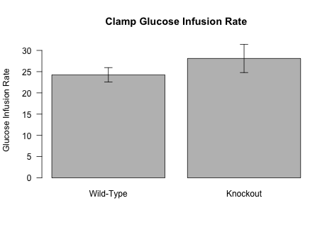<!-- -->

## Glucose Turnover

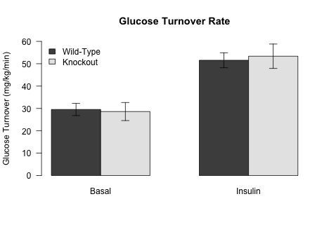<!-- -->

## Endogenous Glucose Production

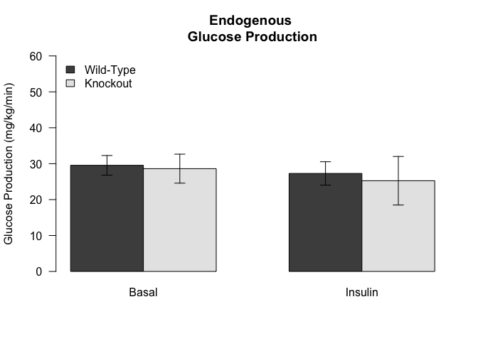<!-- -->

## Clamp Summary

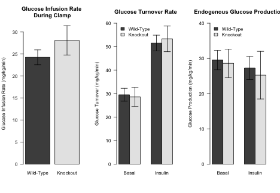<!-- -->

### Suppression of Endogenous Glucose Production

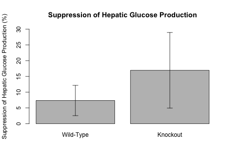<!-- -->

## Insulin Levels

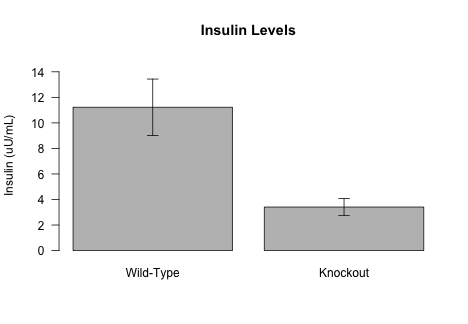<!-- -->

# Glucose Clearance Rate

Blood glucose clearance

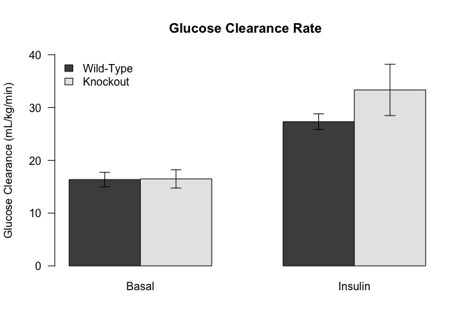<!-- -->

# Tissue Glucose Clearance

## Gasctrocnemius Gluose Uptake During Clamp

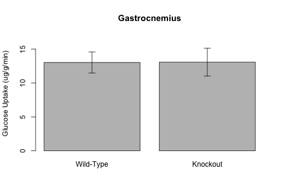<!-- -->

## Visceral Fat Gluose Uptake During Clamp

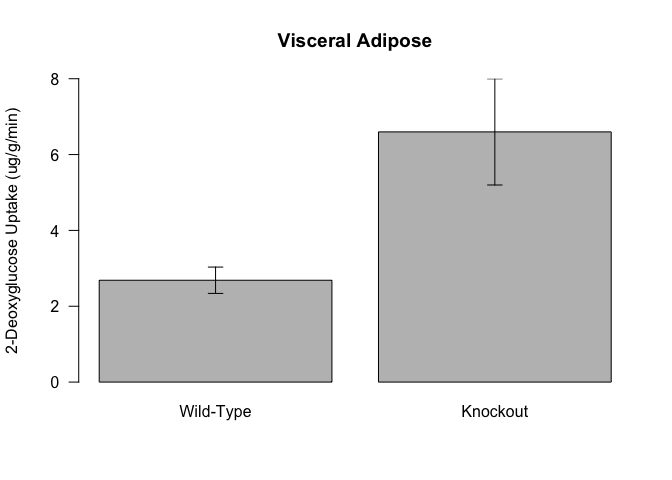<!-- -->

## Subcutaneous Fat Gluose Uptake During Clamp

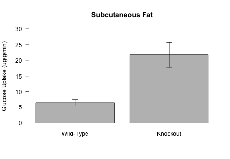<!-- -->

## Heart Gluose Uptake During Clamp

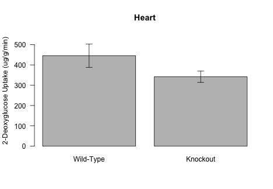<!-- -->

## Brown Adipose Tissue Gluose Uptake During Clamp

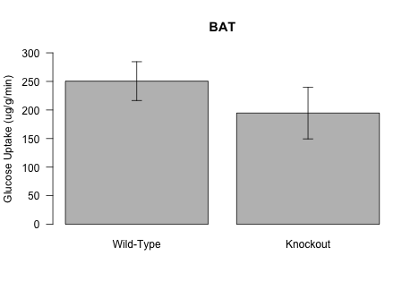<!-- -->

##  Tissue Glucose Uptake Summary

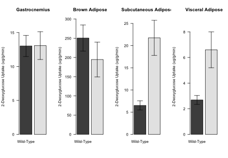<!-- -->

# Session Information


```r
sessionInfo()
```

```
## R version 3.5.0 (2018-04-23)
## Platform: x86_64-apple-darwin15.6.0 (64-bit)
## Running under: macOS  10.14.6
## 
## Matrix products: default
## BLAS: /Library/Frameworks/R.framework/Versions/3.5/Resources/lib/libRblas.0.dylib
## LAPACK: /Library/Frameworks/R.framework/Versions/3.5/Resources/lib/libRlapack.dylib
## 
## locale:
## [1] en_US.UTF-8/en_US.UTF-8/en_US.UTF-8/C/en_US.UTF-8/en_US.UTF-8
## 
## attached base packages:
## [1] stats     graphics  grDevices utils     datasets  methods   base     
## 
## other attached packages:
## [1] tibble_2.1.3     dplyr_0.8.3      tidyr_0.8.3.9000 knitr_1.23      
## 
## loaded via a namespace (and not attached):
##  [1] Rcpp_1.0.1       magrittr_1.5     tidyselect_0.2.5 R6_2.4.0        
##  [5] rlang_0.4.0      stringr_1.4.0    highr_0.8        tools_3.5.0     
##  [9] xfun_0.7         htmltools_0.3.6  yaml_2.2.0       digest_0.6.20   
## [13] assertthat_0.2.1 crayon_1.3.4     purrr_0.3.2      vctrs_0.2.0     
## [17] zeallot_0.1.0    glue_1.3.1       evaluate_0.14    rmarkdown_1.13  
## [21] stringi_1.4.3    compiler_3.5.0   pillar_1.4.2     backports_1.1.4 
## [25] pkgconfig_2.0.2
```
