# Longitudinal Body Composition Analysis of Muscle Tsc1 Knockout Mice on a High Fat Diet
Erin Stephenson and Dave Bridges  
March 31, 2016  


# Data Entry
This was from combined weights over several measurements of mice all placed on a high fat diet from October 2015-February 2016.  Some animals may appear multiple times in this analysis.  Data is downloaded  from the mousedb website.  This includes only fed weights.  This cohort includes both male and female mice.


Data was downloaded from MouseDB then aand the data is saved as Raw Data.csv.  These data are located in /Users/davebrid/Documents/GitHub/TissueSpecificTscKnockouts/Mouse Data/Muscle Tsc1 Knockout/HFD/Body Composition and was most recently updated on Sun Jul 24 07:54:01 2016.

# Enrollment


Table: Total Animals Enrolled in Study by Genotype

Genotype      Gender    Number
------------  -------  -------
fl/fl; Tg/+   M              9
fl/fl; Tg/+   F             17
+/+; +/+      M             11
+/+; +/+      F             16
+/+; Tg/+     M              8
+/+; Tg/+     F             11
fl/fl; +/+    M              5
fl/fl; +/+    F             17


Table: Total Animals Enrolled in Study by Knockout Status

Knockout   Gender    Number
---------  -------  -------
FALSE      M             24
FALSE      F             44
TRUE       M              9
TRUE       F             17

# Body Weights

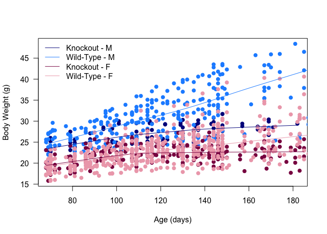<!-- -->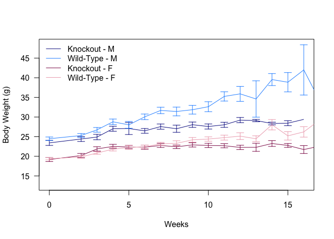<!-- -->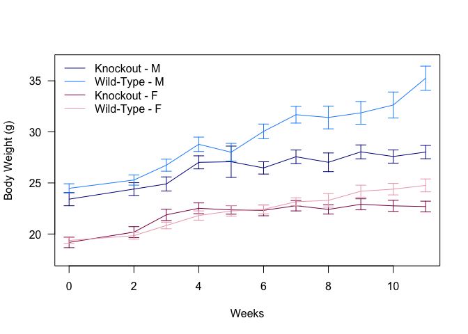<!-- -->

To test whether these groups are different we constructed a linear model with the following formula:

Weight ~ age * Gender * Knockout + (1 | animal.id) + (age - 1 | animal.id)

Based on this formula the knockout caused a 6.193g increase in body weight for males and a 2.322g increase for females (p=7.518&times; 10^-11^ via a Chi-squared test).

The full results are shown below:


Table: Estimates and p-values from mixed linear models.

                            Estimate   Std..Error   t.value     p.z
-------------------------  ---------  -----------  --------  ------
(Intercept)                   16.950        0.542    31.281   0.000
age                            0.119        0.007    17.461   0.000
GenderF                       -3.105        0.671    -4.630   0.000
KnockoutTRUE                   2.866        1.023     2.801   0.005
age:GenderF                   -0.041        0.008    -4.839   0.000
age:KnockoutTRUE              -0.059        0.013    -4.550   0.000
GenderF:KnockoutTRUE           1.192        1.262     0.944   0.345
age:GenderF:KnockoutTRUE       0.017        0.016     1.088   0.276
```


# Lean Mass

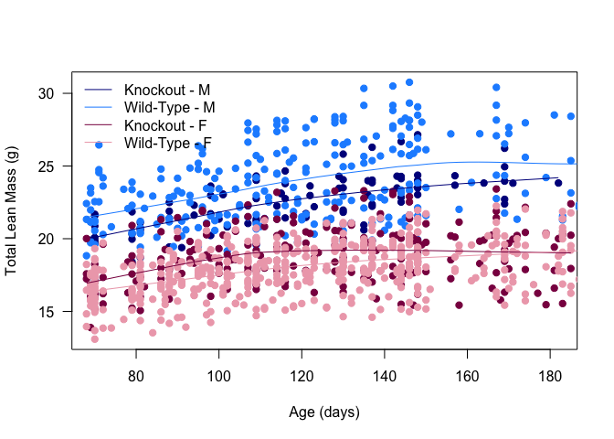<!-- -->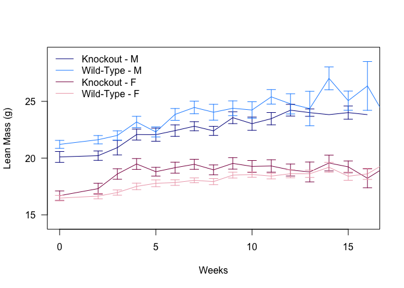<!-- -->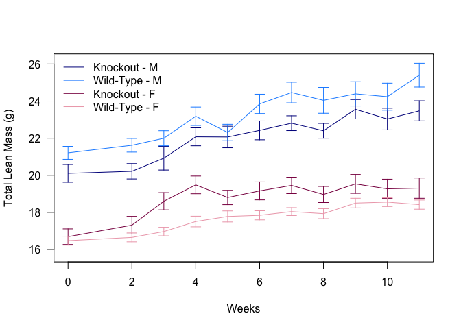<!-- -->

To test whether these groups are different we constructed a linear model with the following formula:

Lean Mass ~ age * Gender * Knockout + (1 | animal.id) + (age - 1 | animal.id)

Based on this formula the knockout caused a 1.265g increase in lean mass for males and a -0.786g increase for females (p=0.006 via a Chi-squared test).

The full results are shown below:


Table: Estimates and p-values from mixed linear models.

                            Estimate   Std..Error   t.value     p.z
-------------------------  ---------  -----------  --------  ------
(Intercept)                   19.148        0.454    42.184   0.000
age                            0.041        0.004     9.300   0.000
GenderF                       -4.897        0.563    -8.693   0.000
KnockoutTRUE                  -2.502        0.869    -2.879   0.004
age:GenderF                   -0.009        0.005    -1.708   0.088
age:KnockoutTRUE               0.008        0.008     0.951   0.342
GenderF:KnockoutTRUE           4.098        1.074     3.818   0.000
age:GenderF:KnockoutTRUE      -0.013        0.010    -1.273   0.203

# Fat Mass

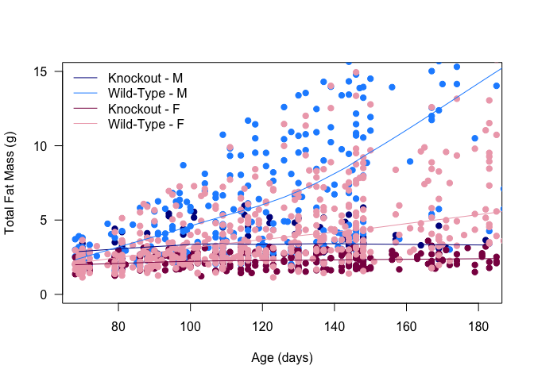<!-- -->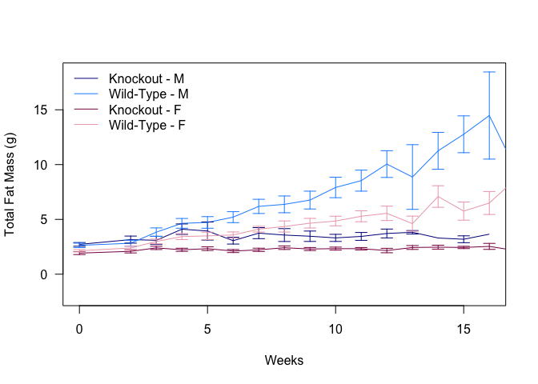<!-- -->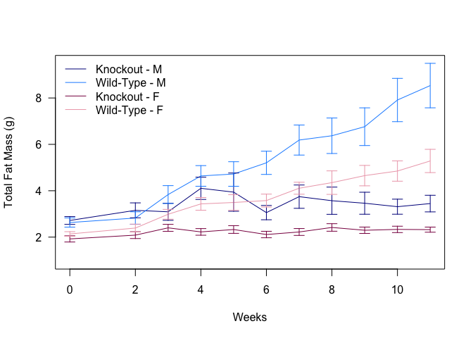<!-- -->

To test whether these groups are different we constructed a linear model with the following formula:

Fat Mass ~ Weight ~ age * Gender * Knockout + (1 | animal.id) + (age - 1 | animal.id)

Based on this formula the knockout caused a 5.086g increase in fat mass for males and a 3.256g increase for females (p=1.03&times; 10^-13^ via a Chi-squared test).

The full results are shown below:


Table: Estimates and p-values from mixed linear models.

                            Estimate   Std..Error   t.value     p.z
-------------------------  ---------  -----------  --------  ------
(Intercept)                   -2.716        0.510     -5.32   0.000
age                            0.074        0.007     11.16   0.000
GenderF                        1.770        0.633      2.80   0.005
KnockoutTRUE                   5.380        0.976      5.51   0.000
age:GenderF                   -0.031        0.008     -3.82   0.000
age:KnockoutTRUE              -0.068        0.013     -5.35   0.000
GenderF:KnockoutTRUE          -2.625        1.205     -2.18   0.029
age:GenderF:KnockoutTRUE       0.029        0.016      1.84   0.065


# Percent Fat Mass

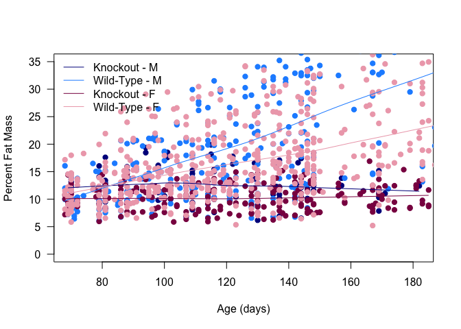<!-- -->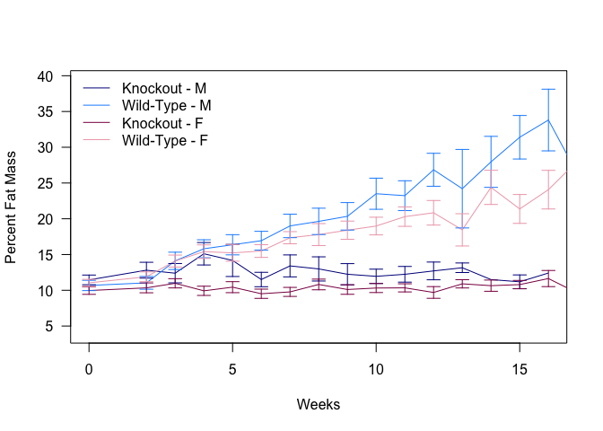<!-- -->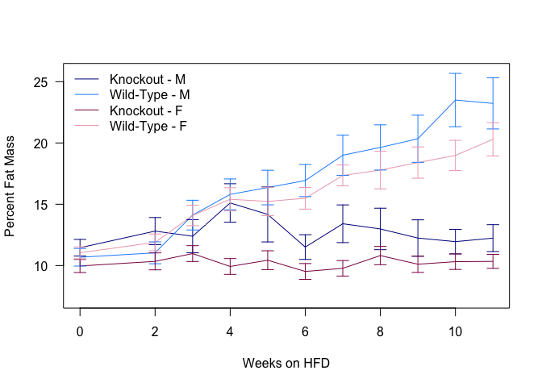<!-- -->

To test whether these groups are different we constructed a linear model with the following formula:

Percent Fat Mass~ age * Gender * Knockout + (1 | animal.id) + (age - 1 | animal.id)

Based on this formula the knockout caused a 12.052 increase in percent fat mass for males and a 11.095 increaes for females (p=1.262&times; 10^-15^ via a Chi-squared test).

The full results are shown below:


Table: Estimates and p-values from mixed linear models.

                            Estimate   Std..Error   t.value     p.z
-------------------------  ---------  -----------  --------  ------
(Intercept)                   -0.778        1.256    -0.619   0.536
age                            0.163        0.015    10.747   0.000
GenderF                        3.526        1.556     2.265   0.024
KnockoutTRUE                  13.720        2.401     5.714   0.000
age:GenderF                   -0.044        0.019    -2.308   0.021
age:KnockoutTRUE              -0.167        0.029    -5.761   0.000
GenderF:KnockoutTRUE          -6.554        2.960    -2.214   0.027
age:GenderF:KnockoutTRUE       0.049        0.036     1.358   0.174

# End of Study Summary

The following animals have completed the study (age is >144 days):


Table: Animals which have completed the study

Genotype      Gender    Number
------------  -------  -------
fl/fl; Tg/+   M              9
fl/fl; Tg/+   F             17
+/+; +/+      M             11
+/+; +/+      F             16
+/+; Tg/+     M              7
+/+; Tg/+     F             11
fl/fl; +/+    M              5
fl/fl; +/+    F             17


Table: Body composition of animals which have completed the study

----------------------  ------  ------  ------  ------
Gender                  M       M       F       F     
Knockout                FALSE   TRUE    FALSE   TRUE  
Body.Weight_mean        34.5    27.9    25.2    22.6  
Lean.Mass_mean          25.0    23.4    18.7    19.2  
Total.Fat.Mass_mean     8.26    3.34    5.47    2.32  
Percent.Fat.Mass_mean   22.8    11.9    20.8    10.3  
Body.Weight_se          1.238   0.622   0.572   0.465 
Lean.Mass_se            0.651   0.536   0.251   0.473 
Total.Fat.Mass_se       0.909   0.319   0.443   0.122 
Percent.Fat.Mass_se     1.912   0.978   1.224   0.589 
----------------------  ------  ------  ------  ------

# Session Information

```
## R version 3.3.0 (2016-05-03)
## Platform: x86_64-apple-darwin13.4.0 (64-bit)
## Running under: OS X 10.11.5 (El Capitan)
## 
## locale:
## [1] en_US.UTF-8/en_US.UTF-8/en_US.UTF-8/C/en_US.UTF-8/en_US.UTF-8
## 
## attached base packages:
## [1] stats     graphics  grDevices utils     datasets  methods   base     
## 
## other attached packages:
## [1] influence.ME_0.9-6 lme4_1.1-12        Matrix_1.2-6      
## [4] tidyr_0.4.1        dplyr_0.4.3        knitr_1.13        
## 
## loaded via a namespace (and not attached):
##  [1] Rcpp_0.12.5     magrittr_1.5    splines_3.3.0   MASS_7.3-45    
##  [5] lattice_0.20-33 R6_2.1.2        minqa_1.2.4     stringr_1.0.0  
##  [9] highr_0.6       tools_3.3.0     parallel_3.3.0  grid_3.3.0     
## [13] nlme_3.1-128    DBI_0.4-1       htmltools_0.3.5 yaml_2.1.13    
## [17] lazyeval_0.1.10 assertthat_0.1  digest_0.6.9    nloptr_1.0.4   
## [21] formatR_1.4     evaluate_0.9    rmarkdown_0.9.6 stringi_1.1.1
```

