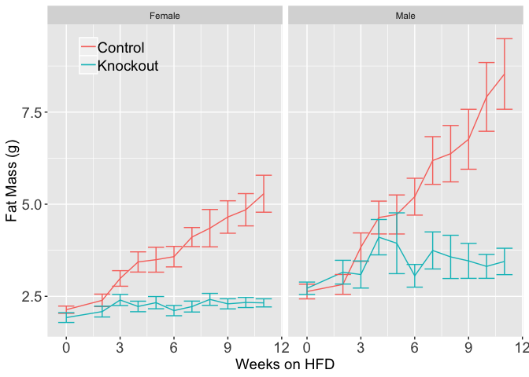

# Data Entry
This was from combined weights over several measurements of mice all placed on a high fat diet from October 2015-February 2016.  Some animals may appear multiple times in this analysis.  Data is downloaded  from the mousedb website.  This includes only fed weights.  This cohort includes both male and female mice.


Data was downloaded from MouseDB then aand the data is saved as Raw Data.csv.  These data are located in /Users/davebrid/Documents/GitHub/TissueSpecificTscKnockouts/Mouse Data/Muscle Tsc1 Knockout/HFD/Body Composition and was most recently updated on Mon May 20 08:19:18 2019.

# Enrollment


Table: Total Animals Enrolled in Study by Genotype

Genotype      Gender    Number
------------  -------  -------
fl/fl; Tg/+   M              9
fl/fl; Tg/+   F             17
+/+; +/+      M             11
+/+; +/+      F             16
+/+; Tg/+     M              8
+/+; Tg/+     F             11
fl/fl; +/+    M              5
fl/fl; +/+    F             17


Table: Total Animals Enrolled in Study by Knockout Status

Knockout   Gender    Number
---------  -------  -------
FALSE      M             24
FALSE      F             44
TRUE       M              9
TRUE       F             17

# Body Weights

<!-- --><!-- --><!-- -->

To test whether these groups are different we constructed a linear model with the following formula:

Weight ~ age * Gender * Knockout + (1 | animal.id) + (age - 1 | animal.id)

The knockout caused a s (p=7.518&times; 10^-11^ via a Chi-squared test).

The full results are shown below:


Table: Estimates and p-values from mixed linear models.

                            Estimate   Std..Error   t.value     p.z
-------------------------  ---------  -----------  --------  ------
(Intercept)                   16.950        0.542    31.281   0.000
age                            0.119        0.007    17.461   0.000
GenderF                       -3.105        0.671    -4.630   0.000
KnockoutTRUE                   2.866        1.023     2.801   0.005
age:GenderF                   -0.041        0.008    -4.839   0.000
age:KnockoutTRUE              -0.059        0.013    -4.550   0.000
GenderF:KnockoutTRUE           1.192        1.262     0.944   0.345
age:GenderF:KnockoutTRUE       0.017        0.016     1.088   0.276


# Lean Mass

<!-- --><!-- --><!-- -->

## Lean Mass Statistics


To test whether these groups are different we constructed a linear model with the following formula:

Fat-Free Mass ~ age + Gender + age:Gender + Knockout + Knockout:age + Gender:Knockout + Gender:age:Knockout + (1 | animal.id) + (age - 1 | animal.id).  

We used this model because the base model was that Lean Mass changes with age.  We asked if sex modified the age dependent effect, and it did (p=4.197&times; 10^-12^).  We next added knockout to the modified sex-modified model, by adding both a knockout and knockout:age term and it was not significant (p=0.941).  

Based on this formula the knockout caused significant reductions in lean mass, via a Chi-squared test with a model not including genotype (p=0.941).

The full results are shown below:


Table: Estimates and p-values from mixed linear models.

                    Estimate   Std..Error   t.value     p.z
-----------------  ---------  -----------  --------  ------
(Intercept)           18.418        0.440    41.833   0.000
age                    0.043        0.004    10.682   0.000
GenderF               -3.771        0.513    -7.346   0.000
KnockoutTRUE           0.181        0.546     0.332   0.740
age:GenderF           -0.013        0.005    -2.746   0.006
age:KnockoutTRUE      -0.001        0.005    -0.144   0.886

# Fat Mass

<!-- --><!-- --><!-- --><!-- -->

## Statistics for Fat Mass 


To test whether these groups are different we constructed a linear model with the following formula:

Fat Mass ~ age + Gender + age:Gender + Knockout + Knockout:age + Gender:Knockout + Gender:age:Knockout + (1 | animal.id) + (age - 1 | animal.id).  

We used this model because the base model was that Fat Mass changes with age.  We asked if sex modified the age dependent effect, and it did (p=0.01).  We next added knockout to the modified sex-modified model, by adding both a knockout and knockout:age term and it too was significant (p=1.005&times; 10^-13^).  

Finally we asked if sex modified that last model by adding Gender:Knockout and Gender:age:Knockout terms.  This ANOVA yielded a p-value of 0.03, which was also significant.

Based on this formula the knockout caused significant reductions in mass, via a Chi-squared test with a model not including genotype (p=1.03&times; 10^-13^).

The full results are shown below:


Table: Estimates and p-values from mixed linear models.

                            Estimate   Std..Error   t.value     p.z
-------------------------  ---------  -----------  --------  ------
(Intercept)                   -2.716        0.510     -5.32   0.000
age                            0.074        0.007     11.16   0.000
GenderF                        1.770        0.633      2.80   0.005
KnockoutTRUE                   5.380        0.976      5.51   0.000
age:GenderF                   -0.031        0.008     -3.82   0.000
age:KnockoutTRUE              -0.068        0.013     -5.35   0.000
GenderF:KnockoutTRUE          -2.625        1.205     -2.18   0.029
age:GenderF:KnockoutTRUE       0.029        0.016      1.84   0.065


# Percent Fat Mass

<!-- --><!-- --><!-- -->

To test whether these groups are different we constructed a linear model with the following formula:

Percent Fat Mass~ age * Gender * Knockout + (1 | animal.id) + (age - 1 | animal.id)

Based on this formula the knockout caused a increaes for females (p=1.262&times; 10^-15^ via a Chi-squared test).

The full results are shown below:


Table: Estimates and p-values from mixed linear models.

                            Estimate   Std..Error   t.value     p.z
-------------------------  ---------  -----------  --------  ------
(Intercept)                   -0.778        1.256    -0.619   0.536
age                            0.163        0.015    10.747   0.000
GenderF                        3.526        1.556     2.265   0.024
KnockoutTRUE                  13.720        2.401     5.714   0.000
age:GenderF                   -0.044        0.019    -2.308   0.021
age:KnockoutTRUE              -0.167        0.029    -5.761   0.000
GenderF:KnockoutTRUE          -6.554        2.960    -2.214   0.027
age:GenderF:KnockoutTRUE       0.049        0.036     1.358   0.174

# End of Study Summary

The following animals have completed the study (age is >144 days):


Table: Animals which have completed the study by genotype

Genotype      Gender    Number
------------  -------  -------
fl/fl; Tg/+   M              9
fl/fl; Tg/+   F             17
+/+; +/+      M             11
+/+; +/+      F             16
+/+; Tg/+     M              7
+/+; Tg/+     F             11
fl/fl; +/+    M              5
fl/fl; +/+    F             17


Table: Animals which have completed the study, by knockout status

Knockout   Gender    Number
---------  -------  -------
FALSE      M             23
FALSE      F             44
TRUE       M              9
TRUE       F             17


Table: Body composition of animals which have completed the study

----------------------  ------  ------  ------  ------
Gender                  M       M       F       F     
Knockout                FALSE   TRUE    FALSE   TRUE  
Body.Weight_mean        34.5    27.9    25.2    22.6  
Lean.Mass_mean          25.0    23.4    18.7    19.2  
Total.Fat.Mass_mean     8.26    3.34    5.47    2.32  
Percent.Fat.Mass_mean   22.8    11.9    20.8    10.3  
Body.Weight_se          1.238   0.622   0.572   0.465 
Lean.Mass_se            0.651   0.536   0.251   0.473 
Total.Fat.Mass_se       0.909   0.319   0.443   0.122 
Percent.Fat.Mass_se     1.912   0.978   1.224   0.589 
----------------------  ------  ------  ------  ------


Table: Effects at the end of the study

Gender   Variable                 FALSE    TRUE   Difference   Difference.pct
-------  ----------------------  ------  ------  -----------  ---------------
M        Body.Weight_mean         34.55   27.88       -6.670           -19.31
M        Lean.Mass_mean           24.99   23.44       -1.545            -6.18
M        Percent.Fat.Mass_mean    22.83   11.94      -10.884           -47.68
M        Total.Fat.Mass_mean       8.26    3.34       -4.922           -59.57
F        Body.Weight_mean         25.21   22.64       -2.572           -10.20
F        Lean.Mass_mean           18.72   19.24        0.517             2.76
F        Percent.Fat.Mass_mean    20.77   10.31      -10.454           -50.34
F        Total.Fat.Mass_mean       5.47    2.32       -3.155           -57.67


# Session Information

```
## R version 3.5.0 (2018-04-23)
## Platform: x86_64-apple-darwin15.6.0 (64-bit)
## Running under: macOS  10.14.4
## 
## Matrix products: default
## BLAS: /Library/Frameworks/R.framework/Versions/3.5/Resources/lib/libRblas.0.dylib
## LAPACK: /Library/Frameworks/R.framework/Versions/3.5/Resources/lib/libRlapack.dylib
## 
## locale:
## [1] en_US.UTF-8/en_US.UTF-8/en_US.UTF-8/C/en_US.UTF-8/en_US.UTF-8
## 
## attached base packages:
## [1] stats     graphics  grDevices utils     datasets  methods   base     
## 
## other attached packages:
## [1] forcats_0.3.0      ggplot2_3.1.0      influence.ME_0.9-9
## [4] lme4_1.1-19        Matrix_1.2-15      bindrcpp_0.2.2    
## [7] tidyr_0.8.2        dplyr_0.7.8        knitr_1.21        
## 
## loaded via a namespace (and not attached):
##  [1] Rcpp_1.0.0       plyr_1.8.4       pillar_1.3.1     compiler_3.5.0  
##  [5] nloptr_1.2.1     highr_0.7        bindr_0.1.1      tools_3.5.0     
##  [9] digest_0.6.18    evaluate_0.12    tibble_2.0.0     nlme_3.1-137    
## [13] gtable_0.2.0     lattice_0.20-38  pkgconfig_2.0.2  rlang_0.3.1     
## [17] yaml_2.2.0       xfun_0.4         withr_2.1.2      stringr_1.3.1   
## [21] grid_3.5.0       tidyselect_0.2.5 glue_1.3.0       R6_2.3.0        
## [25] rmarkdown_1.11   minqa_1.2.4      reshape2_1.4.3   purrr_0.2.5     
## [29] magrittr_1.5     scales_1.0.0     htmltools_0.3.6  splines_3.5.0   
## [33] MASS_7.3-51.1    assertthat_0.2.0 colorspace_1.3-2 labeling_0.3    
## [37] stringi_1.2.4    lazyeval_0.2.1   munsell_0.5.0    crayon_1.3.4
```

