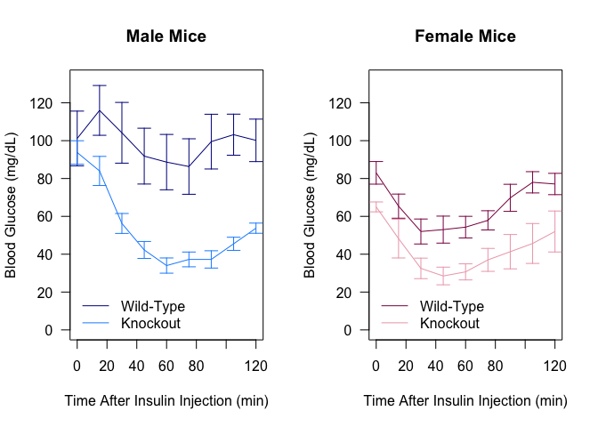
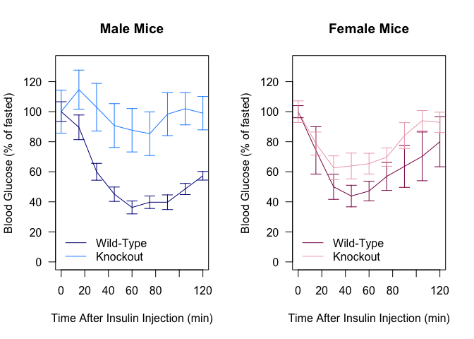

# Data Entry


```r
library(rjson)
library(RCurl)
#download data from experiment 1417
itt_url <- 'http://bridgeslab.sph.umich.edu/mousedb/api/v1/data/?format=json&username=davebridges&api_key=fce3fde2a9a2e5dc9e04c20aad90120a621c50b3&limit=0&experiment=1417'
itt.json <- fromJSON(getURL(itt_url))
library(plyr)
#parse json data into data frame
itt.data <-  rbind(ldply(lapply(itt.json[[2]],function(x) do.call(c,unlist(x,r=F))),as.data.frame))
#figure out which mice are mTSC1-KO

#set fl/fl;Tg/+ as the reference level
itt.data$genotype <- relevel(as.factor(itt.data$animal.Genotype), ref='fl/fl; Tg/+')
itt.data$Sex <- relevel(as.factor(itt.data$animal.Gender), ref='F')
itt.data <-
  itt.data %>%
  mutate(Knockout = factor(if_else(genotype!='fl/fl; Tg/+', "Wild-Type", "Knockout")))

itt.glucose <- itt.data[itt.data$assay.assay=='Plasma Glucose',]                   
#separate comma separated list into values
s <- strsplit(as.character(itt.glucose$values), split = ",")
#paste values into new colunms
itt.glucose <- cbind(itt.glucose, as.data.frame(rbind.fill.matrix(lapply(s, t))))
#convert all values to numbers, put in new columns
itt.glucose$t0 <- as.numeric(as.character(itt.glucose$`1`))
itt.glucose$t15 <- as.numeric(as.character(itt.glucose$`2`))
itt.glucose$t30 <- as.numeric(as.character(itt.glucose$`3`))
itt.glucose$t45 <- as.numeric(as.character(itt.glucose$`4`))
itt.glucose$t60 <- as.numeric(as.character(itt.glucose$`5`))
itt.glucose$t75 <- as.numeric(as.character(itt.glucose$`6`))
itt.glucose$t90 <- as.numeric(as.character(itt.glucose$`7`))
itt.glucose$t105 <- as.numeric(as.character(itt.glucose$`8`))
itt.glucose$t120 <- as.numeric(as.character(itt.glucose$`9`))

color.palette <- c("blue4","dodgerblue", "deeppink4","pink2")

library(readr)
write_csv(itt.glucose, "ITT Data.csv")
```


```r
itt.glucose <- read_csv("ITT Data.csv")
library(dplyr)
#generate averages/se/n/shapiro test for each time point
se <- function(x) sd(x, na.rm=T)/sqrt(length(x))
itt.summary.means <- 
  itt.glucose %>%
  dplyr::group_by(Sex,Knockout) %>%
  dplyr::summarize(
    t0 = mean(t0, na.rm=T),
    t15 = mean(t15, na.rm=T),
    t30 = mean(t30, na.rm=T),
    t45 = mean(t45, na.rm=T),
    t60 = mean(t60, na.rm=T),
    t75 = mean(t75, na.rm=T),
    t90 = mean(t90, na.rm=T),
    t105 = mean(t105, na.rm=T),
    t120 = mean(t120, na.rm=T))

itt.summary.se <- 
  itt.glucose %>%
  dplyr::group_by(Sex,Knockout) %>%
  dplyr::summarize(
    t0 = se(t0),
    t15 = se(t15),
    t30 = se(t30),
    t45 = se(t45),
    t60 = se(t60),
    t75 = se(t75),
    t90 = se(t90),
    t105 = se(t105),
    t120 = se(t120))

times <- seq(0,120,15)
ymax <- max(itt.summary.means[,3:dim(itt.summary.means)[2]]) + max(itt.summary.se[,3:dim(itt.summary.se)[2]])

par(mfrow=c(1,2))
plot <- plot(times,
     as.numeric(itt.summary.means[itt.summary.means$Knockout=='Wild-Type'&itt.summary.means$Sex=="M",3:dim(itt.summary.means)[2]]), 
     las=1, ylim=c(0,ymax), 
     ylab="Blood Glucose (mg/dL)", 
     xlab="Time post-insulin (min)", 
     type="l",
     col=color.palette[1],
     main="Male Mice")
#add ko line
lines(times, as.numeric(itt.summary.means[itt.summary.means$Knockout=='Knockout'&itt.summary.means$Sex=="M",3:dim(itt.summary.means)[2]]), col=color.palette[2])
#add error bars
superpose.eb <- function (x, y, ebl, ebu = ebl, length = 0.08, ...)
arrows(x, y + ebu, x, y - ebl, angle = 90, code = 3,
length = length, ...)

#add error bars for wt and ko
superpose.eb(times,
             as.numeric(itt.summary.means[itt.summary.means$Knockout=='Wild-Type'&itt.summary.means$Sex=="M",3:dim(itt.summary.means)[2]]),
             as.numeric(itt.summary.se[itt.summary.se$Knockout=='Wild-Type'&itt.summary.se$Sex=="M",3:dim(itt.summary.se)[2]]),
             col=color.palette[1])
superpose.eb(times,
             as.numeric(itt.summary.means[itt.summary.means$Knockout=='Knockout'&itt.summary.means$Sex=="M",3:dim(itt.summary.means)[2]]),
             as.numeric(itt.summary.se[itt.summary.se$Knockout=='Knockout'&itt.summary.se$Sex=="M",3:dim(itt.summary.se)[2]]),
             col=color.palette[2])
#add legend
legend("bottomleft",c("Wild-Type",'Knockout'), col=color.palette[1:2], lty=1, bty='n')


plot <- plot(times,
     as.numeric(itt.summary.means[itt.summary.means$Knockout=='Wild-Type'&itt.summary.means$Sex=="F",3:dim(itt.summary.means)[2]]), 
     las=1, ylim=c(0,ymax), 
     ylab="Blood Glucose (mg/dL)", 
     xlab="Time post-insulin (min)", 
     type="l",
     col=color.palette[3],
     main="Female Mice")
#add ko line
lines(times, as.numeric(itt.summary.means[itt.summary.means$Knockout=='Knockout'&itt.summary.means$Sex=="F",3:dim(itt.summary.means)[2]]), col=color.palette[4])
#add error bars for wt and ko
superpose.eb(times,
             as.numeric(itt.summary.means[itt.summary.means$Knockout=='Wild-Type'&itt.summary.means$Sex=="F",3:dim(itt.summary.means)[2]]),
             as.numeric(itt.summary.se[itt.summary.se$Knockout=='Wild-Type'&itt.summary.se$Sex=="F",3:dim(itt.summary.se)[2]]),
             col=color.palette[3])
superpose.eb(times,
             as.numeric(itt.summary.means[itt.summary.means$Knockout=='Knockout'&itt.summary.means$Sex=="F",3:dim(itt.summary.means)[2]]),
             as.numeric(itt.summary.se[itt.summary.se$Knockout=='Knockout'&itt.summary.se$Sex=="F",3:dim(itt.summary.se)[2]]),
             col=color.palette[4])
#add legend
legend("bottomleft",c("Wild-Type",'Knockout'), col=color.palette[3:4], lty=1, bty='n')
```

<!-- -->


```r
#normalized means and errors to 100%
itt.summary.means.norm <- sweep(itt.summary.means[3:dim(itt.summary.means)[2]], 1, itt.summary.means$t0, "/")*100
itt.summary.se.norm <- sweep(itt.summary.se[3:dim(itt.summary.se)[2]], 1, itt.summary.means$t0, "/")*100

par(mfrow=c(1,2))
plot <- plot(times,
     as.numeric(itt.summary.means.norm[3,1:dim(itt.summary.means.norm)[2]]), 
     las=1, ylim=c(0,ymax), 
     ylab="Blood Glucose (% of fasted)", 
     xlab="Time post-insulin (min)", 
     type="l",
     col=color.palette[1],
     main="Male Mice")
#add ko line
lines(times, as.numeric(itt.summary.means.norm[4,1:dim(itt.summary.means.norm)[2]]), col=color.palette[2])

#add error bars for wt and ko
superpose.eb(times,
             as.numeric(itt.summary.means.norm[3,1:dim(itt.summary.means.norm)[2]]),
             as.numeric(itt.summary.se.norm[3,1:dim(itt.summary.se.norm)[2]]),
             col=color.palette[1])
superpose.eb(times,
             as.numeric(itt.summary.means.norm[4,1:dim(itt.summary.means.norm)[2]]),
             as.numeric(itt.summary.se.norm[4,1:dim(itt.summary.se.norm)[2]]),
             col=color.palette[2])
#add legend
legend("bottomleft",c("Wild-Type",'Knockout'), col=color.palette[1:2], lty=1, bty='n')


plot <- plot(times,
     as.numeric(itt.summary.means.norm[1,1:dim(itt.summary.means.norm)[2]]), 
     las=1, ylim=c(0,ymax), 
     ylab="Blood Glucose (% of fasted)", 
     xlab="Time post-insulin (min)", 
     type="l",
     col=color.palette[3],
     main="Female Mice")
#add ko line
lines(times, as.numeric(itt.summary.means.norm[2,1:dim(itt.summary.means.norm)[2]]), col=color.palette[4])
#add error bars for wt and ko
superpose.eb(times,
             as.numeric(itt.summary.means.norm[1,1:dim(itt.summary.means.norm)[2]]),
             as.numeric(itt.summary.se.norm[1,1:dim(itt.summary.se.norm)[2]]),
             col=color.palette[3])
superpose.eb(times,
             as.numeric(itt.summary.means.norm[2,1:dim(itt.summary.means.norm)[2]]),
             as.numeric(itt.summary.se.norm[2,1:dim(itt.summary.se.norm)[2]]),
             col=color.palette[4])
#add legend
legend("bottomleft",c("Wild-Type",'Knockout'), col=color.palette[3:4], lty=1, bty='n')
```

<!-- -->


# Statistics


```r
#mixed linear model
library(lme4)
library(reshape2)
melted.data <- melt(itt.glucose[,c('animal.id','genotype',paste("t", seq(0,120,15), sep=""))],
                    id.vars=c('genotype','animal.id'), value.name="glucose", variable.name='time')
fit.lme <- lmer(glucose~time*genotype+(1|animal.id), data=melted.data, REML=F)
fit.no.genotype <- lmer(glucose~time+(1|animal.id), data=melted.data, REML=F)
```

We also did a mixed linear model of these data.  From a test between a model with an interacting time:genotype term and a model without any genotype data, we found a Chi-squared value of 79.077 and a p-value of from a Chi-squared value of  5.208&times; 10^-7^.


## Session Information


```r
sessionInfo()
```

```
## R version 3.5.0 (2018-04-23)
## Platform: x86_64-apple-darwin15.6.0 (64-bit)
## Running under: macOS  10.14.2
## 
## Matrix products: default
## BLAS: /Library/Frameworks/R.framework/Versions/3.5/Resources/lib/libRblas.0.dylib
## LAPACK: /Library/Frameworks/R.framework/Versions/3.5/Resources/lib/libRlapack.dylib
## 
## locale:
## [1] en_US.UTF-8/en_US.UTF-8/en_US.UTF-8/C/en_US.UTF-8/en_US.UTF-8
## 
## attached base packages:
## [1] stats     graphics  grDevices utils     datasets  methods   base     
## 
## other attached packages:
##  [1] reshape2_1.4.3  lme4_1.1-19     Matrix_1.2-15   bindrcpp_0.2.2 
##  [5] readr_1.3.1     plyr_1.8.4      RCurl_1.95-4.11 bitops_1.0-6   
##  [9] rjson_0.2.20    dplyr_0.7.8     tidyr_0.8.2     knitr_1.21     
## 
## loaded via a namespace (and not attached):
##  [1] Rcpp_1.0.0       nloptr_1.2.1     pillar_1.3.1     compiler_3.5.0  
##  [5] bindr_0.1.1      tools_3.5.0      digest_0.6.18    evaluate_0.12   
##  [9] tibble_2.0.0     nlme_3.1-137     lattice_0.20-38  pkgconfig_2.0.2 
## [13] rlang_0.3.1      yaml_2.2.0       xfun_0.4         stringr_1.3.1   
## [17] hms_0.4.2        grid_3.5.0       tidyselect_0.2.5 glue_1.3.0      
## [21] R6_2.3.0         rmarkdown_1.11   minqa_1.2.4      purrr_0.2.5     
## [25] magrittr_1.5     htmltools_0.3.6  splines_3.5.0    MASS_7.3-51.1   
## [29] assertthat_0.2.0 stringi_1.2.4    crayon_1.3.4
```
