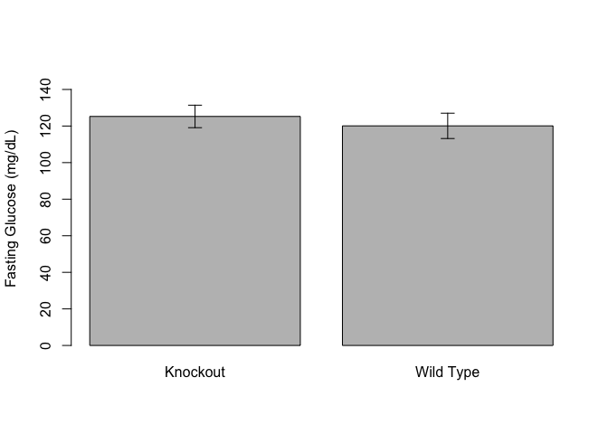
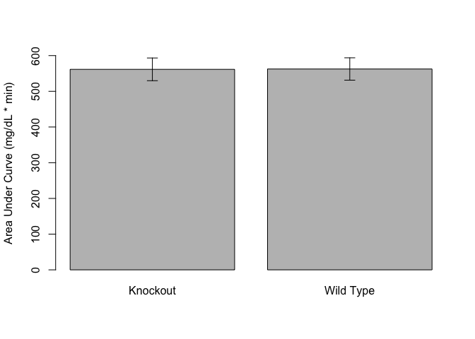

```
##             Df Sum Sq Mean Sq F value Pr(>F)
## Genotype     1      4       4       0   0.98
## Residuals   17 164311    9665
```

```
##   Tukey multiple comparisons of means
##     95% family-wise confidence level
## 
## Fit: aov(formula = auc ~ Genotype, data = data.no.unk)
## 
## $Genotype
##                     diff   lwr  upr p adj
## Wild Type-Knockout 0.955 -95.4 97.3 0.984
```

```
## 
## 	Pairwise comparisons using t tests with pooled SD 
## 
## data:  auc and Genotype 
## 
##           Knockout
## Wild Type 1       
## 
## P value adjustment method: bonferroni
```

# ITT Plots


## ITT Statistics


Table: Mixed linear model for effect of genotype on ITT values

                Df    AIC    BIC   logLik   deviance   Chisq   Chi Df   Pr(>Chisq)
-------------  ---  -----  -----  -------  ---------  ------  -------  -----------
itt.lme.null    12   1574   1613     -775       1550      NA       NA           NA
itt.lme.geno    13   1576   1618     -775       1550   0.001        1        0.982


Table: Tukey test of AUC with age and weight as covariates

term       comparison            estimate   conf.low   conf.high   adj.p.value
---------  -------------------  ---------  ---------  ----------  ------------
Genotype   Wild Type-Knockout         -14       -101        72.9         0.736


Table: Linear model of AUC after accounting for age and genotype

term                 estimate   std.error   statistic   p.value
------------------  ---------  ----------  ----------  --------
(Intercept)            486.88      210.81       2.310     0.036
Age                     -5.16        2.51      -2.058     0.057
Weight                  19.45        8.75       2.223     0.042
GenotypeWild Type      -14.47       41.41      -0.349     0.732



## Area Under Curve

<!-- -->

# Session Information


```r
sessionInfo()
```

```
## R version 3.5.0 (2018-04-23)
## Platform: x86_64-apple-darwin15.6.0 (64-bit)
## Running under: macOS  10.14.5
## 
## Matrix products: default
## BLAS: /Library/Frameworks/R.framework/Versions/3.5/Resources/lib/libRblas.0.dylib
## LAPACK: /Library/Frameworks/R.framework/Versions/3.5/Resources/lib/libRlapack.dylib
## 
## locale:
## [1] en_US.UTF-8/en_US.UTF-8/en_US.UTF-8/C/en_US.UTF-8/en_US.UTF-8
## 
## attached base packages:
## [1] stats     graphics  grDevices utils     datasets  methods   base     
## 
## other attached packages:
## [1] broom_0.5.2   lme4_1.1-21   Matrix_1.2-17 plyr_1.8.4    ggplot2_3.1.1
## [6] dplyr_0.8.1   tidyr_0.8.3   knitr_1.23   
## 
## loaded via a namespace (and not attached):
##  [1] Rcpp_1.0.1       nloptr_1.2.1     pillar_1.4.1     compiler_3.5.0  
##  [5] highr_0.8        tools_3.5.0      boot_1.3-22      digest_0.6.19   
##  [9] nlme_3.1-140     evaluate_0.14    tibble_2.1.3     gtable_0.3.0    
## [13] lattice_0.20-38  pkgconfig_2.0.2  rlang_0.3.4      yaml_2.2.0      
## [17] xfun_0.7         withr_2.1.2      stringr_1.4.0    generics_0.0.2  
## [21] grid_3.5.0       tidyselect_0.2.5 glue_1.3.1       R6_2.4.0        
## [25] rmarkdown_1.13   minqa_1.2.4      purrr_0.3.2      magrittr_1.5    
## [29] backports_1.1.4  scales_1.0.0     htmltools_0.3.6  splines_3.5.0   
## [33] MASS_7.3-51.4    assertthat_0.2.1 colorspace_1.4-1 stringi_1.4.3   
## [37] lazyeval_0.2.2   munsell_0.5.0    crayon_1.3.4
```
