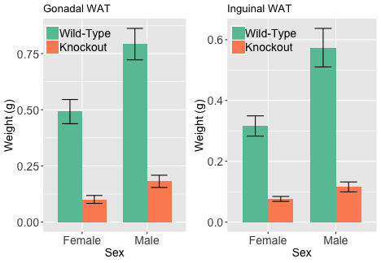
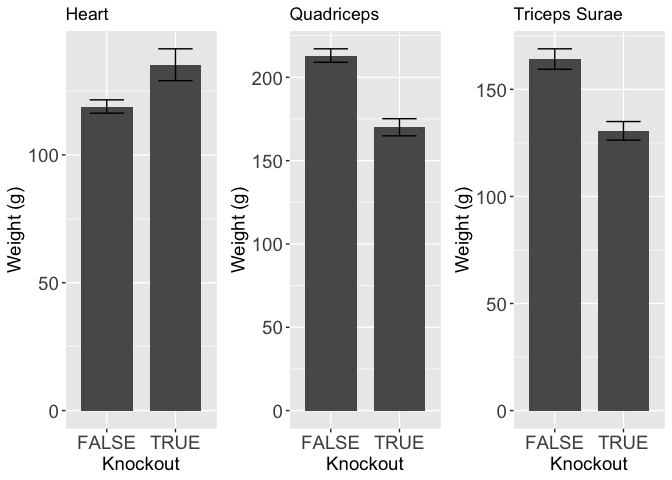

# Purpose

To determine tissue weights at sacrifice for fat pads and muscle tissues

# Experimental Details

At sacrifice, after a 16h fast data were entered and collected in the raw data sheet


These data can be found in **/Users/ejstephenson/Documents/GitHubClones/GitHub/TissueSpecificTscKnockouts/Mouse Data/Muscle Tsc1 Knockout/NCD** in a file named **NCD Sacrifice Data.xlsx**.  This script was most recently updated on **Fri Jul  5 16:50:59 2019**.

# Analysis


 EWAT_mean.na   IWAT_mean.na   Quadriceps_mean.na   TricepsSurae_mean.na   Heart_mean.na
-------------  -------------  -------------------  ---------------------  --------------
          453          341.0                  213                    164             119
          110           72.8                  170                    131             135


 EWAT_length   IWAT_length   Quadriceps_length   TricepsSurae_length   Heart_length
------------  ------------  ------------------  --------------------  -------------
          20            20                  20                    20             20
           8             8                   8                     8              8

## Fat Pad Weights



For the chow-fed mice, the fat pads were reduced in weight:


Table: Changes in Epididymal Fat Pad Weights

 Wild-Type   Knockout   Difference   Pct.Difference
----------  ---------  -----------  ---------------
       453        110          343             75.7


Table: Changes in Inguinal Fat Pad Weights

 Wild-Type   Knockout   Difference   Pct.Difference
----------  ---------  -----------  ---------------
       341       72.8          268             78.7


Table: Shapiro-Wilk Tests for each group

Knockout    IWAT_shapiro.p   EWAT_shapiro.p
---------  ---------------  ---------------
FALSE                0.001            0.038
TRUE                 0.102            0.602


Table: Pairwise tests for effects of knockout on Inguinal WAT weights.

 Levene   Mann.Whitney   Welch   Student
-------  -------------  ------  --------
  0.053              0       0     0.012


Table: Pairwise tests for effects of knockout on Gonadal WAT weights.

 Levene   Mann.Whitney   Welch   Student
-------  -------------  ------  --------
  0.014              0       0     0.002

For the chow-fed mice, normality can not be assumed, but not equal variance, so a Mann-Whitney t-test wsa used, which had a p-value of 0.000043 for inguinal WAT and 0.000019 for epididymal WAT.

## Muscle Weights



# Session Information


```r
sessionInfo()
```

```
## R version 3.5.2 (2018-12-20)
## Platform: x86_64-apple-darwin15.6.0 (64-bit)
## Running under: OS X El Capitan 10.11.6
## 
## Matrix products: default
## BLAS: /Library/Frameworks/R.framework/Versions/3.5/Resources/lib/libRblas.0.dylib
## LAPACK: /Library/Frameworks/R.framework/Versions/3.5/Resources/lib/libRlapack.dylib
## 
## locale:
## [1] en_US.UTF-8/en_US.UTF-8/en_US.UTF-8/C/en_US.UTF-8/en_US.UTF-8
## 
## attached base packages:
## [1] stats     graphics  grDevices utils     datasets  methods   base     
## 
## other attached packages:
##  [1] gridExtra_2.3      ggplot2_3.1.1      RColorBrewer_1.1-2
##  [4] car_3.0-2          carData_3.0-2      forcats_0.4.0     
##  [7] readxl_1.3.1       dplyr_0.8.0.1      tidyr_0.8.3       
## [10] knitr_1.22        
## 
## loaded via a namespace (and not attached):
##  [1] zip_2.0.1         Rcpp_1.0.1        plyr_1.8.4       
##  [4] cellranger_1.1.0  pillar_1.3.1      compiler_3.5.2   
##  [7] highr_0.8         tools_3.5.2       digest_0.6.18    
## [10] gtable_0.3.0      evaluate_0.13.1   tibble_2.1.1     
## [13] pkgconfig_2.0.2   rlang_0.3.4       openxlsx_4.1.0   
## [16] cli_1.1.0         curl_3.3          yaml_2.2.0       
## [19] haven_2.1.0       xfun_0.6          rio_0.5.16       
## [22] withr_2.1.2       stringr_1.4.0     hms_0.4.2        
## [25] grid_3.5.2        tidyselect_0.2.5  glue_1.3.1       
## [28] data.table_1.12.2 R6_2.4.0          foreign_0.8-71   
## [31] rmarkdown_1.12    purrr_0.3.2       magrittr_1.5     
## [34] scales_1.0.0      htmltools_0.3.6   assertthat_0.2.1 
## [37] abind_1.4-5       colorspace_1.4-1  labeling_0.3     
## [40] stringi_1.4.3     lazyeval_0.2.2    munsell_0.5.0    
## [43] crayon_1.3.4
```
