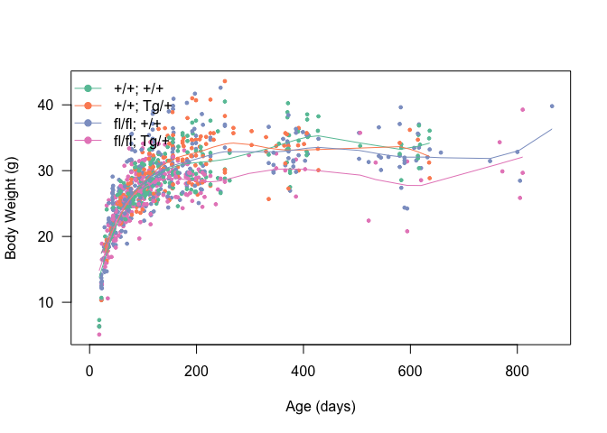
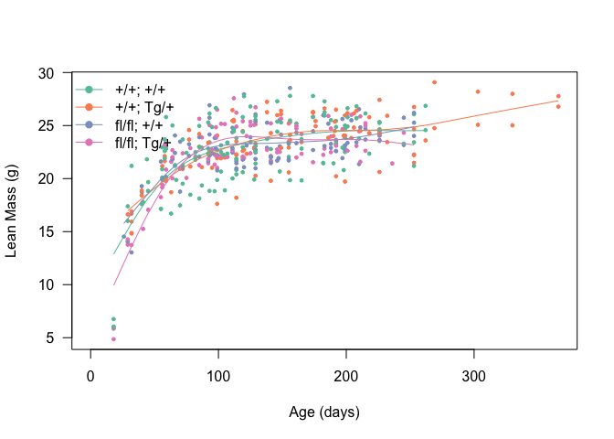
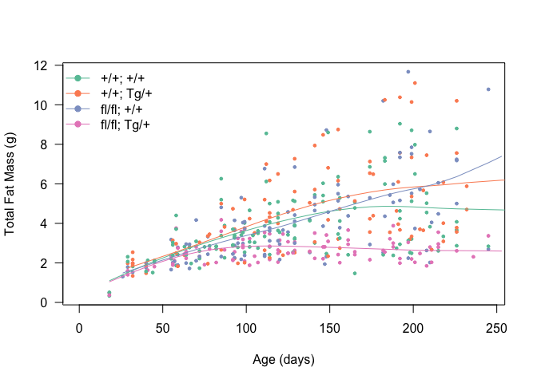
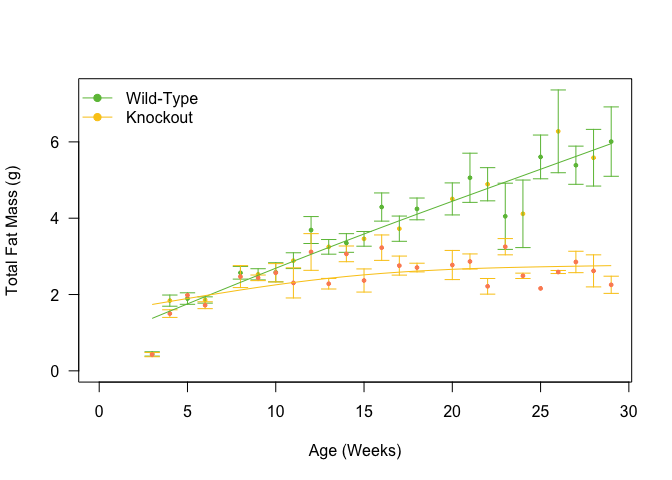
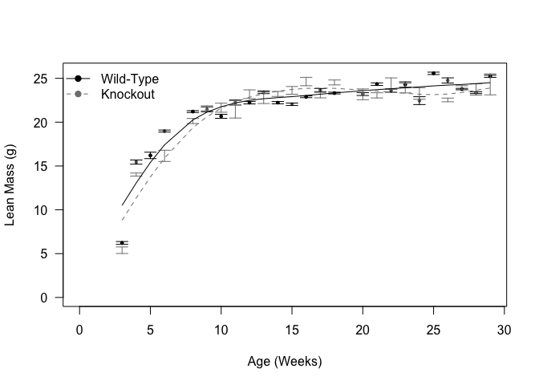
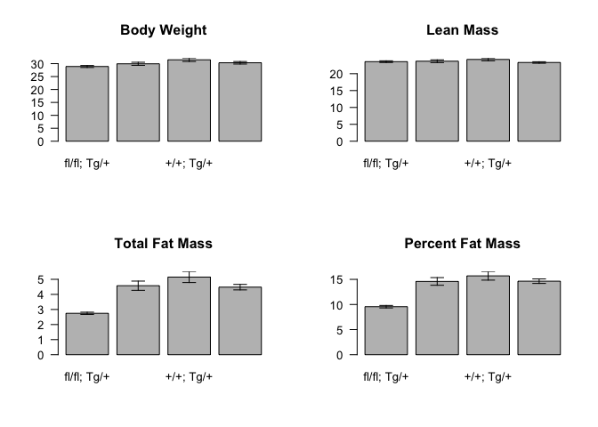
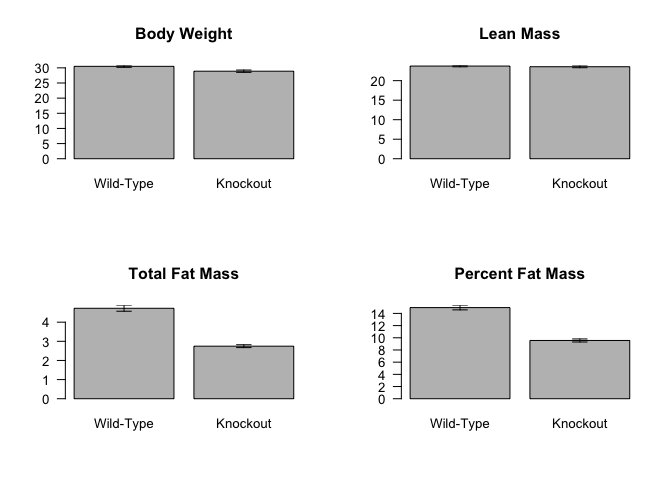

# Normal Chow Fed Animals


This retrieved 1934 measurements.

<!-- -->

<!-- -->

<!-- -->

<!-- -->

<!-- -->

# Summary

<!-- -->

This analysis uses measurements between 125175, with only one measurement per animal.

## Statistics

First, we tested whether there was a difference between the control animals.  The p-values for these tests are below:


Table: Statistical tests for control strains

                      Shapiro       ANOVA
-----------------  ----------  ----------
Total.Fat.Mass      0.0833905   0.3776970
Percent.Fat.Mass    0.6192229   0.6039856
Body.Weight         0.4143959   0.2316470
Lean.Mass           0.2196330   0.3551032

These tests suggest that it is appropriate to combine the controls and compare to the knockouts.  These tests are shown below:

<!-- -->

Table: Pairwise tests for body composition, after combining the controls

                      Shapiro      Levene  Test              pval
-----------------  ----------  ----------  ----------  ----------
Total.Fat.Mass      0.0197057   0.0001100  Wilcoxon     0.0000013
Percent.Fat.Mass    0.5344418   0.0006355  Welch's      0.0000000
Body.Weight         0.4466816   0.0061261  Welch's      0.6995812
Lean.Mass           0.1831920   0.1821235  Student's    0.7438294

The total fat mass was reduced by 41.8939496% wheras the percent fat mass was reduced by 36.0694359%.

## Mixed Linear Model


Table: Model covariates for mixed linear model of fat mass

term                          estimate     std.error    statistic  group     
-------------------------  -----------  ------------  -----------  ----------
(Intercept)                 1903.34574   207.6461560    9.1662941  fixed     
age                           15.42241     0.8413327   18.3309291  fixed     
KnockoutTRUE                 353.88807   460.4360315    0.7685933  fixed     
age:KnockoutTRUE             -12.92736     2.1185806   -6.1018973  fixed     
sd_(Intercept).animal.id    1285.91653            NA           NA  animal.id 
sd_Observation.Residual      963.61939            NA           NA  Residual  


Table: Mixed linear model for fat mass modified by knockout status

term                 df        AIC        BIC      logLik   deviance   statistic   Chi.Df   p.value
------------------  ---  ---------  ---------  ----------  ---------  ----------  -------  --------
fat.mass.lme.null     4   8009.375   8025.978   -4000.688   8001.375          NA       NA        NA
fat.mass.lme          6   7968.427   7993.331   -3978.213   7956.427    44.94859        2         0

Based on a mixed linear model there was a significant effect of knockout reducing the accretion of fat mass (p=1.7359526&times; 10^-10^).  Comparing the slopes of the lines there was an 83.8219239 reduction in fat mass gain.

# Session Information

```
## R version 3.5.0 (2018-04-23)
## Platform: x86_64-apple-darwin15.6.0 (64-bit)
## Running under: macOS  10.14.4
## 
## Matrix products: default
## BLAS: /Library/Frameworks/R.framework/Versions/3.5/Resources/lib/libRblas.0.dylib
## LAPACK: /Library/Frameworks/R.framework/Versions/3.5/Resources/lib/libRlapack.dylib
## 
## locale:
## [1] en_US.UTF-8/en_US.UTF-8/en_US.UTF-8/C/en_US.UTF-8/en_US.UTF-8
## 
## attached base packages:
## [1] stats     graphics  grDevices utils     datasets  methods   base     
## 
## other attached packages:
##  [1] broom_0.5.1        lme4_1.1-19        Matrix_1.2-15     
##  [4] car_3.0-2          carData_3.0-2      tidyr_0.8.2       
##  [7] bindrcpp_0.2.2     dplyr_0.7.8        RColorBrewer_1.1-2
## [10] knitr_1.21        
## 
## loaded via a namespace (and not attached):
##  [1] zip_1.0.0         Rcpp_1.0.0        plyr_1.8.4       
##  [4] nloptr_1.2.1      pillar_1.3.1      compiler_3.5.0   
##  [7] cellranger_1.1.0  highr_0.7         bindr_0.1.1      
## [10] forcats_0.3.0     tools_3.5.0       digest_0.6.18    
## [13] nlme_3.1-137      lattice_0.20-38   evaluate_0.12    
## [16] tibble_2.0.0      pkgconfig_2.0.2   rlang_0.3.1      
## [19] openxlsx_4.1.0    curl_3.2          yaml_2.2.0       
## [22] haven_2.0.0       xfun_0.4          rio_0.5.16       
## [25] stringr_1.3.1     generics_0.0.2    hms_0.4.2        
## [28] grid_3.5.0        tidyselect_0.2.5  glue_1.3.0       
## [31] data.table_1.11.8 R6_2.3.0          readxl_1.2.0     
## [34] foreign_0.8-71    rmarkdown_1.11    minqa_1.2.4      
## [37] purrr_0.2.5       magrittr_1.5      backports_1.1.3  
## [40] MASS_7.3-51.1     splines_3.5.0     htmltools_0.3.6  
## [43] abind_1.4-5       assertthat_0.2.0  stringi_1.2.4    
## [46] crayon_1.3.4
```
