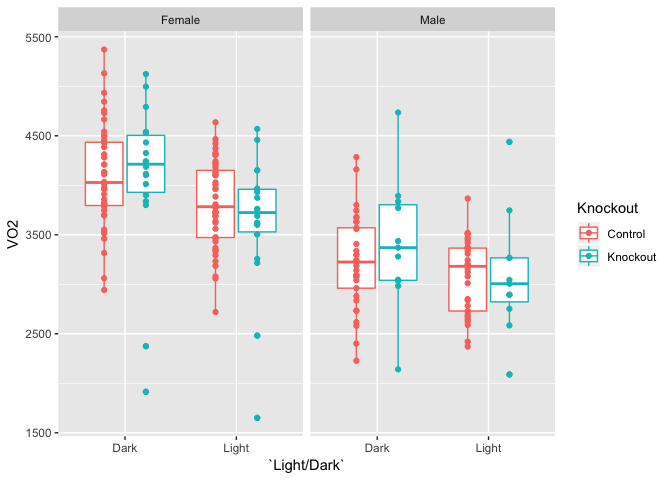
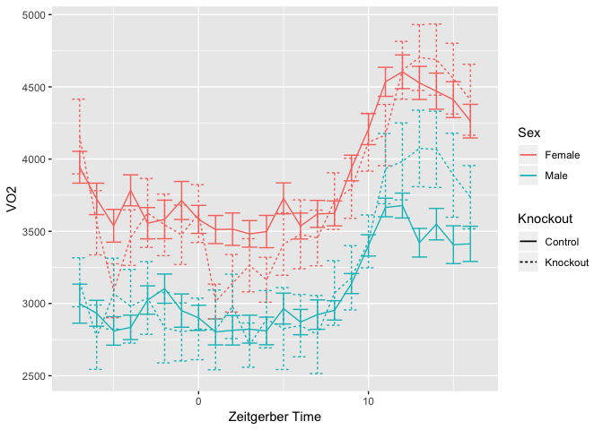

# Purpose

To evaluate energy expenditure and other parameters in muscle _Tsc1_ knockout mice.  This script was most recently updated on **Thu Jan 31 14:39:11 2019**.

# Experimental Details

Mice were run in the CLAMS in several batches, and combined.

# Raw Data

## Sample Key


## Oxymax Input

There are two batches of data, baseline and after 3 months of diet.

### Baseline Data


Table: Total animals tested by genotype

Genotype      Sex        n
------------  -------  ---
+/+; +/+      Female    16
+/+; +/+      Male      17
+/+; Tg/+     Female    11
+/+; Tg/+     Male       8
fl/fl; +/+    Female    17
fl/fl; +/+    Male       8
fl/fl; Tg/+   Female    18
fl/fl; Tg/+   Male      11


Table: Total animals tested by knockout

Knockout   Sex        n
---------  -------  ---
Control    Female    44
Control    Male      33
Knockout   Female    18
Knockout   Male      11

## VO2 Summary

<!-- --><!-- -->

# Interpretation

A brief summary of what the interpretation of these results were

# Session Information


```r
sessionInfo()
```

```
## R version 3.5.0 (2018-04-23)
## Platform: x86_64-apple-darwin15.6.0 (64-bit)
## Running under: macOS  10.14.2
## 
## Matrix products: default
## BLAS: /Library/Frameworks/R.framework/Versions/3.5/Resources/lib/libRblas.0.dylib
## LAPACK: /Library/Frameworks/R.framework/Versions/3.5/Resources/lib/libRlapack.dylib
## 
## locale:
## [1] en_US.UTF-8/en_US.UTF-8/en_US.UTF-8/C/en_US.UTF-8/en_US.UTF-8
## 
## attached base packages:
## [1] stats     graphics  grDevices utils     datasets  methods   base     
## 
## other attached packages:
## [1] ggplot2_3.1.0   lubridate_1.7.4 readr_1.3.1     bindrcpp_0.2.2 
## [5] readxl_1.2.0    dplyr_0.7.8     tidyr_0.8.2     knitr_1.21     
## 
## loaded via a namespace (and not attached):
##  [1] Rcpp_1.0.0       pillar_1.3.1     compiler_3.5.0   cellranger_1.1.0
##  [5] highr_0.7        plyr_1.8.4       bindr_0.1.1      tools_3.5.0     
##  [9] digest_0.6.18    evaluate_0.12    tibble_2.0.0     gtable_0.2.0    
## [13] pkgconfig_2.0.2  rlang_0.3.1      yaml_2.2.0       xfun_0.4        
## [17] withr_2.1.2      stringr_1.3.1    hms_0.4.2        grid_3.5.0      
## [21] tidyselect_0.2.5 glue_1.3.0       R6_2.3.0         rmarkdown_1.11  
## [25] reshape2_1.4.3   purrr_0.2.5      magrittr_1.5     scales_1.0.0    
## [29] htmltools_0.3.6  assertthat_0.2.0 colorspace_1.3-2 labeling_0.3    
## [33] stringi_1.2.4    lazyeval_0.2.1   munsell_0.5.0    crayon_1.3.4
```
