# Purpose

To evaluate energy expenditure and other parameters in muscle _Tsc1_ knockout mice.  This script was most recently updated on **Tue Jul 16 08:46:14 2019**.

# Experimental Details

Mice were run in the CLAMS in several batches, and combined.

# Raw Data

## Sample Key


## Oxymax Input

There are two batches of data, baseline and after 3 months of diet.

### Baseline Data


Table: Total animals tested by genotype

Genotype      Sex        n
------------  -------  ---
NA            NA        24
+/+; +/+      Female    16
+/+; +/+      Male      16
+/+; Tg/+     Female    11
+/+; Tg/+     Male       8
fl/fl; +/+    Female    17
fl/fl; +/+    Male       8
fl/fl; Tg/+   Female    18
fl/fl; Tg/+   Male      11


Table: Total animals tested by knockout

Knockout   Sex        n
---------  -------  ---
NA         NA        24
Control    Female    44
Control    Male      32
Knockout   Female    18
Knockout   Male      11

The baseline raw data files can be found in Oxymax/Oxymax files by time period/Baseline.  The MRI data can be found in EchoMRI.

## VO2 Analysis

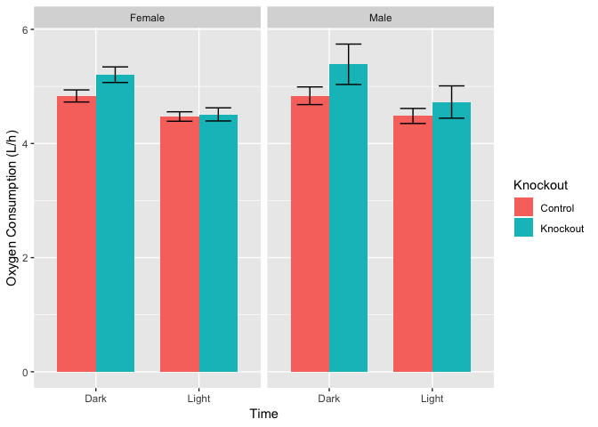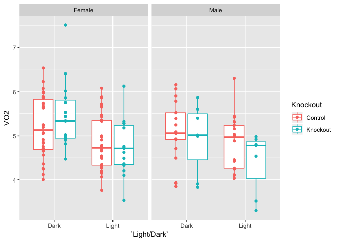

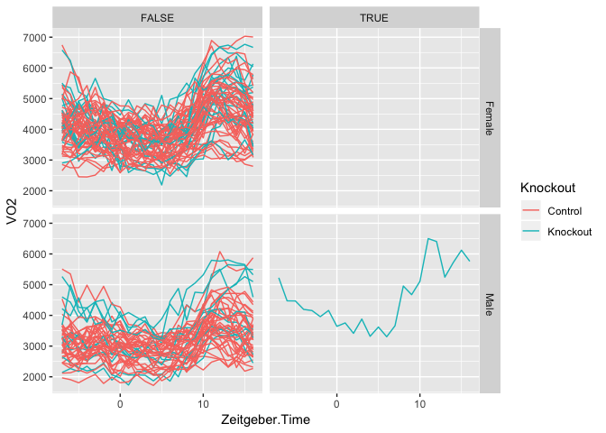<!-- -->

### VO2 Summary Data

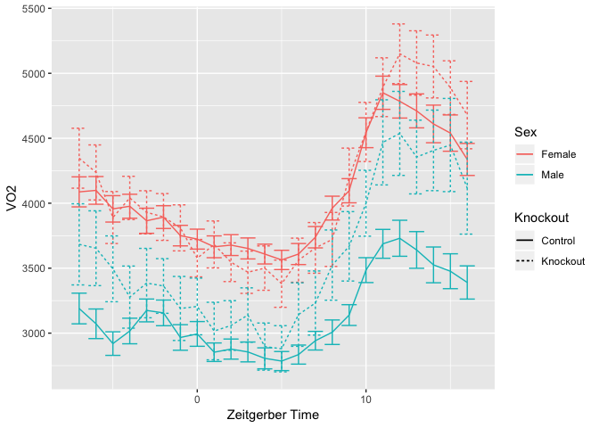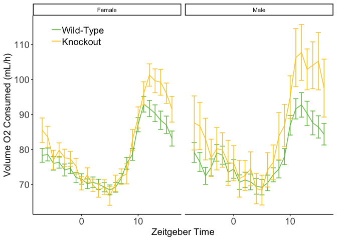

## VCO2 Analysis

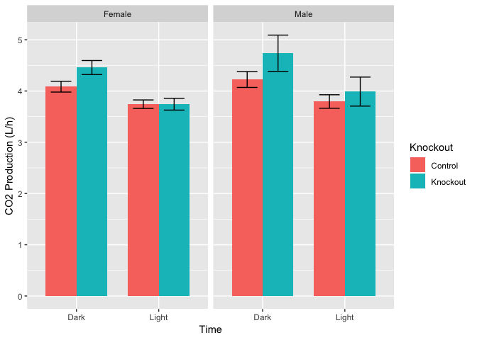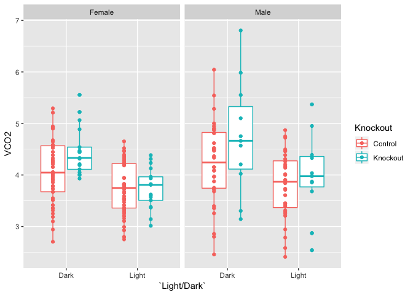

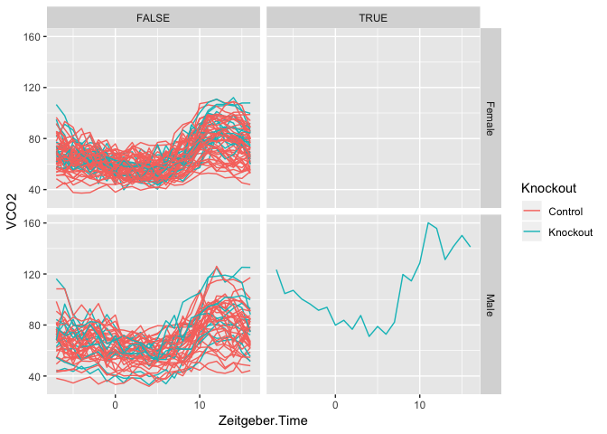<!-- -->

### VCO2 Summary Data
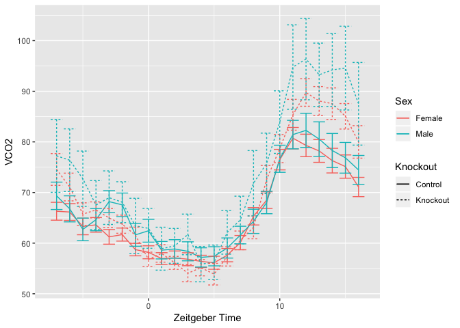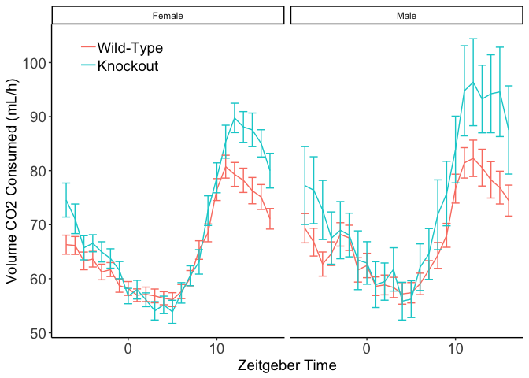
# Heat Production

Another way to present these data is to evaluate this by heat instead of VO2. We calculated this manually from VO2 data.  The equation for Heat production from the CLAMS is the Lusk Equation:

$$(3.815 + 1.232 * RER)*VO2$$

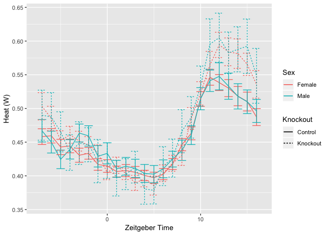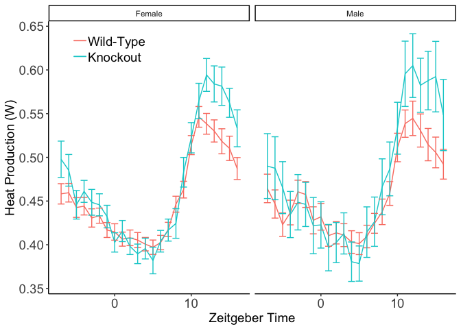

## Heat Statistics


Table: Average changes in heat production comparing wt to knockout

Sex      Light/Dark    Control   Knockout   Change   Pct.Change
-------  -----------  --------  ---------  -------  -----------
Female   Dark            0.470      0.504    0.034        7.221
Female   Light           0.434      0.433   -0.001       -0.173
Male     Dark            0.474      0.504    0.030        6.395
Male     Light           0.437      0.439    0.003        0.581

To test whether these groups are different we constructed a linear model with the following formula:

Heat ~ as.factor(Zeitgeber.Time) + Lean + Sex + `Light/Dark` + Knockout + Knockout:`Light/Dark` + (1 | Subject).  

We used this model because the base model was that Heat production changes over the day.  We asked if lean mass modified the time dependent effect, and it did (p=0.008).  After adjusting for lean mass, we asked if there was any additional benefit to including the light/dark cycle in addition to the time of day, and found that there was no significant effect, so that was not included in the model (p=1).  we added sex as a covariate which had no significant effect 0.003. We chose to keep sex in the model though as it was borderline significant.  We next added knockout to the model and found no significant effect 0.147.  Finally we asked if Sex modified the effect of the knockout and found no significant effect 0.417.

Since it appears from the figures that the elevation in energy expenditure is restricted to the awake cycle, we next asked if there was an *interaction* between genotype and the Light/Dark cycle.  Adding this interaction was highly significant 7.304&times; 10^-16^.  

The full results are shown below:


Table: Estimates and p-values from mixed linear models, excluding time of day.

                                      Estimate   Std..Error   t.value     p.z
-----------------------------------  ---------  -----------  --------  ------
Lean                                     0.013        0.003      4.24   0.000
SexMale                                 -0.061        0.020     -3.11   0.002
KnockoutKnockout                         0.035        0.013      2.64   0.008
`Light/Dark`Light:KnockoutKnockout      -0.032        0.004     -8.28   0.000

# RER Analysis

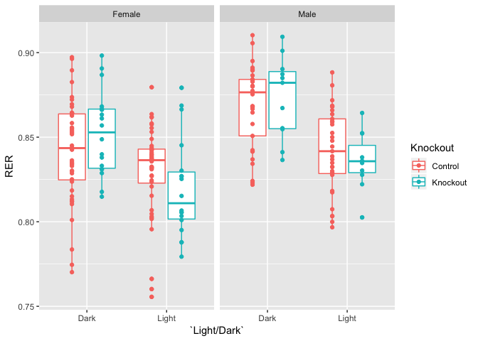

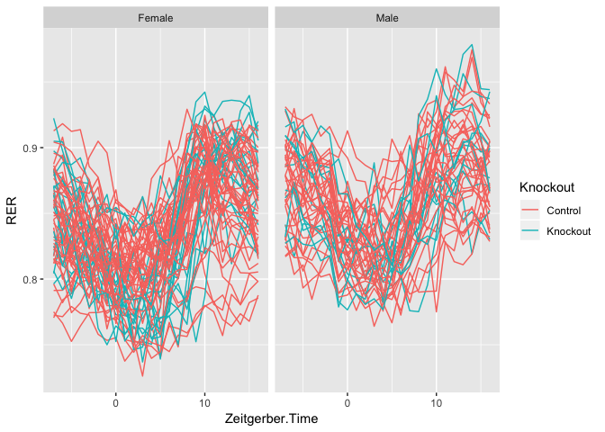<!-- -->

### RER Summary Data

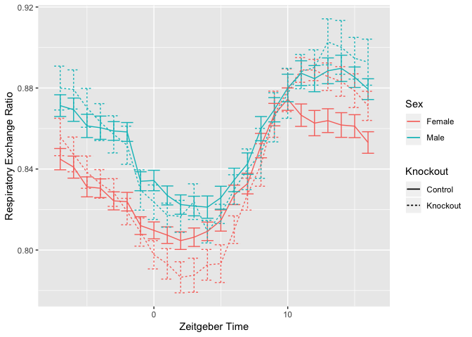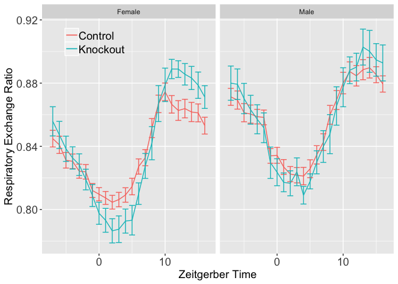

# Carbohydrate Oxidation Analysis

Calculated as $Carbohydrate\ oxidation = (4.585 * vCO_2) - (3.226 * vO_2)$ where both units are in L/min and the output is in g/min

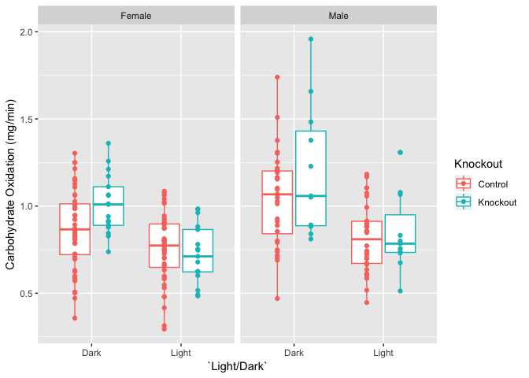

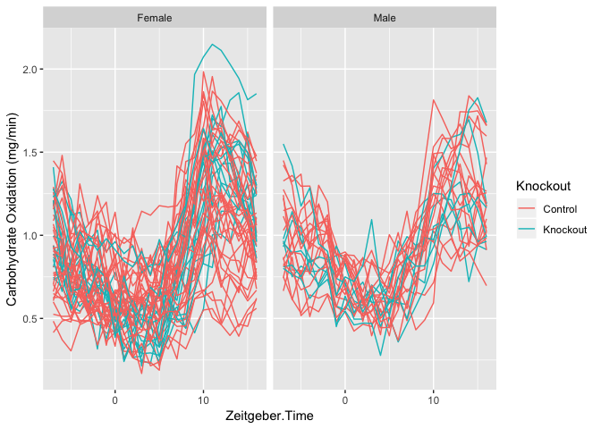<!-- -->

### Carbohydrate Oxidation Summary Data

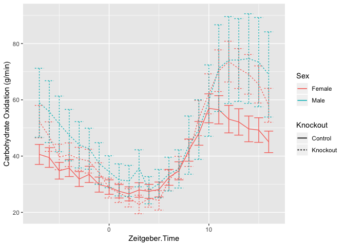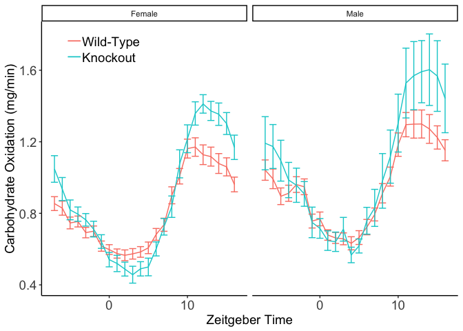

### Carbohydrate Oxidation Statistics


Table: Average changes in carbohydrate production comparing wt to knockout

Sex      Light/Dark    Control   Knockout   Change   Pct.Change
-------  -----------  --------  ---------  -------  -----------
Female   Dark            0.871      1.012    0.141        16.19
Female   Light           0.758      0.724   -0.034        -4.45
Male     Dark            1.045      1.204    0.158        15.15
Male     Light           0.816      0.844    0.028         3.42

To test whether these groups are different we constructed a linear model with the following formula:

CHO Oxidation ~ as.factor(Zeitgeber.Time) + Lean + Sex + `Light/Dark` + Knockout + Knockout:`Light/Dark` + (1 | Subject).  

We used this model because the base model was that carbohydrate oxidation changes over the day.  We asked if lean mass modified the time dependent effect, and it did (p=0.001).  After adjusting for lean mass, we asked if there was any additional benefit to including the light/dark cycle in addition to the time of day, and found that there was no significant effect, so that was not included in the model (p=1).  We added sex as a covariate which had no significant effect 0.432. We chose to keep sex in the model though.  We next added knockout to the model and found no significant effect 0.09.  Finally we asked if Sex modified the effect of the knockout and found no significant effect 0.438.

Since it appears from the figures that the elevation in energy expenditure is restricted to the awake cycle, we next asked if there was an *interaction* between genotype and the Light/Dark cycle.  Adding this interaction was highly significant 6.432&times; 10^-18^.  

The full results are shown below:


Table: Estimates and p-values from mixed linear models, excluding time of day.

                                      Estimate   Std..Error   t.value     p.z
-----------------------------------  ---------  -----------  --------  ------
Lean                                     0.017        0.011     1.545   0.122
SexMale                                  0.054        0.069     0.781   0.435
KnockoutKnockout                         0.160        0.048     3.337   0.001
`Light/Dark`Light:KnockoutKnockout      -0.159        0.018    -8.804   0.000

# Lipid Oxidation Analysis

Calculated as $Lipid\ oxidation = (1.695 * vO_2) - (1.701 * vCO_2)$ where both units are in L/min and the output is in g/min

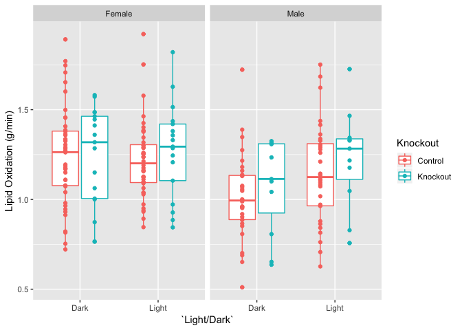

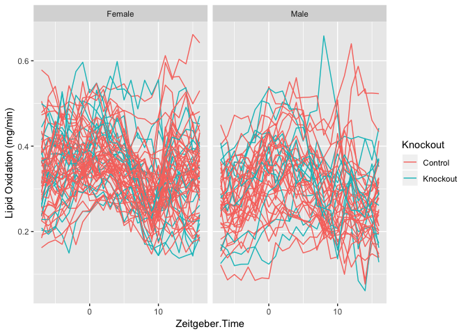<!-- -->

### Lipid Oxidation Summary Data

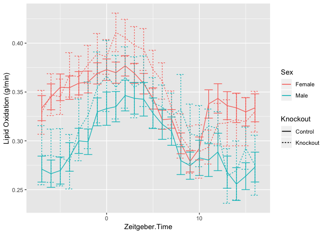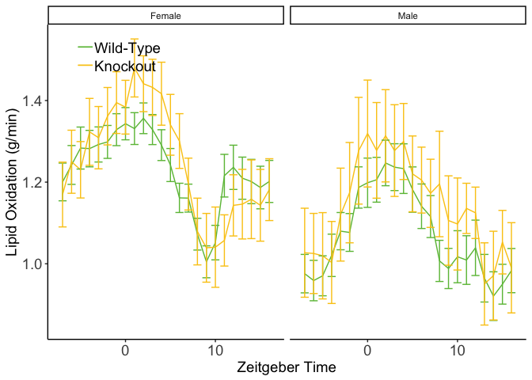

### Lipid versus CHO Oxidation

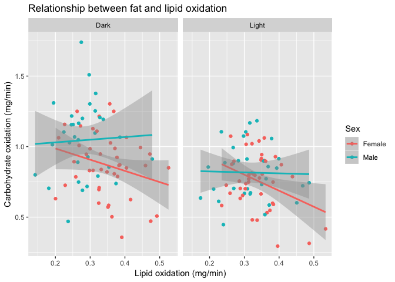

## Activity Analysis

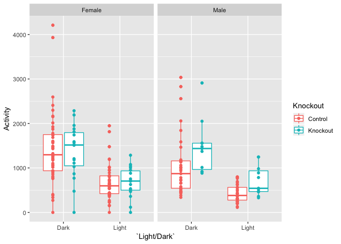

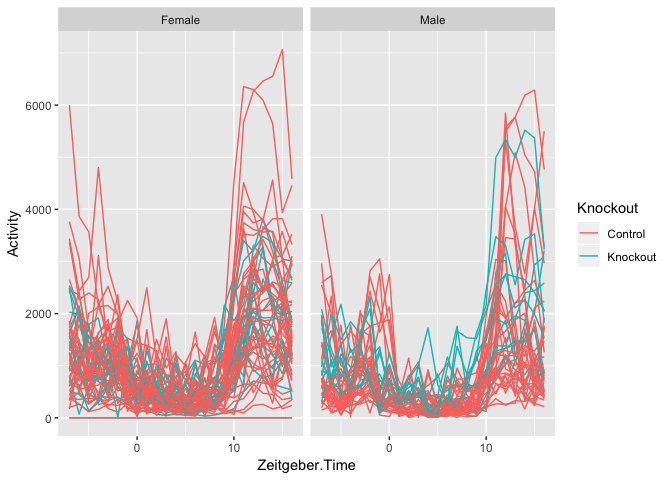<!-- -->

### Activity Summary Data

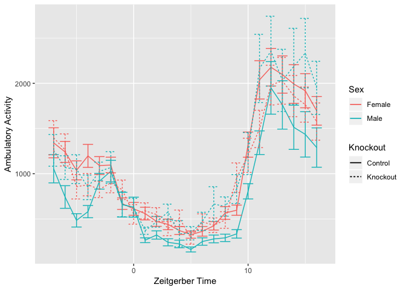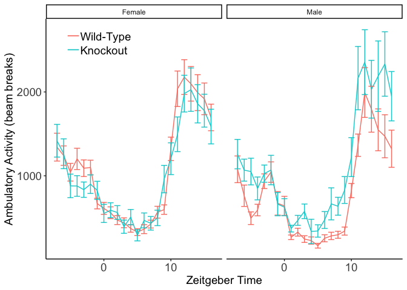


# Interpretation

A brief summary of what the interpretation of these results were

# Session Information


```r
sessionInfo()
```

```
## R version 3.5.0 (2018-04-23)
## Platform: x86_64-apple-darwin15.6.0 (64-bit)
## Running under: macOS  10.14.5
## 
## Matrix products: default
## BLAS: /Library/Frameworks/R.framework/Versions/3.5/Resources/lib/libRblas.0.dylib
## LAPACK: /Library/Frameworks/R.framework/Versions/3.5/Resources/lib/libRlapack.dylib
## 
## locale:
## [1] en_US.UTF-8/en_US.UTF-8/en_US.UTF-8/C/en_US.UTF-8/en_US.UTF-8
## 
## attached base packages:
## [1] stats     graphics  grDevices utils     datasets  methods   base     
## 
## other attached packages:
##  [1] multcomp_1.4-10   TH.data_1.0-10    MASS_7.3-51.4    
##  [4] survival_2.44-1.1 mvtnorm_1.0-10    lme4_1.1-21      
##  [7] Matrix_1.2-17     ggplot2_3.1.1     lubridate_1.7.4  
## [10] readr_1.3.1       readxl_1.3.1      dplyr_0.8.1      
## [13] tidyr_0.8.3       knitr_1.23       
## 
## loaded via a namespace (and not attached):
##  [1] Rcpp_1.0.1       nloptr_1.2.1     cellranger_1.1.0 pillar_1.4.1    
##  [5] compiler_3.5.0   highr_0.8        plyr_1.8.4       tools_3.5.0     
##  [9] boot_1.3-22      digest_0.6.19    nlme_3.1-140     lattice_0.20-38 
## [13] evaluate_0.14    tibble_2.1.3     gtable_0.3.0     pkgconfig_2.0.2 
## [17] rlang_0.3.4      yaml_2.2.0       xfun_0.7         withr_2.1.2     
## [21] stringr_1.4.0    hms_0.4.2        grid_3.5.0       tidyselect_0.2.5
## [25] glue_1.3.1       R6_2.4.0         rmarkdown_1.13   minqa_1.2.4     
## [29] purrr_0.3.2      reshape2_1.4.3   magrittr_1.5     codetools_0.2-16
## [33] splines_3.5.0    scales_1.0.0     htmltools_0.3.6  assertthat_0.2.1
## [37] colorspace_1.4-1 labeling_0.3     sandwich_2.5-1   stringi_1.4.3   
## [41] lazyeval_0.2.2   munsell_0.5.0    crayon_1.3.4     zoo_1.8-6
```
