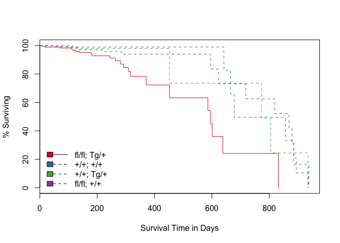
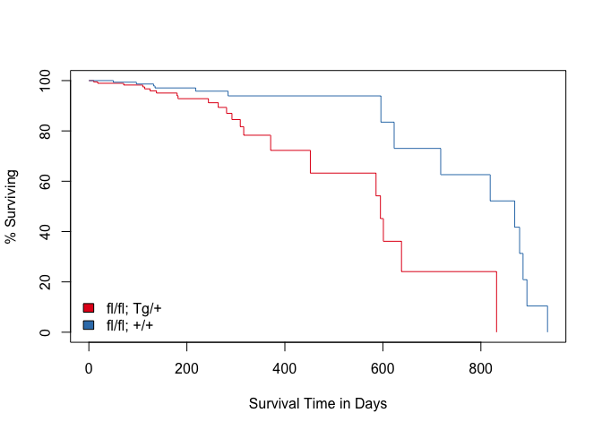
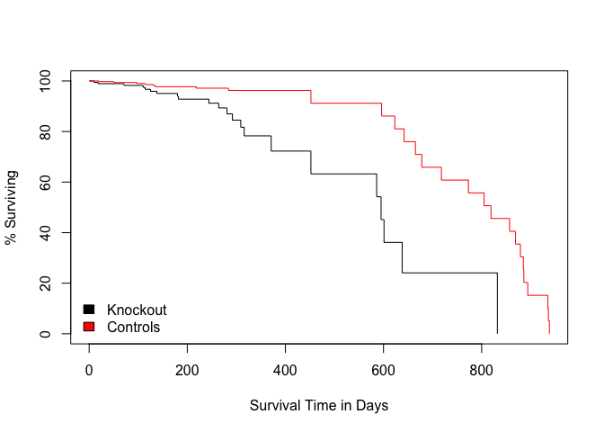
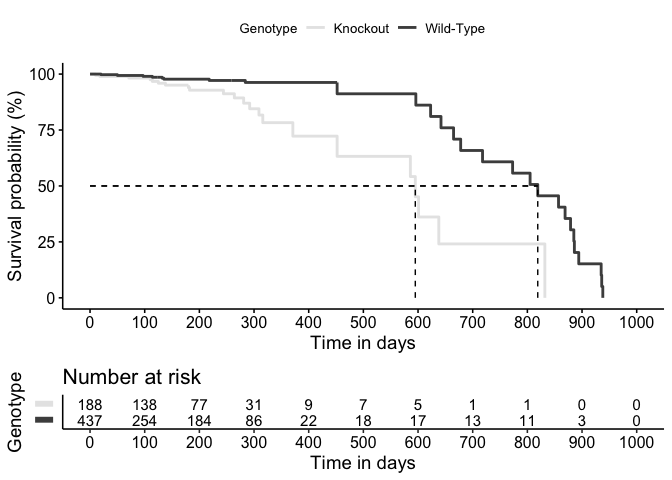
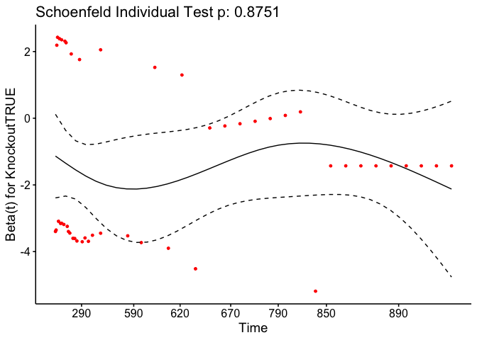
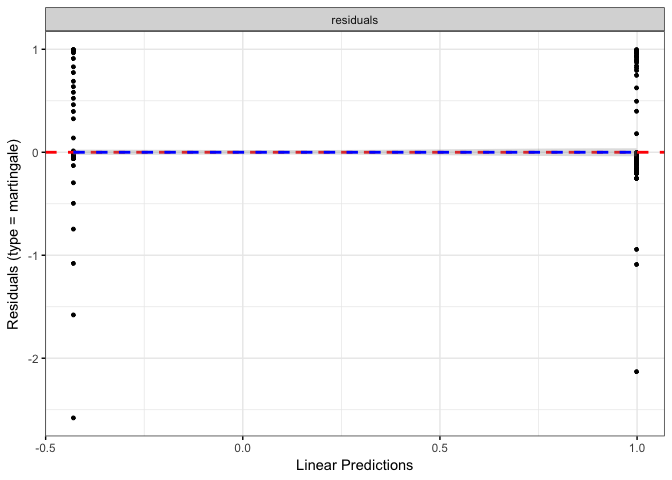
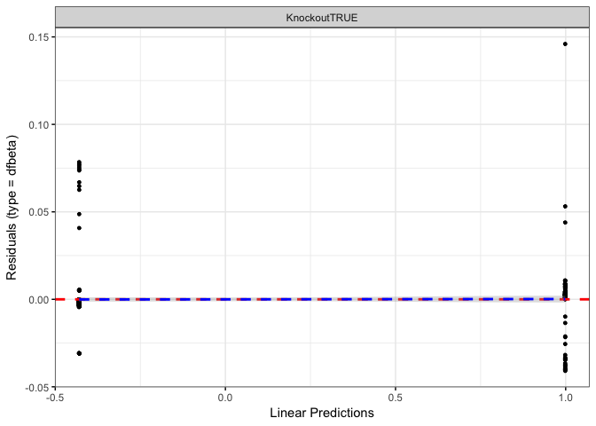
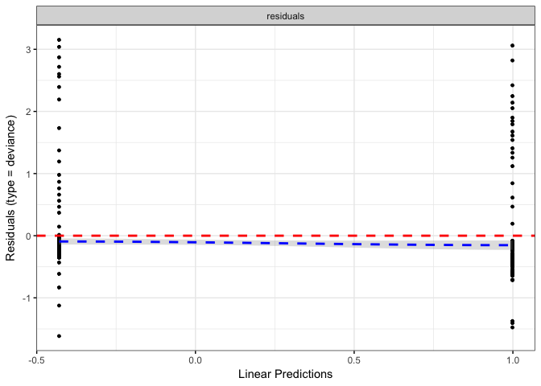

# Data Entry

These data are accumulated from the database.  The analysis includes all alive animals, animals which were sacrificed and animals which died of natural causes (denoted in the database as "Unknown").  Animals which died with an estimated death date are excluded from the analysis.  We are testing the effects of age on death by natural causes.  This script is located in /Users/davebrid/Documents/GitHub/TissueSpecificTscKnockouts/Mouse Data/Muscle Tsc1 Knockout and was most recently run on Wed Aug 15 12:58:25 2018.


# Mck-TSC1 Mice

```
## [1] 292
```

## Analysis

The data is saved in /Users/davebrid/Documents/GitHub/TissueSpecificTscKnockouts/Mouse Data/Muscle Tsc1 Knockout with the data saved as Mouse Gerontology Log.csv and analysed using R \cite{base}.
The data was analysed using the survival package \cite{survival1, survival2}.  Log rank tests were performed using the coin package \cite{coin1, coin2}.
This plot analyses all of the natural deaths (marked in the database as unknown).  The median age at death was 272.5 for knockout mice and 623 for control mice

<!-- -->
This analysis contains a total of **625** animals, from which we have detected **49** natural deaths.  See Table below for a summary of natural deaths and see the figure below for the combined death curves with errors.

## Comparing all Four Genotypes
This analysis looks at all four genotypes for *Ckmm-Tsc1*.


```
## 
## 	Asymptotic K-Sample Logrank Test
## 
## data:  survobj.mck by
## 	 Genotype (fl/fl; Tg/+, +/+; +/+, +/+; Tg/+, fl/fl; +/+)
## chi-squared = 20, df = 3, p-value = 0.001
```

The chi-squared test for comparing all four genotypes is significant, with a p-value of 0.  The results of these tests are in the table below.  The effects of each genotype, relative to the knockout strains are in Table \ref{tab:mck-coef}. These data are visualised in the figure.  This means that the knockout mice are 3.667 to 5.347 times more likely to die at any given time, depending on the strain.


Table: Muscle TSC1 Knockout Tests

                         test   df     pvalue
----------------------  -----  ---  ---------
Likelihood ratio test      19    3   0.000322
Wald test                  18    3   0.000348
Score (logrank) test       21    3   0.000088


Table: Muscle TSC1 Knockout Coefficients, relative to Knockout

                       beta      se   2.5 %   97.5 %          p
-------------------  ------  ------  ------  -------  ---------
Genotype+/+; +/+      -1.68   0.187   -2.65   -0.705   0.000719
Genotype+/+; Tg/+     -1.46   0.232   -2.48   -0.440   0.004996
Genotypefl/fl; +/+    -1.30   0.273   -2.04   -0.561   0.000565

# Comparing Floxed to Knockout
This section only compares fl/fl;+/+ to fl/fl;Tg/+.


The chi-squared test for comparing the two genotypes is significant, with a p-value of 0.002.  The results of these tests are in the table below.  The effects of each genotype, relative to the knockout strains are in the table below. These results are presented graphically in the figure below.  This means that the knockout mice are 3.277 times more likely to die at any given time.


Table: Muscle TSC1 Knockout Tests (WT vs KO)

                         test   df   pvalue
----------------------  -----  ---  -------
Likelihood ratio test      10    1   0.0015
Wald test                   9    1   0.0026
Score (logrank) test       10    1   0.0015


Table: Muscle TSC1 Knockout Coefficients, relative to Knockout

                       beta      se   2.5 %   97.5 %        p
-------------------  ------  ------  ------  -------  -------
Genotypefl/fl; +/+    -1.19   0.305   -1.96   -0.415   0.0026

# Comparing Control Strains


The chi-squared test for comparing the three control genotypes is not significant, with a p-value of 0.772. 


# Death Logs
This table shows the age, and at risk individuals for each natural death, along with the \% survival and the confidence intervals.

 time   n.risk   n.event   n.censor    surv   std.err   upper   lower  strata      
-----  -------  --------  ---------  ------  --------  ------  ------  ------------
   10      188         1          0   0.995     0.005   1.000   0.984  fl/fl; Tg/+ 
   17      187         0          3   0.995     0.005   1.000   0.984  fl/fl; Tg/+ 
   18      184         1          7   0.989     0.008   1.000   0.975  fl/fl; Tg/+ 
   19      176         0          1   0.989     0.008   1.000   0.975  fl/fl; Tg/+ 
   21      175         0          3   0.989     0.008   1.000   0.975  fl/fl; Tg/+ 
   22      172         0          1   0.989     0.008   1.000   0.975  fl/fl; Tg/+ 
   28      171         0          2   0.989     0.008   1.000   0.975  fl/fl; Tg/+ 
   30      169         0          1   0.989     0.008   1.000   0.975  fl/fl; Tg/+ 
   31      168         0          2   0.989     0.008   1.000   0.975  fl/fl; Tg/+ 
   33      166         0          1   0.989     0.008   1.000   0.975  fl/fl; Tg/+ 
   34      165         0          1   0.989     0.008   1.000   0.975  fl/fl; Tg/+ 
   41      164         0          3   0.989     0.008   1.000   0.975  fl/fl; Tg/+ 
   42      161         0          3   0.989     0.008   1.000   0.975  fl/fl; Tg/+ 
   43      158         0          1   0.989     0.008   1.000   0.975  fl/fl; Tg/+ 
   48      157         0          2   0.989     0.008   1.000   0.975  fl/fl; Tg/+ 
   50      155         0          1   0.989     0.008   1.000   0.975  fl/fl; Tg/+ 
   58      154         0          1   0.989     0.008   1.000   0.975  fl/fl; Tg/+ 
   60      153         0          1   0.989     0.008   1.000   0.975  fl/fl; Tg/+ 
   62      152         0          2   0.989     0.008   1.000   0.975  fl/fl; Tg/+ 
   63      150         0          3   0.989     0.008   1.000   0.975  fl/fl; Tg/+ 
   64      147         0          1   0.989     0.008   1.000   0.975  fl/fl; Tg/+ 
   69      146         0          1   0.989     0.008   1.000   0.975  fl/fl; Tg/+ 
   71      145         1          0   0.982     0.010   1.000   0.963  fl/fl; Tg/+ 
   78      144         0          2   0.982     0.010   1.000   0.963  fl/fl; Tg/+ 
   85      142         0          2   0.982     0.010   1.000   0.963  fl/fl; Tg/+ 
   89      140         0          2   0.982     0.010   1.000   0.963  fl/fl; Tg/+ 
  102      138         0          2   0.982     0.010   1.000   0.963  fl/fl; Tg/+ 
  103      136         0          3   0.982     0.010   1.000   0.963  fl/fl; Tg/+ 
  108      133         0          4   0.982     0.010   1.000   0.963  fl/fl; Tg/+ 
  110      129         1          0   0.975     0.013   1.000   0.950  fl/fl; Tg/+ 
  111      128         0          1   0.975     0.013   1.000   0.950  fl/fl; Tg/+ 
  112      127         0          1   0.975     0.013   1.000   0.950  fl/fl; Tg/+ 
  114      126         1          0   0.967     0.015   0.996   0.939  fl/fl; Tg/+ 
  123      125         0          1   0.967     0.015   0.996   0.939  fl/fl; Tg/+ 
  124      124         0          3   0.967     0.015   0.996   0.939  fl/fl; Tg/+ 
  125      121         1          0   0.959     0.017   0.992   0.927  fl/fl; Tg/+ 
  130      120         0          1   0.959     0.017   0.992   0.927  fl/fl; Tg/+ 
  132      119         0          6   0.959     0.017   0.992   0.927  fl/fl; Tg/+ 
  137      113         0          1   0.959     0.017   0.992   0.927  fl/fl; Tg/+ 
  138      112         1          0   0.951     0.019   0.988   0.915  fl/fl; Tg/+ 
  147      111         0          1   0.951     0.019   0.988   0.915  fl/fl; Tg/+ 
  148      110         0          3   0.951     0.019   0.988   0.915  fl/fl; Tg/+ 
  150      107         0          3   0.951     0.019   0.988   0.915  fl/fl; Tg/+ 
  153      104         0          2   0.951     0.019   0.988   0.915  fl/fl; Tg/+ 
  160      102         0          3   0.951     0.019   0.988   0.915  fl/fl; Tg/+ 
  164       99         0          2   0.951     0.019   0.988   0.915  fl/fl; Tg/+ 
  172       97         0          4   0.951     0.019   0.988   0.915  fl/fl; Tg/+ 
  174       93         0          1   0.951     0.019   0.988   0.915  fl/fl; Tg/+ 
  177       92         0          6   0.951     0.019   0.988   0.915  fl/fl; Tg/+ 
  180       86         1          3   0.939     0.023   0.982   0.899  fl/fl; Tg/+ 
  182       82         1          0   0.928     0.026   0.976   0.882  fl/fl; Tg/+ 
  191       81         0          2   0.928     0.026   0.976   0.882  fl/fl; Tg/+ 
  195       79         0          1   0.928     0.026   0.976   0.882  fl/fl; Tg/+ 
  196       78         0          1   0.928     0.026   0.976   0.882  fl/fl; Tg/+ 
  200       77         0          4   0.928     0.026   0.976   0.882  fl/fl; Tg/+ 
  202       73         0          3   0.928     0.026   0.976   0.882  fl/fl; Tg/+ 
  204       70         0          3   0.928     0.026   0.976   0.882  fl/fl; Tg/+ 
  209       67         0          3   0.928     0.026   0.976   0.882  fl/fl; Tg/+ 
  216       64         0          1   0.928     0.026   0.976   0.882  fl/fl; Tg/+ 
  221       63         0          1   0.928     0.026   0.976   0.882  fl/fl; Tg/+ 
  225       62         0          3   0.928     0.026   0.976   0.882  fl/fl; Tg/+ 
  243       59         0          1   0.928     0.026   0.976   0.882  fl/fl; Tg/+ 
  244       58         1          0   0.912     0.031   0.969   0.858  fl/fl; Tg/+ 
  245       57         0          1   0.912     0.031   0.969   0.858  fl/fl; Tg/+ 
  248       56         0          1   0.912     0.031   0.969   0.858  fl/fl; Tg/+ 
  251       55         0          1   0.912     0.031   0.969   0.858  fl/fl; Tg/+ 
  256       54         0          2   0.912     0.031   0.969   0.858  fl/fl; Tg/+ 
  257       52         0          1   0.912     0.031   0.969   0.858  fl/fl; Tg/+ 
  261       51         0          2   0.912     0.031   0.969   0.858  fl/fl; Tg/+ 
  264       49         1          0   0.893     0.037   0.961   0.830  fl/fl; Tg/+ 
  266       48         0          3   0.893     0.037   0.961   0.830  fl/fl; Tg/+ 
  267       45         0          1   0.893     0.037   0.961   0.830  fl/fl; Tg/+ 
  270       44         0          1   0.893     0.037   0.961   0.830  fl/fl; Tg/+ 
  273       43         0          2   0.893     0.037   0.961   0.830  fl/fl; Tg/+ 
  276       41         0          1   0.893     0.037   0.961   0.830  fl/fl; Tg/+ 
  280       40         0          2   0.893     0.037   0.961   0.830  fl/fl; Tg/+ 
  281       38         1          0   0.870     0.046   0.952   0.795  fl/fl; Tg/+ 
  283       37         0          1   0.870     0.046   0.952   0.795  fl/fl; Tg/+ 
  287       36         0          1   0.870     0.046   0.952   0.795  fl/fl; Tg/+ 
  292       35         1          0   0.845     0.054   0.940   0.760  fl/fl; Tg/+ 
  296       34         0          1   0.845     0.054   0.940   0.760  fl/fl; Tg/+ 
  297       33         0          1   0.845     0.054   0.940   0.760  fl/fl; Tg/+ 
  299       32         0          1   0.845     0.054   0.940   0.760  fl/fl; Tg/+ 
  308       31         0          1   0.845     0.054   0.940   0.760  fl/fl; Tg/+ 
  309       30         1          0   0.817     0.064   0.926   0.721  fl/fl; Tg/+ 
  310       29         0          2   0.817     0.064   0.926   0.721  fl/fl; Tg/+ 
  313       27         0          2   0.817     0.064   0.926   0.721  fl/fl; Tg/+ 
  314       25         0          1   0.817     0.064   0.926   0.721  fl/fl; Tg/+ 
  316       24         1          1   0.783     0.077   0.910   0.673  fl/fl; Tg/+ 
  317       22         0          1   0.783     0.077   0.910   0.673  fl/fl; Tg/+ 
  318       21         0          1   0.783     0.077   0.910   0.673  fl/fl; Tg/+ 
  319       20         0          1   0.783     0.077   0.910   0.673  fl/fl; Tg/+ 
  320       19         0          1   0.783     0.077   0.910   0.673  fl/fl; Tg/+ 
  323       18         0          1   0.783     0.077   0.910   0.673  fl/fl; Tg/+ 
  324       17         0          1   0.783     0.077   0.910   0.673  fl/fl; Tg/+ 
  338       16         0          1   0.783     0.077   0.910   0.673  fl/fl; Tg/+ 
  343       15         0          1   0.783     0.077   0.910   0.673  fl/fl; Tg/+ 
  352       14         0          1   0.783     0.077   0.910   0.673  fl/fl; Tg/+ 
  371       13         1          0   0.723     0.111   0.898   0.581  fl/fl; Tg/+ 
  375       12         0          2   0.723     0.111   0.898   0.581  fl/fl; Tg/+ 
  396       10         0          1   0.723     0.111   0.898   0.581  fl/fl; Tg/+ 
  411        9         0          1   0.723     0.111   0.898   0.581  fl/fl; Tg/+ 
  452        8         1          0   0.632     0.174   0.889   0.450  fl/fl; Tg/+ 
  586        7         1          0   0.542     0.232   0.855   0.344  fl/fl; Tg/+ 
  595        6         1          0   0.452     0.295   0.806   0.253  fl/fl; Tg/+ 
  601        5         1          0   0.361     0.371   0.747   0.175  fl/fl; Tg/+ 
  635        4         0          1   0.361     0.371   0.747   0.175  fl/fl; Tg/+ 
  638        3         1          1   0.241     0.551   0.710   0.082  fl/fl; Tg/+ 
  832        1         1          0   0.000       Inf      NA      NA  fl/fl; Tg/+ 
   15      125         0          5   1.000     0.000   1.000   1.000  +/+; +/+    
   16      120         0          5   1.000     0.000   1.000   1.000  +/+; +/+    
   17      115         0          2   1.000     0.000   1.000   1.000  +/+; +/+    
   18      113         0         12   1.000     0.000   1.000   1.000  +/+; +/+    
   19      101         0          3   1.000     0.000   1.000   1.000  +/+; +/+    
   20       98         1          6   0.990     0.010   1.000   0.970  +/+; +/+    
   21       91         0          3   0.990     0.010   1.000   0.970  +/+; +/+    
   22       88         0          7   0.990     0.010   1.000   0.970  +/+; +/+    
   24       81         0          1   0.990     0.010   1.000   0.970  +/+; +/+    
   28       80         0          1   0.990     0.010   1.000   0.970  +/+; +/+    
   30       79         0          1   0.990     0.010   1.000   0.970  +/+; +/+    
   31       78         0          2   0.990     0.010   1.000   0.970  +/+; +/+    
   32       76         0          2   0.990     0.010   1.000   0.970  +/+; +/+    
   34       74         0          1   0.990     0.010   1.000   0.970  +/+; +/+    
   38       73         0          2   0.990     0.010   1.000   0.970  +/+; +/+    
   41       71         0          1   0.990     0.010   1.000   0.970  +/+; +/+    
   43       70         0          1   0.990     0.010   1.000   0.970  +/+; +/+    
   49       69         0          1   0.990     0.010   1.000   0.970  +/+; +/+    
   50       68         0          2   0.990     0.010   1.000   0.970  +/+; +/+    
   70       66         0          2   0.990     0.010   1.000   0.970  +/+; +/+    
   86       64         0          1   0.990     0.010   1.000   0.970  +/+; +/+    
  100       63         0          2   0.990     0.010   1.000   0.970  +/+; +/+    
  103       61         0          1   0.990     0.010   1.000   0.970  +/+; +/+    
  112       60         0          2   0.990     0.010   1.000   0.970  +/+; +/+    
  138       58         0          1   0.990     0.010   1.000   0.970  +/+; +/+    
  143       57         0          1   0.990     0.010   1.000   0.970  +/+; +/+    
  156       56         0          1   0.990     0.010   1.000   0.970  +/+; +/+    
  170       55         0          1   0.990     0.010   1.000   0.970  +/+; +/+    
  193       54         0          1   0.990     0.010   1.000   0.970  +/+; +/+    
  195       53         0          3   0.990     0.010   1.000   0.970  +/+; +/+    
  198       50         0          1   0.990     0.010   1.000   0.970  +/+; +/+    
  206       49         0          1   0.990     0.010   1.000   0.970  +/+; +/+    
  216       48         0          1   0.990     0.010   1.000   0.970  +/+; +/+    
  217       47         0          1   0.990     0.010   1.000   0.970  +/+; +/+    
  225       46         0          1   0.990     0.010   1.000   0.970  +/+; +/+    
  247       45         0          1   0.990     0.010   1.000   0.970  +/+; +/+    
  251       44         0          1   0.990     0.010   1.000   0.970  +/+; +/+    
  254       43         0          1   0.990     0.010   1.000   0.970  +/+; +/+    
  259       42         0          2   0.990     0.010   1.000   0.970  +/+; +/+    
  261       40         0          1   0.990     0.010   1.000   0.970  +/+; +/+    
  262       39         0          2   0.990     0.010   1.000   0.970  +/+; +/+    
  263       37         0          1   0.990     0.010   1.000   0.970  +/+; +/+    
  266       36         0          2   0.990     0.010   1.000   0.970  +/+; +/+    
  267       34         0          1   0.990     0.010   1.000   0.970  +/+; +/+    
  268       33         0          2   0.990     0.010   1.000   0.970  +/+; +/+    
  273       31         0          1   0.990     0.010   1.000   0.970  +/+; +/+    
  276       30         0          2   0.990     0.010   1.000   0.970  +/+; +/+    
  280       28         0          1   0.990     0.010   1.000   0.970  +/+; +/+    
  283       27         0          1   0.990     0.010   1.000   0.970  +/+; +/+    
  284       26         0          1   0.990     0.010   1.000   0.970  +/+; +/+    
  286       25         0          2   0.990     0.010   1.000   0.970  +/+; +/+    
  296       23         0          3   0.990     0.010   1.000   0.970  +/+; +/+    
  306       20         0          1   0.990     0.010   1.000   0.970  +/+; +/+    
  312       19         0          1   0.990     0.010   1.000   0.970  +/+; +/+    
  313       18         0          1   0.990     0.010   1.000   0.970  +/+; +/+    
  317       17         0          1   0.990     0.010   1.000   0.970  +/+; +/+    
  320       16         0          1   0.990     0.010   1.000   0.970  +/+; +/+    
  325       15         0          1   0.990     0.010   1.000   0.970  +/+; +/+    
  343       14         0          1   0.990     0.010   1.000   0.970  +/+; +/+    
  365       13         0          1   0.990     0.010   1.000   0.970  +/+; +/+    
  368       12         0          1   0.990     0.010   1.000   0.970  +/+; +/+    
  372       11         0          2   0.990     0.010   1.000   0.970  +/+; +/+    
  396        9         0          3   0.990     0.010   1.000   0.970  +/+; +/+    
  642        6         1          0   0.825     0.183   1.000   0.576  +/+; +/+    
  665        5         1          0   0.660     0.289   1.000   0.375  +/+; +/+    
  678        4         1          0   0.495     0.408   1.000   0.222  +/+; +/+    
  857        3         1          0   0.330     0.577   1.000   0.106  +/+; +/+    
  885        2         1          0   0.165     0.913   0.987   0.028  +/+; +/+    
  938        1         1          0   0.000       Inf      NA      NA  +/+; +/+    
   14      104         0          1   1.000     0.000   1.000   1.000  +/+; Tg/+   
   16      103         0          4   1.000     0.000   1.000   1.000  +/+; Tg/+   
   17       99         0          3   1.000     0.000   1.000   1.000  +/+; Tg/+   
   18       96         0          6   1.000     0.000   1.000   1.000  +/+; Tg/+   
   19       90         0          2   1.000     0.000   1.000   1.000  +/+; Tg/+   
   20       88         0          5   1.000     0.000   1.000   1.000  +/+; Tg/+   
   21       83         0          6   1.000     0.000   1.000   1.000  +/+; Tg/+   
   22       77         0          4   1.000     0.000   1.000   1.000  +/+; Tg/+   
   24       73         0          2   1.000     0.000   1.000   1.000  +/+; Tg/+   
   28       71         0          1   1.000     0.000   1.000   1.000  +/+; Tg/+   
   29       70         0          2   1.000     0.000   1.000   1.000  +/+; Tg/+   
   30       68         0          1   1.000     0.000   1.000   1.000  +/+; Tg/+   
   31       67         0          4   1.000     0.000   1.000   1.000  +/+; Tg/+   
   32       63         0          2   1.000     0.000   1.000   1.000  +/+; Tg/+   
   33       61         0          1   1.000     0.000   1.000   1.000  +/+; Tg/+   
   35       60         0          1   1.000     0.000   1.000   1.000  +/+; Tg/+   
   38       59         0          1   1.000     0.000   1.000   1.000  +/+; Tg/+   
   46       58         0          4   1.000     0.000   1.000   1.000  +/+; Tg/+   
   47       54         0          1   1.000     0.000   1.000   1.000  +/+; Tg/+   
  100       53         0          2   1.000     0.000   1.000   1.000  +/+; Tg/+   
  112       51         0          1   1.000     0.000   1.000   1.000  +/+; Tg/+   
  114       50         1          0   0.980     0.020   1.000   0.942  +/+; Tg/+   
  170       49         0          1   0.980     0.020   1.000   0.942  +/+; Tg/+   
  188       48         0          2   0.980     0.020   1.000   0.942  +/+; Tg/+   
  245       46         0          1   0.980     0.020   1.000   0.942  +/+; Tg/+   
  248       45         0          1   0.980     0.020   1.000   0.942  +/+; Tg/+   
  259       44         0          2   0.980     0.020   1.000   0.942  +/+; Tg/+   
  261       42         0          1   0.980     0.020   1.000   0.942  +/+; Tg/+   
  262       41         0          2   0.980     0.020   1.000   0.942  +/+; Tg/+   
  266       39         0          3   0.980     0.020   1.000   0.942  +/+; Tg/+   
  267       36         0          1   0.980     0.020   1.000   0.942  +/+; Tg/+   
  268       35         0          1   0.980     0.020   1.000   0.942  +/+; Tg/+   
  273       34         0          1   0.980     0.020   1.000   0.942  +/+; Tg/+   
  280       33         0          1   0.980     0.020   1.000   0.942  +/+; Tg/+   
  295       32         0          2   0.980     0.020   1.000   0.942  +/+; Tg/+   
  296       30         0          1   0.980     0.020   1.000   0.942  +/+; Tg/+   
  298       29         0          2   0.980     0.020   1.000   0.942  +/+; Tg/+   
  299       27         0          1   0.980     0.020   1.000   0.942  +/+; Tg/+   
  306       26         0          2   0.980     0.020   1.000   0.942  +/+; Tg/+   
  310       24         0          1   0.980     0.020   1.000   0.942  +/+; Tg/+   
  312       23         0          3   0.980     0.020   1.000   0.942  +/+; Tg/+   
  313       20         0          2   0.980     0.020   1.000   0.942  +/+; Tg/+   
  319       18         0          2   0.980     0.020   1.000   0.942  +/+; Tg/+   
  322       16         0          1   0.980     0.020   1.000   0.942  +/+; Tg/+   
  325       15         0          1   0.980     0.020   1.000   0.942  +/+; Tg/+   
  337       14         0          2   0.980     0.020   1.000   0.942  +/+; Tg/+   
  343       12         0          1   0.980     0.020   1.000   0.942  +/+; Tg/+   
  354       11         0          2   0.980     0.020   1.000   0.942  +/+; Tg/+   
  360        9         0          1   0.980     0.020   1.000   0.942  +/+; Tg/+   
  368        8         0          1   0.980     0.020   1.000   0.942  +/+; Tg/+   
  372        7         0          1   0.980     0.020   1.000   0.942  +/+; Tg/+   
  380        6         0          2   0.980     0.020   1.000   0.942  +/+; Tg/+   
  452        4         1          0   0.735     0.289   1.000   0.417  +/+; Tg/+   
  773        3         1          0   0.490     0.500   1.000   0.184  +/+; Tg/+   
  805        2         1          0   0.245     0.866   1.000   0.045  +/+; Tg/+   
  935        1         1          0   0.000       Inf      NA      NA  +/+; Tg/+   
   15      208         0          1   1.000     0.000   1.000   1.000  fl/fl; +/+  
   17      207         0          3   1.000     0.000   1.000   1.000  fl/fl; +/+  
   18      204         0          9   1.000     0.000   1.000   1.000  fl/fl; +/+  
   19      195         0          1   1.000     0.000   1.000   1.000  fl/fl; +/+  
   21      194         0          4   1.000     0.000   1.000   1.000  fl/fl; +/+  
   22      190         0          3   1.000     0.000   1.000   1.000  fl/fl; +/+  
   23      187         0          1   1.000     0.000   1.000   1.000  fl/fl; +/+  
   24      186         0          1   1.000     0.000   1.000   1.000  fl/fl; +/+  
   28      185         0          2   1.000     0.000   1.000   1.000  fl/fl; +/+  
   31      183         0          8   1.000     0.000   1.000   1.000  fl/fl; +/+  
   32      175         0          3   1.000     0.000   1.000   1.000  fl/fl; +/+  
   36      172         0          1   1.000     0.000   1.000   1.000  fl/fl; +/+  
   37      171         0          1   1.000     0.000   1.000   1.000  fl/fl; +/+  
   38      170         0          1   1.000     0.000   1.000   1.000  fl/fl; +/+  
   39      169         0          3   1.000     0.000   1.000   1.000  fl/fl; +/+  
   41      166         0          6   1.000     0.000   1.000   1.000  fl/fl; +/+  
   42      160         0          1   1.000     0.000   1.000   1.000  fl/fl; +/+  
   43      159         0          1   1.000     0.000   1.000   1.000  fl/fl; +/+  
   45      158         0          1   1.000     0.000   1.000   1.000  fl/fl; +/+  
   48      157         0          1   1.000     0.000   1.000   1.000  fl/fl; +/+  
   49      156         0          1   1.000     0.000   1.000   1.000  fl/fl; +/+  
   50      155         1          1   0.994     0.006   1.000   0.981  fl/fl; +/+  
   58      153         0          1   0.994     0.006   1.000   0.981  fl/fl; +/+  
   59      152         0          1   0.994     0.006   1.000   0.981  fl/fl; +/+  
   62      151         0          4   0.994     0.006   1.000   0.981  fl/fl; +/+  
   69      147         0          1   0.994     0.006   1.000   0.981  fl/fl; +/+  
   70      146         0          1   0.994     0.006   1.000   0.981  fl/fl; +/+  
   78      145         0          2   0.994     0.006   1.000   0.981  fl/fl; +/+  
   81      143         0          1   0.994     0.006   1.000   0.981  fl/fl; +/+  
   85      142         0          1   0.994     0.006   1.000   0.981  fl/fl; +/+  
   86      141         0          1   0.994     0.006   1.000   0.981  fl/fl; +/+  
   89      140         0          1   0.994     0.006   1.000   0.981  fl/fl; +/+  
   97      139         1          0   0.986     0.010   1.000   0.968  fl/fl; +/+  
  103      138         0          2   0.986     0.010   1.000   0.968  fl/fl; +/+  
  106      136         0          1   0.986     0.010   1.000   0.968  fl/fl; +/+  
  111      135         0          1   0.986     0.010   1.000   0.968  fl/fl; +/+  
  112      134         0          3   0.986     0.010   1.000   0.968  fl/fl; +/+  
  124      131         0          1   0.986     0.010   1.000   0.968  fl/fl; +/+  
  126      130         0          1   0.986     0.010   1.000   0.968  fl/fl; +/+  
  131      129         0          2   0.986     0.010   1.000   0.968  fl/fl; +/+  
  132      127         1          1   0.979     0.013   1.000   0.955  fl/fl; +/+  
  134      125         0          1   0.979     0.013   1.000   0.955  fl/fl; +/+  
  135      124         1          0   0.971     0.015   1.000   0.943  fl/fl; +/+  
  141      123         0          1   0.971     0.015   1.000   0.943  fl/fl; +/+  
  143      122         0          3   0.971     0.015   1.000   0.943  fl/fl; +/+  
  150      119         0          1   0.971     0.015   1.000   0.943  fl/fl; +/+  
  153      118         0          2   0.971     0.015   1.000   0.943  fl/fl; +/+  
  154      116         0          1   0.971     0.015   1.000   0.943  fl/fl; +/+  
  155      115         0          1   0.971     0.015   1.000   0.943  fl/fl; +/+  
  160      114         0          2   0.971     0.015   1.000   0.943  fl/fl; +/+  
  164      112         0          2   0.971     0.015   1.000   0.943  fl/fl; +/+  
  170      110         0          1   0.971     0.015   1.000   0.943  fl/fl; +/+  
  171      109         0          2   0.971     0.015   1.000   0.943  fl/fl; +/+  
  172      107         0          4   0.971     0.015   1.000   0.943  fl/fl; +/+  
  174      103         0          3   0.971     0.015   1.000   0.943  fl/fl; +/+  
  177      100         0          2   0.971     0.015   1.000   0.943  fl/fl; +/+  
  180       98         0          1   0.971     0.015   1.000   0.943  fl/fl; +/+  
  181       97         0          1   0.971     0.015   1.000   0.943  fl/fl; +/+  
  188       96         0          2   0.971     0.015   1.000   0.943  fl/fl; +/+  
  193       94         0          1   0.971     0.015   1.000   0.943  fl/fl; +/+  
  195       93         0          2   0.971     0.015   1.000   0.943  fl/fl; +/+  
  196       91         0          2   0.971     0.015   1.000   0.943  fl/fl; +/+  
  200       89         0          1   0.971     0.015   1.000   0.943  fl/fl; +/+  
  202       88         0          2   0.971     0.015   1.000   0.943  fl/fl; +/+  
  204       86         0          2   0.971     0.015   1.000   0.943  fl/fl; +/+  
  207       84         0          3   0.971     0.015   1.000   0.943  fl/fl; +/+  
  209       81         0          3   0.971     0.015   1.000   0.943  fl/fl; +/+  
  210       78         0          1   0.971     0.015   1.000   0.943  fl/fl; +/+  
  212       77         0          1   0.971     0.015   1.000   0.943  fl/fl; +/+  
  218       76         1          0   0.958     0.020   0.996   0.921  fl/fl; +/+  
  221       75         0          1   0.958     0.020   0.996   0.921  fl/fl; +/+  
  223       74         0          2   0.958     0.020   0.996   0.921  fl/fl; +/+  
  225       72         0          3   0.958     0.020   0.996   0.921  fl/fl; +/+  
  240       69         0          1   0.958     0.020   0.996   0.921  fl/fl; +/+  
  243       68         0          1   0.958     0.020   0.996   0.921  fl/fl; +/+  
  247       67         0          1   0.958     0.020   0.996   0.921  fl/fl; +/+  
  251       66         0          2   0.958     0.020   0.996   0.921  fl/fl; +/+  
  256       64         0          2   0.958     0.020   0.996   0.921  fl/fl; +/+  
  261       62         0          2   0.958     0.020   0.996   0.921  fl/fl; +/+  
  263       60         0          1   0.958     0.020   0.996   0.921  fl/fl; +/+  
  266       59         0          3   0.958     0.020   0.996   0.921  fl/fl; +/+  
  270       56         0          1   0.958     0.020   0.996   0.921  fl/fl; +/+  
  273       55         0          2   0.958     0.020   0.996   0.921  fl/fl; +/+  
  276       53         0          1   0.958     0.020   0.996   0.921  fl/fl; +/+  
  280       52         0          1   0.958     0.020   0.996   0.921  fl/fl; +/+  
  284       51         1          0   0.939     0.028   0.992   0.889  fl/fl; +/+  
  286       50         0          1   0.939     0.028   0.992   0.889  fl/fl; +/+  
  287       49         0          1   0.939     0.028   0.992   0.889  fl/fl; +/+  
  293       48         0          1   0.939     0.028   0.992   0.889  fl/fl; +/+  
  294       47         0          1   0.939     0.028   0.992   0.889  fl/fl; +/+  
  296       46         0          2   0.939     0.028   0.992   0.889  fl/fl; +/+  
  297       44         0          3   0.939     0.028   0.992   0.889  fl/fl; +/+  
  298       41         0          1   0.939     0.028   0.992   0.889  fl/fl; +/+  
  305       40         0          1   0.939     0.028   0.992   0.889  fl/fl; +/+  
  306       39         0          1   0.939     0.028   0.992   0.889  fl/fl; +/+  
  310       38         0          1   0.939     0.028   0.992   0.889  fl/fl; +/+  
  314       37         0          2   0.939     0.028   0.992   0.889  fl/fl; +/+  
  316       35         0          4   0.939     0.028   0.992   0.889  fl/fl; +/+  
  317       31         0          6   0.939     0.028   0.992   0.889  fl/fl; +/+  
  318       25         0          2   0.939     0.028   0.992   0.889  fl/fl; +/+  
  333       23         0          3   0.939     0.028   0.992   0.889  fl/fl; +/+  
  343       20         0          1   0.939     0.028   0.992   0.889  fl/fl; +/+  
  360       19         0          2   0.939     0.028   0.992   0.889  fl/fl; +/+  
  368       17         0          2   0.939     0.028   0.992   0.889  fl/fl; +/+  
  375       15         0          1   0.939     0.028   0.992   0.889  fl/fl; +/+  
  376       14         0          1   0.939     0.028   0.992   0.889  fl/fl; +/+  
  378       13         0          1   0.939     0.028   0.992   0.889  fl/fl; +/+  
  402       12         0          1   0.939     0.028   0.992   0.889  fl/fl; +/+  
  427       11         0          2   0.939     0.028   0.992   0.889  fl/fl; +/+  
  596        9         1          0   0.835     0.121   1.000   0.658  fl/fl; +/+  
  623        8         1          0   0.730     0.180   1.000   0.513  fl/fl; +/+  
  718        7         1          0   0.626     0.237   0.997   0.393  fl/fl; +/+  
  819        6         1          0   0.522     0.299   0.938   0.290  fl/fl; +/+  
  869        5         1          0   0.417     0.374   0.868   0.201  fl/fl; +/+  
  879        4         1          0   0.313     0.472   0.790   0.124  fl/fl; +/+  
  886        3         1          0   0.209     0.624   0.709   0.061  fl/fl; +/+  
  894        2         1          0   0.104     0.943   0.663   0.016  fl/fl; +/+  
  936        1         1          0   0.000       Inf      NA      NA  fl/fl; +/+  

<!-- -->

<!-- -->


Table: Muscle TSC1 Knockout Summary

                        Total Animals   Natural Deaths
---------------------  --------------  ---------------
Genotype=fl/fl; Tg/+              188               22
Genotype=+/+; +/+                 125                7
Genotype=+/+; Tg/+                104                5
Genotype=fl/fl; +/+               208               15


## Combining the Control Mice

<!-- -->

<!-- -->


The chi-squared test for comparing the two genotypes is significant, with a p-value of 4.703&times; 10^-6^.  The results of these tests are in the table below.  The effects of each genotype, relative to the knockout strains are in the table below. These results are presented graphically in the figure below.  This means that the knockout mice are 4.171 times more likely to die at any given time.

## Testing Model Assumptions


                  rho   chisq       p
-------------  ------  ------  ------
KnockoutTRUE    0.023   0.025   0.875



We checked for correlation between scaled Schoenfeld residuals with time, and found no violation of the proportional hazard assumption (p = 0.875).

## Influential Observations

<!-- --><!-- --><!-- -->


Table: Muscle TSC1 Knockout Tests controls combined

                         test   df      pvalue
----------------------  -----  ---  ----------
Likelihood ratio test      18    1   0.0000219
Wald test                  18    1   0.0000202
Score (logrank) test       21    1   0.0000047


Table: Muscle TSC1 Knockout Coefficients, relative to Knockout, controls combined

                 beta     se   2.5 %   97.5 %           p
-------------  ------  -----  ------  -------  ----------
KnockoutTRUE    -1.43   0.24   -2.08   -0.771   0.0000202


\bibliography{references}
\bibliographystyle{unsrt}

# Session Information


```
## R version 3.5.0 (2018-04-23)
## Platform: x86_64-apple-darwin15.6.0 (64-bit)
## Running under: macOS High Sierra 10.13.6
## 
## Matrix products: default
## BLAS: /Library/Frameworks/R.framework/Versions/3.5/Resources/lib/libRblas.0.dylib
## LAPACK: /Library/Frameworks/R.framework/Versions/3.5/Resources/lib/libRlapack.dylib
## 
## locale:
## [1] en_US.UTF-8/en_US.UTF-8/en_US.UTF-8/C/en_US.UTF-8/en_US.UTF-8
## 
## attached base packages:
## [1] stats     graphics  grDevices utils     datasets  methods   base     
## 
## other attached packages:
##  [1] bibtex_0.4.2       survminer_0.4.3    ggpubr_0.1.7      
##  [4] magrittr_1.5       RColorBrewer_1.1-2 ggfortify_0.4.5   
##  [7] ggplot2_3.0.0      xtable_1.8-2       coin_1.2-2        
## [10] survival_2.42-4    knitr_1.20        
## 
## loaded via a namespace (and not attached):
##  [1] Rcpp_0.12.17      mvtnorm_1.0-8     lattice_0.20-35  
##  [4] tidyr_0.8.1       zoo_1.8-2         assertthat_0.2.0 
##  [7] rprojroot_1.3-2   digest_0.6.15     psych_1.8.4      
## [10] R6_2.2.2          plyr_1.8.4        backports_1.1.2  
## [13] stats4_3.5.0      evaluate_0.10.1   highr_0.7        
## [16] pillar_1.2.3      rlang_0.2.1       lazyeval_0.2.1   
## [19] multcomp_1.4-8    data.table_1.11.4 Matrix_1.2-14    
## [22] rmarkdown_1.10    labeling_0.3      splines_3.5.0    
## [25] stringr_1.3.1     foreign_0.8-70    munsell_0.5.0    
## [28] broom_0.4.5       compiler_3.5.0    pkgconfig_2.0.1  
## [31] mnormt_1.5-5      htmltools_0.3.6   tidyselect_0.2.4 
## [34] tibble_1.4.2      gridExtra_2.3     km.ci_0.5-2      
## [37] codetools_0.2-15  dplyr_0.7.6       withr_2.1.2      
## [40] MASS_7.3-50       grid_3.5.0        nlme_3.1-137     
## [43] gtable_0.2.0      KMsurv_0.1-5      scales_0.5.0     
## [46] stringi_1.2.3     reshape2_1.4.3    bindrcpp_0.2.2   
## [49] survMisc_0.5.5    sandwich_2.4-0    TH.data_1.0-8    
## [52] tools_3.5.0       cmprsk_2.2-7      glue_1.2.0       
## [55] purrr_0.2.5       parallel_3.5.0    yaml_2.1.19      
## [58] colorspace_1.3-2  bindr_0.1.1       modeltools_0.2-21
```
