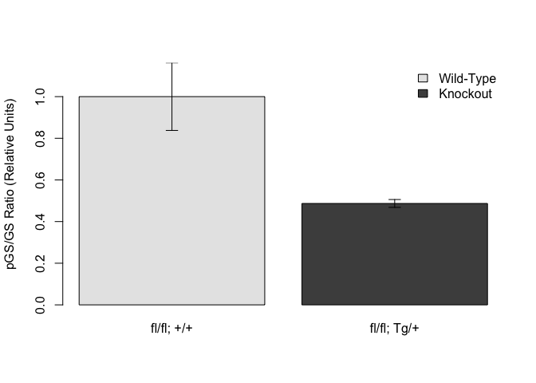

# Quantification of Blots from McK-TSC1 Knockout Mice Quadriceps
Dave Bridges  
June 6, 2013  


# Experimental Details
Sacrificed mice after a 16h fast.  Mice were 69-203 days old. Lysed cells using the Qiagen Tissue Lyser in HNTG buffer (has 1\% Triton X-100).  Blots quantified by ImageJ.


# Statistics

## Effects on GS phosphorylation

A Shapiro-wilk test on the pGS ratio had a p-value of 0.0204, indicating a non-normal distribution for one of the groups.  Beacause of this we did a Wilcoxon-Rank Sum test, which had a p-value of 0.0012.


#Summary


Table: Raw and Calculated Data

Mouse                      Label   Genotype        pGS      GS   GS.PD   pGS.Ratio   GS.PD.Ratio
-------------------------  ------  ------------  -----  ------  ------  ----------  ------------
Muscle TSC1-EarTag #4687   A       fl/fl; +/+     1218   139.3    1393       8.743         9.996
Muscle TSC1 (3976)         B       fl/fl; +/+     1658   468.0    2175       3.544         4.648
Muscle TSC1-EarTag #4616   C       fl/fl; +/+     1382   282.8    3181       4.886        11.245
Muscle TSC1-EarTag #4618   D       fl/fl; +/+     1329   357.1    2060       3.720         5.769
Muscle TSC1-EarTag #4617   E       fl/fl; +/+     1401   374.0    2602       3.747         6.957
Muscle TSC1-EarTag #4620   F       fl/fl; +/+     1475   293.4    3148       5.028        10.729
Muscle TSC1-EarTag #4686   G       fl/fl; Tg/+    1338   606.1    1889       2.208         3.116
Muscle TSC1-EarTag #4688   H       fl/fl; Tg/+    1779   715.8    2297       2.485         3.208
Muscle TSC1 (3975)         I       fl/fl; Tg/+    1974   743.8    2138       2.655         2.875
Muscle TSC1-EarTag #773    J       fl/fl; Tg/+    1655   614.1    2676       2.695         4.357
Muscle TSC1-EarTag #4615   K       fl/fl; Tg/+    1722   757.1    4295       2.275         5.674
Muscle TSC1-EarTag #4669   L       fl/fl; Tg/+    1791   712.4    4716       2.515         6.620
Muscle TSC1-EarTag #4672   M       fl/fl; Tg/+    1224   604.7    3602       2.024         5.957


Table: Summarized Data

               pGS.mean   GS.PD.mean   pGS.se   GS.PD.se
------------  ---------  -----------  -------  ---------
fl/fl; +/+        1.000       1.0000   0.1624     0.1386
fl/fl; Tg/+       0.487       0.5525   0.0189     0.0708

 

 

# Session Information

```
## R version 3.2.2 (2015-08-14)
## Platform: x86_64-apple-darwin13.4.0 (64-bit)
## Running under: OS X 10.10.5 (Yosemite)
## 
## locale:
## [1] en_US.UTF-8/en_US.UTF-8/en_US.UTF-8/C/en_US.UTF-8/en_US.UTF-8
## 
## attached base packages:
## [1] stats     graphics  grDevices utils     datasets  methods   base     
## 
## other attached packages:
## [1] plyr_1.8.3 knitr_1.11
## 
## loaded via a namespace (and not attached):
##  [1] magrittr_1.5    formatR_1.2     tools_3.2.2     htmltools_0.2.6
##  [5] yaml_2.1.13     Rcpp_0.12.0     stringi_0.5-5   rmarkdown_0.7  
##  [9] highr_0.5       stringr_1.0.0   digest_0.6.8    evaluate_0.7.2
```
