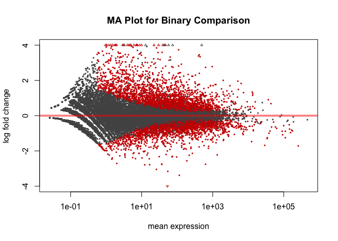
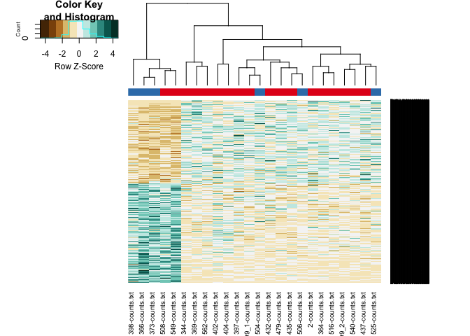
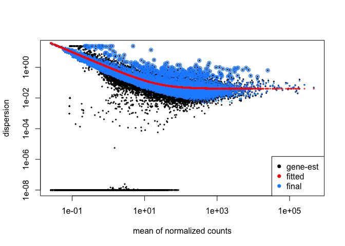
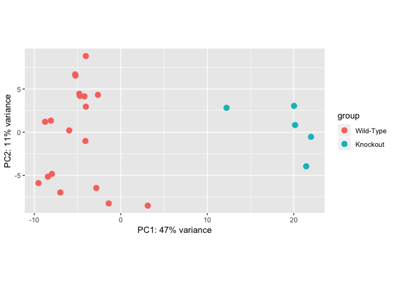

This file uses the counts table in ../data/raw/htseq-counts from ../data/raw/sample_mapping.csv.  This script was most recently run on Mon Mar  4 07:52:47 2019


The calculated data was exported to ../data/processed/Binary DESeq Results.csv.  There was a total of **4403** significantly different genes out of 14182 that met our testing criteria.  These are broken down into up and downregulated genes below:

<!-- html table generated in R 3.5.0 by xtable 1.8-3 package -->
<!-- Mon Mar  4 07:53:35 2019 -->
<table border=1>
<caption align="bottom"> Number of Genes Up/Downregulated and Significant or Not </caption>
<tr> <th>  </th> <th> Upregulated FALSE </th> <th> Upregulated TRUE </th>  </tr>
  <tr> <td align="right"> Significant FALSE </td> <td align="right"> 5111 </td> <td align="right"> 4668 </td> </tr>
  <tr> <td align="right"> Significant TRUE </td> <td align="right"> 1939 </td> <td align="right"> 2464 </td> </tr>
   </table>

Diagnostic Plots
----------------

<!-- -->

<!-- -->

Plotting Estimated Dispersions
-------------------------------
<!-- -->


Principal Component Analysis
------------------------------

<!-- -->


Session Information
-------------------


```
## R version 3.5.0 (2018-04-23)
## Platform: x86_64-apple-darwin15.6.0 (64-bit)
## Running under: macOS  10.14.2
## 
## Matrix products: default
## BLAS: /Library/Frameworks/R.framework/Versions/3.5/Resources/lib/libRblas.0.dylib
## LAPACK: /Library/Frameworks/R.framework/Versions/3.5/Resources/lib/libRlapack.dylib
## 
## locale:
## [1] en_US.UTF-8/en_US.UTF-8/en_US.UTF-8/C/en_US.UTF-8/en_US.UTF-8
## 
## attached base packages:
## [1] parallel  stats4    stats     graphics  grDevices utils     datasets 
## [8] methods   base     
## 
## other attached packages:
##  [1] gplots_3.0.1                RColorBrewer_1.1-2         
##  [3] xtable_1.8-3                biomaRt_2.36.1             
##  [5] DESeq2_1.20.0               SummarizedExperiment_1.10.1
##  [7] DelayedArray_0.6.5          BiocParallel_1.14.2        
##  [9] matrixStats_0.54.0          Biobase_2.40.0             
## [11] GenomicRanges_1.32.6        GenomeInfoDb_1.16.0        
## [13] IRanges_2.14.11             S4Vectors_0.18.3           
## [15] BiocGenerics_0.26.0         knitr_1.21                 
## 
## loaded via a namespace (and not attached):
##  [1] httr_1.4.0             bit64_0.9-7            splines_3.5.0         
##  [4] gtools_3.8.1           Formula_1.2-3          assertthat_0.2.0      
##  [7] latticeExtra_0.6-28    blob_1.1.1             GenomeInfoDbData_1.1.0
## [10] progress_1.2.0         yaml_2.2.0             pillar_1.3.1          
## [13] RSQLite_2.1.1          backports_1.1.3        lattice_0.20-38       
## [16] glue_1.3.0             digest_0.6.18          XVector_0.20.0        
## [19] checkmate_1.8.5        colorspace_1.3-2       htmltools_0.3.6       
## [22] Matrix_1.2-15          plyr_1.8.4             XML_3.98-1.16         
## [25] pkgconfig_2.0.2        genefilter_1.62.0      zlibbioc_1.26.0       
## [28] purrr_0.2.5            scales_1.0.0           gdata_2.18.0          
## [31] htmlTable_1.13.1       tibble_2.0.0           annotate_1.58.0       
## [34] ggplot2_3.1.0          nnet_7.3-12            lazyeval_0.2.1        
## [37] survival_2.43-3        magrittr_1.5           crayon_1.3.4          
## [40] memoise_1.1.0          evaluate_0.12          foreign_0.8-71        
## [43] prettyunits_1.0.2      tools_3.5.0            data.table_1.11.8     
## [46] hms_0.4.2              stringr_1.3.1          locfit_1.5-9.1        
## [49] munsell_0.5.0          cluster_2.0.7-1        AnnotationDbi_1.42.1  
## [52] bindrcpp_0.2.2         compiler_3.5.0         caTools_1.17.1.1      
## [55] rlang_0.3.1            grid_3.5.0             RCurl_1.95-4.11       
## [58] rstudioapi_0.9.0       htmlwidgets_1.3        labeling_0.3          
## [61] bitops_1.0-6           base64enc_0.1-3        rmarkdown_1.11        
## [64] gtable_0.2.0           curl_3.2               DBI_1.0.0             
## [67] R6_2.3.0               gridExtra_2.3          dplyr_0.7.8           
## [70] bit_1.1-14             bindr_0.1.1            Hmisc_4.1-1           
## [73] KernSmooth_2.23-15     stringi_1.2.4          Rcpp_1.0.0            
## [76] geneplotter_1.58.0     rpart_4.1-13           acepack_1.4.1         
## [79] tidyselect_0.2.5       xfun_0.4
```
