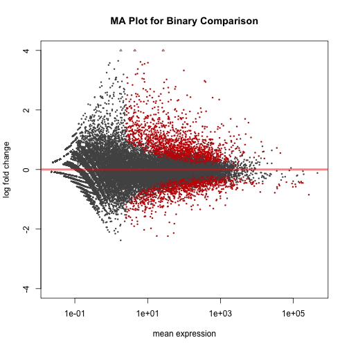
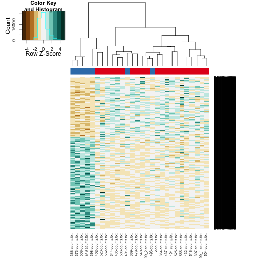
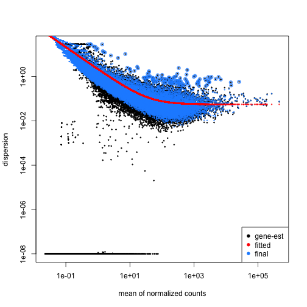
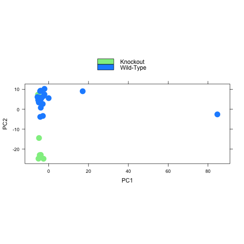

DESeq Analysis
========================================================


```r
input_directory <- "../data/raw/htseq-counts"
sample_mapping_file <- '../data/raw/sample_mapping.csv'
```

This file uses the counts table in ../data/raw/htseq-counts from ../data/raw/sample_mapping.csv.  This script was most recently run on Fri Jun 13 08:31:00 2014


The calculated data was exported to ../data/processed/Binary DESeq Results.csv.  There was a total of **2306** significantly different genes out of 12736 that met our testing criteria.  These are broken down into up and downregulated genes below:

<!-- html table generated in R 3.1.0 by xtable 1.7-3 package -->
<!-- Fri Jun 13 08:32:14 2014 -->
<TABLE border=1>
<CAPTION ALIGN="bottom"> Number of Genes Up/Downregulated and Significant or Not </CAPTION>
<TR> <TH>  </TH> <TH> Upregulated FALSE </TH> <TH> Upregulated TRUE </TH>  </TR>
  <TR> <TD align="right"> Significant FALSE </TD> <TD align="right"> 5791 </TD> <TD align="right"> 4639 </TD> </TR>
  <TR> <TD align="right"> Significant TRUE </TD> <TD align="right"> 888 </TD> <TD align="right"> 1418 </TD> </TR>
   </TABLE>

Diagnostic Plots
----------------

 


```
## KernSmooth 2.23 loaded
## Copyright M. P. Wand 1997-2009
## 
## Attaching package: 'gplots'
## 
## The following object is masked from 'package:IRanges':
## 
##     space
## 
## The following object is masked from 'package:stats':
## 
##     lowess
```

```
## Warning: minimal value for n is 3, returning requested palette with 3 different levels
```

 

Plotting Estimated Dispersions
-------------------------------
 


Principal Component Analysis
------------------------------

 


Session Information
-------------------


```r
sessionInfo()
```

```
## R version 3.1.0 (2014-04-10)
## Platform: x86_64-apple-darwin13.1.0 (64-bit)
## 
## locale:
## [1] en_US.UTF-8/en_US.UTF-8/en_US.UTF-8/C/en_US.UTF-8/en_US.UTF-8
## 
## attached base packages:
## [1] parallel  stats     graphics  grDevices utils     datasets  methods  
## [8] base     
## 
## other attached packages:
##  [1] gplots_2.13.0             RColorBrewer_1.0-5       
##  [3] xtable_1.7-3              biomaRt_2.20.0           
##  [5] DESeq2_1.4.5              RcppArmadillo_0.4.300.8.0
##  [7] Rcpp_0.11.2               GenomicRanges_1.16.3     
##  [9] GenomeInfoDb_1.0.2        IRanges_1.22.8           
## [11] BiocGenerics_0.10.0       knitr_1.6                
## 
## loaded via a namespace (and not attached):
##  [1] annotate_1.42.0      AnnotationDbi_1.26.0 Biobase_2.24.0      
##  [4] bitops_1.0-6         caTools_1.17         DBI_0.2-7           
##  [7] evaluate_0.5.5       formatR_0.10         gdata_2.13.3        
## [10] genefilter_1.46.1    geneplotter_1.42.0   grid_3.1.0          
## [13] gtools_3.4.1         KernSmooth_2.23-12   lattice_0.20-29     
## [16] locfit_1.5-9.1       RCurl_1.95-4.1       RSQLite_0.11.4      
## [19] splines_3.1.0        stats4_3.1.0         stringr_0.6.2       
## [22] survival_2.37-7      tools_3.1.0          XML_3.98-1.1        
## [25] XVector_0.4.0
```
