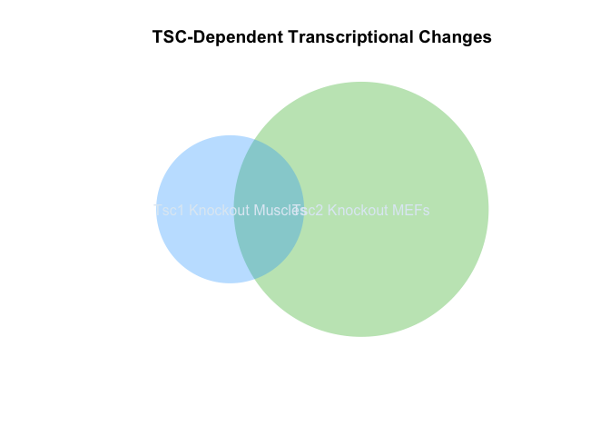
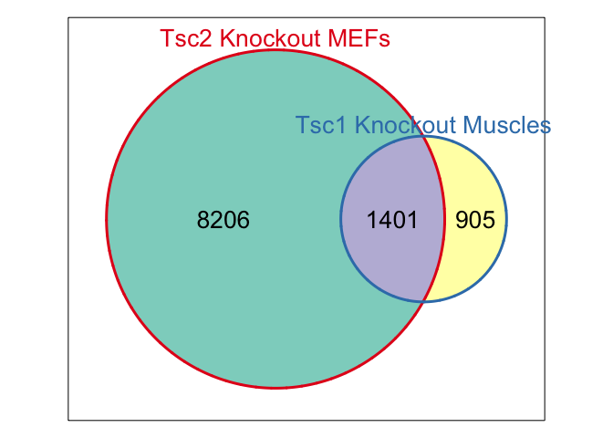

# Re-Analysis of GSE21755
Dave Bridges  
May 20, 2015  


This is generated via GEO2R based on the Duvel et al paper.

"ID"	"adj.P.Val"	"P.Value"	"t"	"B"	"logFC"	"Gene.symbol"	"Gene.title"
"1419033_at"	2.01883904489549e-13	4.47626226668031e-18	107.673971112033	30.3991352752909	7.82313361533334	"2610018G03Rik"	"RIKEN cDNA 2610018G03 gene"
"1448326_a_at"	2.04793811735974e-13	9.08156412212473e-18	-101.00238864846	29.9451471935757	-8.09520831166667	"Crabp1"	"cellular retinoic acid binding protein I"
"1448471_a_at"	7.72077227245425e-13	5.13565482303336e-17	86.3545740917378	28.7353315671063	6.713807584	"Ctla2a"	"cytotoxic T lymphocyte-associated protein 2 alpha"
"1438148_at"	9.66443767725866e-13	9.61690899313287e-17	81.5906823421595	28.2646871240238	5.66704749366667	"Cxcl3"	"chemokine (C-X-C motif) ligand 3"
"1419032_at"	9.66443767725866e-13	1.07142166218694e-16	80.7970187971167	28.1819618667357	6.21956049166667	"2610018G03Rik"	"RIKEN cDNA 2610018G03 gene"
"1456741_s_at"	2.36182600432992e-12	3.94946972544623e-16	71.8003886113241	27.1465034385446	5.055671673	"Gpm6a"	"glycoprotein m6a"
"1417355_at"	2.36182600432992e-12	4.12364988570561e-16	71.5204764037897	27.1111388789357	6.00091193033333	"Peg3"	"paternally expressed 3"
"1418762_at"	2.36182600432992e-12	4.45677475526327e-16	71.0193482363471	27.0473079310192	6.19670858633334	"Cd55"	"CD55 antigen"
"1448323_a_at"	2.36182600432992e-12	5.24253161361024e-16	-69.9831656846818	26.913182192557	-4.80301147233333	"Bgn"	"biglycan"
"1452123_s_at"	2.36182600432992e-12	5.31330999076572e-16	69.8982661189476	26.9020626376672	6.18790882833333	"Frmd4b"	"FERM domain containing 4B"
"1448194_a_at"	2.36182600432992e-12	6.39067805994768e-16	-68.7398050465522	26.7483259344622	-5.55612082366667	"H19"	"H19, imprinted maternally expressed transcript"
"1418318_at"	2.36182600432992e-12	6.47686437104362e-16	68.6564967166058	26.737124127196	6.936847308	"Rnf128"	"ring finger protein 128"
"1426225_at"	2.36182600432992e-12	6.80777323258664e-16	68.3475022595497	26.6954023101606	6.200072006	"Rbp4"	"retinol binding protein 4, plasma"
"1433924_at"	2.64247570620609e-12	8.2026251938727e-16	67.2039013838738	26.5385711017388	7.59209083033334	"Peg3"	"paternally expressed 3"
"1450783_at"	2.97250795765739e-12	1.04459615001811e-15	-65.748894761983	26.3333755583495	-5.98945593133333	"Ifit1"	"interferon-induced protein with tetratricopeptide repeats 1"
"1417356_at"	2.97250795765739e-12	1.05452489573442e-15	65.6926031315913	26.3253062521044	6.17516793966667	"Peg3"	"paternally expressed 3"
"1437502_x_at"	2.9746301789981e-12	1.12123263437546e-15	65.3287712923766	26.2729124882294	5.48807696066667	"Cd24a"	"CD24a antigen"
"1418126_at"	3.18510821147539e-12	1.27119016887778e-15	-64.5904519378604	26.1653028232079	-5.17927236166667	"Ccl5"	"chemokine (C-C motif) ligand 5"
"1421404_at"	3.5723581233754e-12	1.50685621493082e-15	63.6033433971345	26.0186802532459	7.17632408233333	"Cxcl15"	"chemokine (C-X-C motif) ligand 15"
"1438405_at"	3.5723581233754e-12	1.7079174974176e-15	-62.8859990951246	25.9101029613406	-5.58830907833333	"Fgf7"	"fibroblast growth factor 7"
"1425995_s_at"	3.5723581233754e-12	1.76313047948354e-15	62.7050632573902	25.8824421474618	5.676752467	"Wt1"	"Wilms tumor 1 homolog"
"1438169_a_at"	3.5723581233754e-12	1.89549098025247e-15	62.2953312188701	25.8193897822839	7.330959068	"Frmd4b"	"FERM domain containing 4B"
"1439427_at"	3.5723581233754e-12	1.90976126569078e-15	-62.2530295931789	25.8128471939289	-4.59442461833333	"Cldn9"	"claudin 9"
"1425545_x_at"	3.5723581233754e-12	1.98339393117669e-15	-62.0400981480101	25.7798198927197	-4.511991246	"H2-D1"	"histocompatibility 2, D region locus 1"
"1417156_at"	3.5723581233754e-12	1.99492262379423e-15	62.0075409156631	25.7747561183687	6.51906332133333	"Krt19"	"keratin 19"
"1449885_at"	3.5723581233754e-12	2.05940691354428e-15	-61.8291381954075	25.7469426010425	-4.679002756	"Tmem47"	"transmembrane protein 47"
"1420514_at"	3.95243882083434e-12	2.36615259445527e-15	-61.0564550521168	25.6251822968557	-4.77605820633334	"Tmem47"	"transmembrane protein 47"
"1420991_at"	3.98377774243971e-12	2.49125469058545e-15	-60.772189588967	25.5798503943201	-4.51708492933333	"Ankrd1"	"ankyrin repeat domain 1 (cardiac muscle)"
"1451683_x_at"	3.98377774243971e-12	2.56157412320684e-15	-60.6191568791695	25.5553250837322	-4.506546327	"H2-D1"	"histocompatibility 2, D region locus 1"
"1425964_x_at"	4.13714012069997e-12	2.75191688922638e-15	60.2268626081003	25.4920646215188	5.52351455866667	"Hspb1"	"heat shock protein 1"
"1452968_at"	4.20427449660186e-12	2.91285942849126e-15	59.917576278396	25.4417899946654	5.14392709933334	"Cthrc1"	"collagen triple helix repeat containing 1"
"1416239_at"	4.20427449660186e-12	2.9830111059901e-15	-59.7885468314346	25.4207110682441	-4.662567592	"Ass1"	"argininosuccinate synthetase 1"
"1426906_at"	4.40536039219737e-12	3.22336296185258e-15	-59.370307629129	25.3519559224692	-4.82466093066667	"Mndal"	"myeloid nuclear differentiation antigen like"
"1416613_at"	4.45650615638543e-12	3.3595975547572e-15	59.1480788548007	25.3151540847538	4.70726769333333	"Cyp1b1"	"cytochrome P450, family 1, subfamily b, polypeptide 1"
"1451461_a_at"	4.49415954140954e-12	3.54728643317119e-15	58.8575007631013	25.2667486770949	4.241067888	"Aldoc"	"aldolase C, fructose-bisphosphate"
"1437889_x_at"	4.49415954140954e-12	3.58727619101003e-15	-58.797755603577	25.2567559059319	-4.11837698566667	"Bgn"	"biglycan"
"1449005_at"	4.76063995683963e-12	4.00186434279738e-15	58.2180368770121	25.1590742704491	5.440084859	"Slc16a3"	"solute carrier family 16 (monocarboxylic acid transporters), member 3"
"1451784_x_at"	4.76063995683963e-12	4.01109328750817e-15	-58.2058880520848	25.1570131516687	-4.41529714766667	"H2-D1"	"histocompatibility 2, D region locus 1"
"1422567_at"	4.84925043462697e-12	4.2464283078534e-15	57.9059926213317	25.1059493498527	4.13041218966667	"Fam129a"	"family with sequence similarity 129, member A"
"1417065_at"	4.84925043462697e-12	4.40101677452068e-15	-57.7186931714857	25.0738763064268	-4.34667679	"Egr1"	"early growth response 1"
"1435162_at"	4.84925043462697e-12	4.58274085777057e-15	-57.5074783969641	25.0375396005304	-4.38914991533333	"Prkg2"	"protein kinase, cGMP-dependent, type II"
"1431056_a_at"	4.84925043462697e-12	4.67403782942148e-15	57.4047846344479	25.019807640496	4.02290465666666	"Lpl"	"lipoprotein lipase"
"1430637_at"	4.84925043462697e-12	4.7003005321367e-15	57.3756480871564	25.0147689243593	4.376339338	"2210016H18Rik"	"RIKEN cDNA 2210016H18 gene"
"1416405_at"	4.84925043462697e-12	4.73087113641797e-15	-57.3419549285155	25.0089379295209	-4.09882299933333	"Bgn"	"biglycan"
"1454974_at"	4.99214744741951e-12	4.98096794159504e-15	-57.0749182896297	24.9625610443359	-4.39678236166667	"Ntn1"	"netrin 1"
"1442542_at"	5.37866170168401e-12	5.48587477611282e-15	56.5777461890687	24.8754375768055	4.324688638	"Eya4"	"eyes absent 4 homolog (Drosophila)"
"1433716_x_at"	5.49367765415133e-12	5.724991679677e-15	-56.3594290301669	24.836856557206	-4.45888169733333	"Gfra2"	"glial cell line derived neurotrophic factor family receptor alpha 2"
"1455145_at"	5.9287501569727e-12	6.41033170162034e-15	-55.7848830308431	24.7343654448101	-4.59754835	"Pcdh19"	"protocadherin 19"
"1426442_at"	5.9287501569727e-12	6.4412930465325e-15	55.7605294023848	24.7299901572786	3.88992971733333	"Gpm6a"	"glycoprotein m6a"
"1435382_at"	5.98909195131573e-12	6.63964429981124e-15	-55.6074758457214	24.7024350105441	-4.041005962	"Ndn"	"necdin"
"1439489_at"	7.21218619855571e-12	8.15550644390016e-15	54.5807035029318	24.5149518666367	4.276019134	"Ffar4"	"free fatty acid receptor 4"
"1417420_at"	8.61568655109982e-12	9.93360902545821e-15	-53.613593389331	24.3340760665053	-4.19998647533333	"Ccnd1"	"cyclin D1"
"1456428_at"	8.6474632959314e-12	1.02814916999206e-14	53.446561932153	24.3024048646937	4.992866396	"Cxcl15"	"chemokine (C-X-C motif) ligand 15"
"1449254_at"	8.6474632959314e-12	1.0353717611146e-14	-53.412656077974	24.295960158749	-5.26301535533333	"Spp1"	"secreted phosphoprotein 1"
"1434354_at"	8.74102568681672e-12	1.0659551069265e-14	53.271887679137	24.2691463498464	5.12802616433333	"Maob"	"monoamine oxidase B"
"1426915_at"	9.89503557454575e-12	1.24680350680949e-14	52.5203913100861	24.12442721753	4.48031843866667	"Dapk1"	"death associated protein kinase 1"
"1420992_at"	9.89503557454575e-12	1.25056435056675e-14	-52.5060518409138	24.1216397622156	-4.15966509866667	"Ankrd1"	"ankyrin repeat domain 1 (cardiac muscle)"
"1448182_a_at"	1.03336378863946e-11	1.33057172166565e-14	52.2116652137307	24.064195596018	5.99784524166667	"Cd24a"	"CD24a antigen"
"1430700_a_at"	1.03336378863946e-11	1.35182065873768e-14	-52.13671690166	24.0495040304086	-4.87094295633333	"Pla2g7"	"phospholipase A2, group VII (platelet-activating factor acetylhydrolase, plasma)"
"1447845_s_at"	1.11333480037556e-11	1.48112210422239e-14	51.7066738774159	23.9646769325482	3.645576787	"Vnn1"	"vanin 1"
"1451978_at"	1.14300638246194e-11	1.54593887785589e-14	-51.5062477600552	23.9248319577586	-4.05031503633334	"Loxl1"	"lysyl oxidase-like 1"
"1452035_at"	1.14357223215202e-11	1.57206000739286e-14	-51.4280519758925	23.9092325523124	-3.75614155	"Col4a1"	"collagen, type IV, alpha 1"
"1421228_at"	1.25884574140111e-11	1.75843732308087e-14	-50.9081990685517	23.8047483899402	-4.05038769466666	"Ccl7"	"chemokine (C-C motif) ligand 7"
"1455426_at"	1.33624029667279e-11	1.90381729921353e-14	50.5427851658431	23.730485615549	5.182088767	"Epha3"	"Eph receptor A3"
"1454881_s_at"	1.33624029667279e-11	1.9258025162132e-14	50.4901830168825	23.7197390073936	4.63283591866667	"Upk3b"	"uroplakin 3B"
"1415857_at"	1.3786595336954e-11	2.04326880782509e-14	50.2197907072815	23.6642723210354	3.68094159033333	"Emb"	"embigin"
"1435460_at"	1.3786595336954e-11	2.0480740728053e-14	-50.2090929745835	23.6620700514696	-3.56110594833333	"Prkg2"	"protein kinase, cGMP-dependent, type II"
"1418930_at"	1.39082501761463e-11	2.09698457235526e-14	-50.1017373476919	23.6399364451607	-5.08904141833333	"Cxcl10"	"chemokine (C-X-C motif) ligand 10"
"1417649_at"	1.49548528769346e-11	2.28794228178641e-14	-49.7072615328321	23.5580877269518	-3.677815076	"Cdkn1c"	"cyclin-dependent kinase inhibitor 1C (P57)"
"1434440_at"	1.50282178056557e-11	2.33248763086383e-14	49.6204006847812	23.5399547192703	3.90817921833333	"Gnai1"	"guanine nucleotide binding protein (G protein), alpha inhibiting 1"
"1422317_a_at"	1.50621982680704e-11	2.3711582382497e-14	-49.5464488525848	23.5244849413798	-6.17080129233333	"Il1rl1"	"interleukin 1 receptor-like 1"
"1448291_at"	1.66522385749111e-11	2.65839155981818e-14	-49.0352161828102	23.4167386872178	-4.869241656	"Mmp9"	"matrix metallopeptidase 9"
"1424051_at"	1.69158493654456e-11	2.7379814276347e-14	-48.9041724892337	23.388892258757	-3.65247071866667	"Col4a2"	"collagen, type IV, alpha 2"
"1453152_at"	1.74170298806924e-11	2.85771980925308e-14	48.7146494609316	23.3484528328343	4.551556876	"Mamdc2"	"MAM domain containing 2"
"1452956_a_at"	1.87363767462176e-11	3.13040947778586e-14	-48.3135243317875	23.2622083233319	-3.71652457833333	"Ifi27"	"interferon, alpha-inducible protein 27"
"1433720_s_at"	1.87363767462176e-11	3.15727951201202e-14	48.2760758956034	23.2541109244066	4.06233602766667	"Chchd10"	"coiled-coil-helix-coiled-coil-helix domain containing 10"
"1422243_at"	1.87598629889772e-11	3.26307067403648e-14	-48.1319395599938	23.2228711747872	-4.38373810966667	"Fgf7"	"fibroblast growth factor 7"
"1417900_a_at"	1.87598629889772e-11	3.30609767394281e-14	48.0747678975193	23.2104475355704	4.287452039	"Vldlr"	"very low density lipoprotein receptor"
"1449036_at"	1.87598629889772e-11	3.3236469194951e-14	48.051681966876	23.2054256366459	6.53838794133333	"Rnf128"	"ring finger protein 128"
"1454959_s_at"	1.87598629889772e-11	3.44419417561804e-14	47.8966079943375	23.1716140523236	4.98332406166667	"Gnai1"	"guanine nucleotide binding protein (G protein), alpha inhibiting 1"
"1460242_at"	1.87598629889772e-11	3.45206282152832e-14	47.8866920952411	23.1694473933048	5.63663191966667	"Cd55"	"CD55 antigen"
"1454613_at"	1.87598629889772e-11	3.45219796242394e-14	-47.8865220088271	23.1694102239418	-3.42680533433334	"Dpysl3"	"dihydropyrimidinase-like 3"
"1426215_at"	1.87598629889772e-11	3.46648473701896e-14	47.8685816961565	23.1654887628459	4.76066834366667	"Ddc"	"dopa decarboxylase"
"1451931_x_at"	1.87598629889772e-11	3.49399900462094e-14	-47.8342571827807	23.1579808728208	-4.034375275	"H2-L"	"histocompatibility 2, D region locus L"
"1422587_at"	1.88437198724455e-11	3.55139839284688e-14	47.763589241354	23.142502327705	3.697808561	"Tmem45a"	"transmembrane protein 45a"
"1436555_at"	1.88493206374952e-11	3.59424752183896e-14	47.711641772884	23.1311059615273	4.103016852	"Slc7a2"	"solute carrier family 7 (cationic amino acid transporter, y+ system), member 2"
"1422833_at"	2.05618667141623e-11	3.96639188517355e-14	47.2870161907202	23.0373679868237	4.07451332666667	"Foxa2"	"forkhead box A2"
"1415923_at"	2.07390218009259e-11	4.04654867626324e-14	-47.2012434422284	23.0183063143179	-4.02073272933333	"Ndn"	"necdin"
"1421952_at"	2.10177238822294e-11	4.14752982310461e-14	-47.0957861197734	22.994811087974	-3.61714711466667	"Capn6"	"calpain 6"
"1423135_at"	2.19525020746135e-11	4.3806682484096e-14	-46.8626386297594	22.9426351881737	-3.96134732766667	"Thy1"	"thymus cell antigen 1, theta"
"1450355_a_at"	2.35983781101212e-11	4.76142969783602e-14	-46.5095123465944	22.8629950035052	-3.45243541466666	"Capg"	"capping protein (actin filament), gelsolin-like"
"1448845_at"	2.48253485540765e-11	5.06403863988611e-14	46.2501499189679	22.8040245444148	4.45683444966667	"Rpp25"	"ribonuclease P/MRP 25 subunit"
"1427747_a_at"	2.48764329068953e-11	5.12961632855426e-14	-46.1961716647208	22.7917004564887	-3.68257230433333	"Lcn2"	"lipocalin 2"
"1436041_at"	2.51710979418821e-11	5.24618790389774e-14	46.1020507631622	22.7701687285096	5.39598151966667	"Hand2"	"heart and neural crest derivatives expressed transcript 2"
"1449939_s_at"	2.54204898949965e-11	5.37503640470787e-14	-46.0006337668695	22.7469073156481	-3.320012322	"Dlk1"	"delta-like 1 homolog (Drosophila)"
"1423946_at"	2.54204898949965e-11	5.41089339464683e-14	-45.9728814659125	22.740530951379	-4.031407019	"Pdlim2"	"PDZ and LIM domain 2"
"1460431_at"	2.73686692121783e-11	5.88625731930842e-14	45.6228375225494	22.6596970470657	4.28661215266667	"Gcnt1"	"glucosaminyl (N-acetyl) transferase 1, core 2"
"1455792_x_at"	2.75286717188211e-11	5.98170734228612e-14	-45.5562704672588	22.6442389986411	-4.35533329633333	"Ndn"	"necdin"
"1415877_at"	2.77622314232472e-11	6.09401323895584e-14	-45.4794149207795	22.6263573475313	-3.521825171	"Dpysl3"	"dihydropyrimidinase-like 3"
"1448698_at"	2.93335444205354e-11	6.50396763276543e-14	-45.2114191189149	22.5637135823895	-3.45378046433333	"Ccnd1"	"cyclin D1"
"1449740_s_at"	2.99258984609087e-11	6.70166015066579e-14	45.088689857045	22.5348741195893	3.88692547666667	"Dsg2"	"desmoglein 2"
"1452107_s_at"	3.08984650371227e-11	6.98796796919472e-14	44.917771502235	22.4945510540591	4.22922795	"Npnt"	"nephronectin"
"1450699_at"	3.09926258703736e-11	7.07798156282229e-14	44.865608526586	22.4822075078526	3.396012461	"Selenbp1"	"selenium binding protein 1"
"1416298_at"	3.11351227992758e-11	7.1795587040746e-14	-44.8076058184114	22.4684615437375	-3.53563551	"Mmp9"	"matrix metallopeptidase 9"
"1416612_at"	3.11688538163454e-11	7.25644586753346e-14	44.7642931919815	22.4581828234487	4.235478287	"Cyp1b1"	"cytochrome P450, family 1, subfamily b, polypeptide 1"
"1434237_at"	3.14024540542772e-11	7.38045748376617e-14	44.6954773215679	22.4418268982995	3.96022486466667	"Upk3b"	"uroplakin 3B"
"1456069_at"	3.17222072552782e-11	7.61550639944371e-14	-44.5684368417808	22.4115517451867	-4.22358979933333	"Dtna"	"dystrobrevin alpha"
"1450429_at"	3.17222072552782e-11	7.64903897451555e-14	-44.5506618762825	22.407307411076	-3.366143401	"Capn6"	"calpain 6"
"1430051_at"	3.17222072552782e-11	7.66661624093773e-14	44.5413784037821	22.4050898710955	3.6440533	"4930486L24Rik"	"RIKEN cDNA 4930486L24 gene"
"1437360_at"	3.21955023334648e-11	7.89528160091272e-14	-44.42267985075	22.3766868250016	-5.99657392933333	"Pcdh19"	"protocadherin 19"
"1438966_x_at"	3.21955023334648e-11	7.92377277447194e-14	44.4081532925448	22.3732044787358	3.116349172	"Fmod"	"fibromodulin"
"1424649_a_at"	3.38283975770134e-11	8.40065747683089e-14	44.1731244152106	22.3166699814059	4.13061262733333	"Tspan8"	"tetraspanin 8"
"1415834_at"	3.44003516689458e-11	8.61896574042897e-14	-44.0703405353937	22.2918314006637	-4.29336107333333	"Dusp6"	"dual specificity phosphatase 6"
"1460603_at"	3.51372589855744e-11	8.88150489868402e-14	-43.9504259785637	22.2627642915651	-3.796857914	"Samd9l"	"sterile alpha motif domain containing 9-like"
"1424951_at"	3.59986740331684e-11	9.21721323864461e-14	43.8026003156366	22.2267993345708	4.20190899166667	"Baiap2l1"	"BAI1-associated protein 2-like 1"
"1423072_at"	3.59986740331684e-11	9.26902608693872e-14	43.7803086608914	22.2213632074989	3.31905558733333	"6720475J19Rik"	"RIKEN cDNA 6720475J19 gene"
"1448961_at"	3.59986740331684e-11	9.33869506636373e-14	-43.7505478262772	22.214100406165	-3.50647014833334	"Plscr2"	"phospholipid scramblase 2"
"1434465_x_at"	3.66550466484388e-11	9.5902430201454e-14	43.6450721400275	22.1883121378928	3.79590392266667	"Vldlr"	"very low density lipoprotein receptor"
"1423606_at"	3.77957273489827e-11	9.97248742717221e-14	-43.4904334117844	22.150367562931	-3.39070317433333	"Postn"	"periostin, osteoblast specific factor"
"1418580_at"	3.82935112490489e-11	1.02030521848598e-13	-43.4002494186097	22.1281634770456	-4.70728942833334	"Rtp4"	"receptor transporter protein 4"
"1416034_at"	3.82935112490489e-11	1.03577370217939e-13	43.3409815287742	22.1135409327054	5.32811559966667	"Cd24a"	"CD24a antigen"
"1460187_at"	3.82935112490489e-11	1.03585471993614e-13	43.3406736522553	22.1134649107419	3.34507553033333	"Sfrp1"	"secreted frizzled-related protein 1"
"1426621_a_at"	3.97534722641385e-11	1.08416156814462e-13	43.1616285205647	22.0691440881481	4.020373909	"Ppp2r2b"	"protein phosphatase 2, regulatory subunit B, beta"
"1451415_at"	4.02435574019016e-11	1.1064502157016e-13	-43.0819273384315	22.0493437225358	-3.07122974166667	"1810011O10Rik"	"RIKEN cDNA 1810011O10 gene"
"1417419_at"	4.05540069688105e-11	1.12397748854822e-13	-43.0204715143448	22.0340460338708	-4.05039390633334	"Ccnd1"	"cyclin D1"
"1456858_at"	4.21339978058186e-11	1.17710998060645e-13	-42.8403668714287	21.9890626043817	-3.422468488	"Gpr149"	"G protein-coupled receptor 149"
"1416168_at"	4.39558942870205e-11	1.24230837260682e-13	-42.6311005231172	21.9365101126971	-3.038165644	"Serpinf1"	"serine (or cysteine) peptidase inhibitor, clade F, member 1"
"1431591_s_at"	4.39558942870205e-11	1.24983520782328e-13	-42.6077154206878	21.9306182940911	-4.84451642133333	"Isg15///Gm9706"	"ISG15 ubiquitin-like modifier///predicted gene 9706"
"1420357_s_at"	4.39558942870205e-11	1.25724714818422e-13	42.5848367889161	21.924850333969	4.206731526	"Xlr3b///Xlr3c///Xlr3a"	"X-linked lymphocyte-regulated 3B///X-linked lymphocyte-regulated 3C///X-linked lymphocyte-regulated 3A"
"1452232_at"	4.47369858435351e-11	1.28950758512218e-13	-42.4869413552036	21.9001278682004	-3.35192417333333	"Galnt7"	"UDP-N-acetyl-alpha-D-galactosamine: polypeptide N-acetylgalactosaminyltransferase 7"
"1449070_x_at"	4.66121398657016e-11	1.35728724537781e-13	-42.2896821909042	21.850104706588	-3.00415400933333	"Apcdd1"	"adenomatosis polyposis coli down-regulated 1"
"1419431_at"	4.66121398657016e-11	1.3801977918422e-13	-42.2254236183138	21.8337491203719	-3.22010011433333	"Ereg"	"epiregulin"
"1422011_s_at"	4.66121398657016e-11	1.3817018255915e-13	-42.2212458990991	21.8326847471597	-3.883304899	"3830403N18Rik///Xlr"	"RIKEN cDNA 3830403N18 gene///X-linked lymphocyte-regulated"
"1436790_a_at"	4.66121398657016e-11	1.38489761690517e-13	42.212385454022	21.830426922457	3.78262376833333	"Sox11"	"SRY (sex determining region Y)-box 11"
"1448269_a_at"	4.83688868437966e-11	1.44781706035621e-13	42.0423398365207	21.7869859782223	3.85679400533333	"Klhl13"	"kelch-like 13"
"1416129_at"	4.91230990398299e-11	1.4812845545369e-13	-41.9551416823356	21.7646284987859	-3.05998341633333	"Errfi1"	"ERBB receptor feedback inhibitor 1"
"1457825_x_at"	5.25892472630577e-11	1.59746499524155e-13	41.668296711059	21.6906899475283	4.23251933333334	"Tcn2"	"transcobalamin 2"
"1448261_at"	5.39867391866048e-11	1.65531735075696e-13	41.5338260823775	21.6558196275453	4.18885028333333	"Cdh1"	"cadherin 1"
"1454043_a_at"	5.39867391866048e-11	1.66385595595177e-13	41.5144136751483	21.6507746222343	3.20907636733334	"Kcnab1"	"potassium voltage-gated channel, shaker-related subfamily, beta member 1"
"1421882_a_at"	5.41574132906726e-11	1.68794084936321e-13	-41.4602366146672	21.6366799674587	-4.390275017	"Elavl2"	"ELAV (embryonic lethal, abnormal vision, Drosophila)-like 2 (Hu antigen B)"
"1448200_at"	5.41574132906726e-11	1.69884032545622e-13	41.4359953563535	21.6303663088868	3.403808957	"Tcn2"	"transcobalamin 2"
"1441894_s_at"	5.41574132906726e-11	1.70514017145418e-13	-41.4220611940037	21.6267351606847	-3.20386098733334	"Grasp"	"GRP1 (general receptor for phosphoinositides 1)-associated scaffold protein"
"1455607_at"	5.4222958000127e-11	1.71922640163592e-13	41.3911068283284	21.6186634790773	3.36202539533333	"Rspo3"	"R-spondin 3 homolog (Xenopus laevis)"
"1418649_at"	5.52611196896306e-11	1.77658707090206e-13	41.2678503648951	21.5864519479265	3.26068996833333	"Egln3"	"egl-9 family hypoxia-inducible factor 3"
"1426278_at"	5.52611196896306e-11	1.77664849005486e-13	-41.2677207234506	21.5864180077941	-4.11433032366667	"Ifi27l2a"	"interferon, alpha-inducible protein 27 like 2A"
"1423484_at"	5.76201053541273e-11	1.86735675958798e-13	41.0814045730842	21.5375096008661	3.77563545433333	"Bicc1"	"bicaudal C homolog 1 (Drosophila)"
"1453282_at"	5.76201053541273e-11	1.88713335372815e-13	41.042092958007	21.527156692969	3.77062206266667	"Cxadr"	"coxsackie virus and adenovirus receptor"
"1435184_at"	5.76201053541273e-11	1.89081740813083e-13	41.0348194689888	21.5252398986857	4.163327258	"Npr3"	"natriuretic peptide receptor 3"
"1437161_x_at"	5.76355004398673e-11	1.90410180828368e-13	41.0087195242263	21.5183584310884	2.923248054	"Rbpms"	"RNA binding protein gene with multiple splicing"
"1454159_a_at"	5.81216796994174e-11	1.93620134100758e-13	40.9464637922662	21.5019232748388	3.23602646933333	"Igfbp2"	"insulin-like growth factor binding protein 2"
"1416473_a_at"	5.81216796994174e-11	1.95283389044933e-13	40.9146465214803	21.4935122965394	3.172809399	"Igdcc4"	"immunoglobulin superfamily, DCC subclass, member 4"
"1416468_at"	5.81216796994174e-11	1.98226722402645e-13	40.8590590884495	21.4787990649573	3.89476991533333	"Aldh1a1"	"aldehyde dehydrogenase family 1, subfamily A1"
"1448152_at"	5.81216796994174e-11	1.98275495161306e-13	40.8581455639415	21.4785570702229	3.19310325999999	"Igf2"	"insulin-like growth factor 2"
"1436736_x_at"	5.81216796994174e-11	1.99208316751188e-13	40.8407205895741	21.4739399316351	3.877030614	"Nrep"	"neuronal regeneration related protein"
"1433509_s_at"	5.81216796994174e-11	1.99748572169346e-13	40.8306693104101	21.4712755618994	4.59547853033333	"Reep1"	"receptor accessory protein 1"
"1419728_at"	6.30557685147995e-11	2.18103808968953e-13	40.5057322938146	21.3847229973338	3.289974876	"Cxcl5"	"chemokine (C-X-C motif) ligand 5"
"1418643_at"	6.34415177918778e-11	2.21127528891403e-13	40.455073546213	21.3711554912596	4.368273268	"Tspan13"	"tetraspanin 13"
"1439795_at"	6.34415177918778e-11	2.22251387133693e-13	40.4364368230606	21.366159143593	4.66506305666667	"Gpr64"	"G protein-coupled receptor 64"
"1417301_at"	6.4792182902756e-11	2.28951471492375e-13	40.3274196640073	21.3368782048252	2.83008524366667	"Fzd6"	"frizzled homolog 6 (Drosophila)"
"1416046_a_at"	6.4792182902756e-11	2.29856306167069e-13	40.3129640145746	21.3329885718158	3.17625632033333	"Fuca2"	"fucosidase, alpha-L- 2, plasma"
"1422607_at"	6.48609371123337e-11	2.31538344495371e-13	-40.2862558004413	21.3257977836916	-2.858262389	"Etv1"	"ets variant 1"
"1424783_a_at"	6.84368473539654e-11	2.45820919078122e-13	40.0676497833335	21.2667301047334	2.97872370233334	"Ugt1a1///Ugt1a6b///Ugt1a9///Ugt1a5///Ugt1a7c///Ugt1a10///Ugt1a6a///Ugt1a2"	"UDP glucuronosyltransferase 1 family, polypeptide A1///UDP glucuronosyltransferase 1 family, polypeptide A6B///UDP glucuronosyltransferase 1 family, polypeptide A9///UDP glucuronosyltransferase 1 family, polypeptide A5///UDP glucuronosyltransferase 1 family, polypeptide A7C///UDP glycosyltransferase 1 family, polypeptide A10///UDP glucuronosyltransferase 1 family, polypeptide A6A///UDP glucuronosyltransferase 1 family, polypeptide A2"
"1427005_at"	7.20395843374056e-11	2.62568591068529e-13	-39.8282987519168	21.2016220083181	-2.97899831633334	"Plk2"	"polo-like kinase 2"
"1416811_s_at"	7.20395843374056e-11	2.64944615815633e-13	39.7956940562308	21.1927174379015	6.73698598333333	"Ctla2b///Ctla2a"	"cytotoxic T lymphocyte-associated protein 2 beta///cytotoxic T lymphocyte-associated protein 2 alpha"
"1427242_at"	7.20395843374056e-11	2.65079085465827e-13	39.7938583502343	21.1922158398139	3.69548542233334	"Ddx4"	"DEAD (Asp-Glu-Ala-Asp) box polypeptide 4"
"1449357_at"	7.20395843374056e-11	2.66377530999376e-13	39.7761847183795	21.1873852164112	2.89157716	"2310030G06Rik"	"RIKEN cDNA 2310030G06 gene"
"1453196_a_at"	7.20395843374056e-11	2.66748200358013e-13	-39.7711566195452	21.1860104585297	-4.31903027933333	"Oasl2"	"2'-5' oligoadenylate synthetase-like 2"
"1450839_at"	7.26294047203365e-11	2.70542559877088e-13	39.7201201414296	21.1720447974966	3.611000948	"Nrep"	"neuronal regeneration related protein"
"1438789_s_at"	7.27516904174034e-11	2.72611154531855e-13	-39.6926237686622	21.1645119638404	-3.21200423433333	"Dpysl3"	"dihydropyrimidinase-like 3"
"1426324_at"	7.31659180571666e-11	2.75785593883025e-13	-39.6508673118724	21.1530607957153	-4.36357364333333	"H2-D1"	"histocompatibility 2, D region locus 1"
"1450044_at"	7.33484513594732e-11	2.78099935311189e-13	39.6207533362479	21.1447936724334	3.34280708866667	"Fzd7"	"frizzled homolog 7 (Drosophila)"
"1436329_at"	7.36391576859089e-11	2.80834906586912e-13	-39.5855162770771	21.1351107895395	-3.398837788	"Egr3"	"early growth response 3"
"1424131_at"	7.47950352628015e-11	2.86901423482066e-13	-39.508672847197	21.1139598080678	-3.45645257366666	"Col6a3"	"collagen, type VI, alpha 3"
"1423298_at"	7.50706451414263e-11	2.89623118214855e-13	39.474771119706	21.1046131519145	2.87319841766667	"Add3"	"adducin 3 (gamma)"
"1418979_at"	7.71204258556836e-11	2.99241137108814e-13	39.3576903370691	21.0722619436051	3.657565051	"Akr1c14"	"aldo-keto reductase family 1, member C14"
"1424784_at"	7.93833260235443e-11	3.09781720585881e-13	39.2339988266372	21.0379619080785	2.78089442266667	"Gm13139"	"predicted gene 13139"
"1450943_at"	7.9873972044172e-11	3.13467396550375e-13	39.1918271494223	21.0262387474847	3.48452638133333	"Magohb"	"mago-nashi homolog B (Drosophila)"
"1425155_x_at"	8.31413868834743e-11	3.28133896482526e-13	-39.0292063248923	20.9808943817471	-3.14742379233333	"Csf1"	"colony stimulating factor 1 (macrophage)"
"1417149_at"	8.52228702929771e-11	3.38238482127733e-13	38.9217103833081	20.9507998795245	2.75103280933334	"P4ha2"	"procollagen-proline, 2-oxoglutarate 4-dioxygenase (proline 4-hydroxylase), alpha II polypeptide"
"1426261_s_at"	8.63478028513845e-11	3.44617736042421e-13	38.8556325928248	20.9322527761988	4.00688079333333	"Ugt1a1///Ugt1a6b///Ugt1a9///Ugt1a5///Ugt1a7c///Ugt1a10///Ugt1a6a///Ugt1a2"	"UDP glucuronosyltransferase 1 family, polypeptide A1///UDP glucuronosyltransferase 1 family, polypeptide A6B///UDP glucuronosyltransferase 1 family, polypeptide A9///UDP glucuronosyltransferase 1 family, polypeptide A5///UDP glucuronosyltransferase 1 family, polypeptide A7C///UDP glycosyltransferase 1 family, polypeptide A10///UDP glucuronosyltransferase 1 family, polypeptide A6A///UDP glucuronosyltransferase 1 family, polypeptide A2"
"1416474_at"	8.70598605773509e-11	3.49389919613767e-13	38.8070668522143	20.9185976727242	3.40468077866667	"Igdcc4"	"immunoglobulin superfamily, DCC subclass, member 4"
"1454757_s_at"	8.72749873820738e-11	3.52188370624541e-13	-38.778922529703	20.9106753178401	-3.90505076333334	"Ifi27"	"interferon, alpha-inducible protein 27"
"1451046_at"	9.21473285023724e-11	3.73893286533207e-13	38.5685790587473	20.8512535112453	2.83577561466667	"Zfpm1"	"zinc finger protein, multitype 1"
"1424903_at"	9.33843866253816e-11	3.81775743705814e-13	-38.4954650069202	20.830510782722	-4.33975640333333	"Kdm5d"	"lysine (K)-specific demethylase 5D"
"1439476_at"	9.33843866253816e-11	3.83053846382466e-13	38.483765030066	20.8271872180376	3.821010696	"Dsg2"	"desmoglein 2"
"1420549_at"	9.7901019134147e-11	4.03751348283882e-13	38.3000076884278	20.774833971438	2.91287646933333	"Gbp2b"	"guanylate binding protein 2b"
"1436319_at"	9.96775046345689e-11	4.14240803669691e-13	38.210760101977	20.7493019706785	3.729365324	"Sulf1"	"sulfatase 1"
"1423266_at"	9.96775046345689e-11	4.15830709962323e-13	38.1974478617893	20.7454876872204	2.90429719733333	"Fam213b"	"family with sequence similarity 213, member B"
"1417112_at"	9.96775046345689e-11	4.17707997071762e-13	-38.1818006158053	20.741002401999	-2.85276302066667	"Arl2bp"	"ADP-ribosylation factor-like 2 binding protein"
"1435383_x_at"	9.97383670978779e-11	4.20174491665302e-13	-38.1613583912026	20.7351394332183	-4.07361146066667	"Ndn"	"necdin"
"1429244_at"	1.01062071045645e-10	4.27991742305451e-13	38.0974229682978	20.7167788654998	3.221897449	"2610524H06Rik"	"RIKEN cDNA 2610524H06 gene"
"1451567_a_at"	1.0155897431472e-10	4.32347909545827e-13	-38.0623446952549	20.7066901805796	-4.329538157	"Ifi203"	"interferon activated gene 203"
"1421063_s_at"	1.03303840556617e-10	4.42414992652923e-13	37.9827311632973	20.6837530432028	3.33997802533334	"Snurf///Snrpn"	"SNRPN upstream reading frame///small nuclear ribonucleoprotein N"
"1456523_at"	1.03303840556617e-10	4.44357000243535e-13	-37.9676004152654	20.6793875075281	-2.97993760033333	"Gm2115"	"predicted gene 2115"
"1435208_at"	1.03440862617225e-10	4.47239932825413e-13	-37.9452710212408	20.6729413436069	-3.585074965	"Dtx3l"	"deltex 3-like (Drosophila)"
"1433474_at"	1.03731587734626e-10	4.50796904635964e-13	-37.9179361002213	20.6650441973175	-3.66458208033333	"Edil3"	"EGF-like repeats and discoidin I-like domains 3"
"1438658_a_at"	1.04512419021522e-10	4.56507539682928e-13	-37.8745383755877	20.6524929560992	-3.578221522	"S1pr3"	"sphingosine-1-phosphate receptor 3"
"1425145_at"	1.06134588470517e-10	4.65946398464833e-13	-37.8040891646309	20.6320826856481	-4.17309629766667	"Il1rl1"	"interleukin 1 receptor-like 1"
"1443906_at"	1.06789240362345e-10	4.7278717634176e-13	37.7539964483373	20.6175433316095	4.14669385066667	"Cd55"	"CD55 antigen"
"1426348_at"	1.06789240362345e-10	4.75799250401585e-13	-37.7321899252407	20.6112070672091	-3.02395645033333	"Col4a1"	"collagen, type IV, alpha 1"
"1457769_at"	1.06789240362345e-10	4.79929008023598e-13	-37.7025349817423	20.6025835358211	-3.941822688	"H60a"	"histocompatibility 60a"
"1419703_at"	1.06789240362345e-10	4.80608906267773e-13	-37.6976794380412	20.6011708201075	-2.98946067366666	"Col5a3"	"collagen, type V, alpha 3"
"1415856_at"	1.06789240362345e-10	4.80659315615087e-13	37.6973197340427	20.6010661562423	4.329944676	"Emb"	"embigin"
"1460220_a_at"	1.08742172790032e-10	4.9186056294021e-13	-37.6183946025147	20.5780732887512	-2.66426276933334	"Csf1"	"colony stimulating factor 1 (macrophage)"
"1439506_at"	1.1082787194406e-10	5.03751884626336e-13	37.5367222808896	20.5542215693147	3.23095723	"Myrf"	"myelin regulatory factor"
"1448933_at"	1.11279115357995e-10	5.0827027701707e-13	-37.5062382691605	20.5453036643173	-2.89011304133333	"Pcdhb17"	"protocadherin beta 17"
"1460238_at"	1.15557404094295e-10	5.31487920639593e-13	-37.354116997011	20.5006766630656	-3.63423860766667	"Msln"	"mesothelin"
"1415897_a_at"	1.15557404094295e-10	5.32935856225211e-13	37.3448712095005	20.4979575471252	3.12578114	"Mgst1"	"microsomal glutathione S-transferase 1"
"1418486_at"	1.1880539261375e-10	5.50549368224070e-13	37.2345435839885	20.4654512630567	4.52173709533333	"Vnn1"	"vanin 1"
"1422789_at"	1.1917138090867e-10	5.54887696299874e-13	37.2079591399423	20.4576020488076	3.18844455366667	"Aldh1a2"	"aldehyde dehydrogenase family 1, subfamily A2"
"1456084_x_at"	1.21923663682528e-10	5.70406266757132e-13	37.1146851650288	20.4300113895054	3.80097848933334	"Fmod"	"fibromodulin"
"1424942_a_at"	1.23071661828654e-10	5.78505849264421e-13	-37.0670948449512	20.415903414628	-2.56406983066667	"Myc"	"myelocytomatosis oncogene"
"1424698_s_at"	1.23718323471025e-10	5.84288660990406e-13	37.0335591664089	20.4059494124841	3.49489074	"Gca"	"grancalcin"
"1441975_at"	1.2486841002421e-10	5.92488852690207e-13	-36.9866195917993	20.3919995323758	-3.67538478766667	"Acpp"	"acid phosphatase, prostate"
"1456795_at"	1.33035014312409e-10	6.3575737213202e-13	36.7501223847472	20.3214057512103	4.29926184233333	"Bend4"	"BEN domain containing 4"
"1422943_a_at"	1.33035014312409e-10	6.3713804774795e-13	36.7428672799311	20.3192319129569	3.66979522433333	"Hspb1"	"heat shock protein 1"
"1415904_at"	1.34121095777849e-10	6.45313358546224e-13	36.7002561124663	20.3064544695495	3.95632652133334	"Lpl"	"lipoprotein lipase"
"1449025_at"	1.347546661062e-10	6.51349575644702e-13	-36.6691700542939	20.2971222609711	-4.41817373333333	"Ifit3"	"interferon-induced protein with tetratricopeptide repeats 3"
"1437306_at"	1.36082623450071e-10	6.60785670729375e-13	36.6211983922566	20.2827031495112	3.20108854966667	"Ccser1"	"coiled-coil serine rich 1"
"1416953_at"	1.4120339725436e-10	6.88781787453921e-13	-36.4831467331922	20.2410875521591	-3.60339971466667	"Ctgf"	"connective tissue growth factor"
"1434678_at"	1.43624743814051e-10	7.03777485707752e-13	36.4116940007711	20.2194775371846	3.19298673766667	"Mbnl3"	"muscleblind-like 3 (Drosophila)"
"1450065_at"	1.45149017825966e-10	7.14464911140871e-13	-36.361774834991	20.2043513772055	-3.06450945133333	"Adcy7"	"adenylate cyclase 7"
"1424948_x_at"	1.46727534649006e-10	7.27822354982603e-13	-36.3005162970684	20.1857568641639	-2.50174308766667	"H2-K1///H2-D1"	"histocompatibility 2, K1, K region///histocompatibility 2, D region locus 1"
"1416286_at"	1.46727534649006e-10	7.28744033179691e-13	36.2963346582593	20.1844862595585	2.74659441633334	"Rgs4"	"regulator of G-protein signaling 4"
"1416882_at"	1.46727534649006e-10	7.31994751691236e-13	36.2816320732834	20.180017506872	2.93399334	"Rgs10"	"regulator of G-protein signalling 10"
"1442549_at"	1.4846256221624e-10	7.43942242098187e-13	36.2281998985192	20.1637597683227	2.79789044166667	"Mbnl3"	"muscleblind-like 3 (Drosophila)"
"1452352_at"	1.49042434419566e-10	7.50152604448713e-13	36.2007936966794	20.1554103217792	4.19125187633333	"Ctla2b"	"cytotoxic T lymphocyte-associated protein 2 beta"
"1436990_s_at"	1.49097142378393e-10	7.53733807726518e-13	36.1851020742455	20.1506265446558	3.97289035966667	"Chchd10"	"coiled-coil-helix-coiled-coil-helix domain containing 10"
"1453004_at"	1.52809440581157e-10	7.75888824928159e-13	36.0897972494124	20.1215209361491	3.00616844833333	"Slc22a23"	"solute carrier family 22, member 23"
"1435648_at"	1.5530426524868e-10	7.91999756262533e-13	36.0223361122347	20.100865753732	4.46720091966667	"Lrrn4"	"leucine rich repeat neuronal 4"
"1449145_a_at"	1.56530553172687e-10	8.01724081126599e-13	-35.9823372873017	20.0885981764425	-2.5253381	"Cav1"	"caveolin 1, caveolae protein"
"1434667_at"	1.57311263999015e-10	8.10872064846528e-13	35.9451887594951	20.0771908926242	3.661253729	"Col8a2"	"collagen, type VIII, alpha 2"
"1456326_at"	1.57311263999015e-10	8.12698709823962e-13	35.9378257442934	20.0749283240852	3.76942531733333	"Fndc3c1"	"fibronectin type III domain containing 3C1"
"1456735_x_at"	1.59986231029627e-10	8.30065365755367e-13	35.8687103798074	20.0536642774204	3.45790002266667	"Pxylp1"	"2-phosphoxylose phosphatase 1"
"1433670_at"	1.66090200582668e-10	8.65417554753263e-13	-35.7327599980381	20.0117016954117	-2.59829888366667	"Emp2"	"epithelial membrane protein 2"
"1425039_at"	1.68067756302513e-10	8.79448138342677e-13	-35.6804730870028	19.9955145154489	-3.46196270366667	"Itgbl1"	"integrin, beta-like 1"
"1448468_a_at"	1.6834613715505e-10	8.84637469363137e-13	35.6613641981986	19.9895920011612	3.327104559	"Kcnab1"	"potassium voltage-gated channel, shaker-related subfamily, beta member 1"
"1437685_x_at"	1.68686506536293e-10	8.90166261405241e-13	35.6411392185813	19.9833196511261	2.46333478166667	"Fmod"	"fibromodulin"
"1424560_at"	1.69310326097136e-10	8.97212211197434e-13	35.6155617585356	19.9753815630684	3.12233912266667	"Pstpip1"	"proline-serine-threonine phosphatase-interacting protein 1"
"1435639_at"	1.69421712734341e-10	9.01558968897404e-13	35.5998915397737	19.9705150430656	2.84481127866667	"2610528A11Rik"	"RIKEN cDNA 2610528A11 gene"
"1419816_s_at"	1.69697757244629e-10	9.06790525619289e-13	-35.5811403912342	19.9646885232271	-2.803283549	"Errfi1"	"ERBB receptor feedback inhibitor 1"
"1427126_at"	1.74468917488267e-10	9.36153921912165e-13	-35.4780361765325	19.932588825573	-2.45526710666667	"Hspa1b"	"heat shock protein 1B"
"1426712_at"	1.75324562784006e-10	9.44632463947883e-13	-35.4489199763499	19.9235048770984	-4.19026105633333	"Slc6a15"	"solute carrier family 6 (neurotransmitter transporter), member 15"
"1424318_at"	1.77602615386884e-10	9.60844286255286e-13	-35.3940313612211	19.9063572215201	-2.74200406333334	"Lgalsl"	"lectin, galactoside binding-like"
"1454838_s_at"	1.8141438847766e-10	9.85488684885627e-13	35.3124963349867	19.880829399319	3.793462555	"Pkdcc"	"protein kinase domain containing, cytoplasmic"
"1421830_at"	1.85965892546003e-10	1.01433692304643e-12	35.2198297276341	19.8517353616585	2.735777652	"Ak4"	"adenylate kinase 4"
"1451814_a_at"	1.86563396487381e-10	1.02173253214747e-12	35.1965355964642	19.844408222875	3.13173563833333	"Htatip2"	"HIV-1 tat interactive protein 2, homolog (human)"
"1453724_a_at"	1.91311539140943e-10	1.05197804276965e-12	-35.1031460777696	19.8149775824557	-2.61019034866667	"Serpinf1"	"serine (or cysteine) peptidase inhibitor, clade F, member 1"
"1453304_s_at"	1.92041953441221e-10	1.06025246462083e-12	-35.0781061462876	19.8070715050513	-2.439585772	"Ly6e"	"lymphocyte antigen 6 complex, locus E"
"1418350_at"	1.96608505284708e-10	1.09195464952978e-12	-34.984102275214	19.7773339109807	-2.63899518133333	"Hbegf"	"heparin-binding EGF-like growth factor"

Duvel et al identified 9607 in their analysis out of a total of 21679 genes assessed.  Of these differentially expressed genes. 2607 genes overlapped with our 4451 significantly different genes.

  


```
## R version 3.1.2 (2014-10-31)
## Platform: x86_64-apple-darwin13.4.0 (64-bit)
## 
## locale:
## [1] en_US.UTF-8/en_US.UTF-8/en_US.UTF-8/C/en_US.UTF-8/en_US.UTF-8
## 
## attached base packages:
## [1] grid      parallel  stats     graphics  grDevices utils     datasets 
## [8] methods   base     
## 
## other attached packages:
##  [1] Vennerable_3.0      xtable_1.7-4        gtools_3.4.2       
##  [4] reshape_0.8.5       RColorBrewer_1.1-2  lattice_0.20-31    
##  [7] RBGL_1.40.1         graph_1.42.0        venneuler_1.1-0    
## [10] rJava_0.9-6         limma_3.20.9        GEOquery_2.30.1    
## [13] Biobase_2.24.0      BiocGenerics_0.10.0 knitr_1.10         
## 
## loaded via a namespace (and not attached):
##  [1] bitops_1.0-6    digest_0.6.8    evaluate_0.7    formatR_1.2    
##  [5] htmltools_0.2.6 magrittr_1.5    plyr_1.8.2      Rcpp_0.11.6    
##  [9] RCurl_1.95-4.6  rmarkdown_0.5.1 stats4_3.1.2    stringi_0.4-1  
## [13] stringr_1.0.0   tools_3.1.2     XML_3.98-1.1    yaml_2.1.13
```
